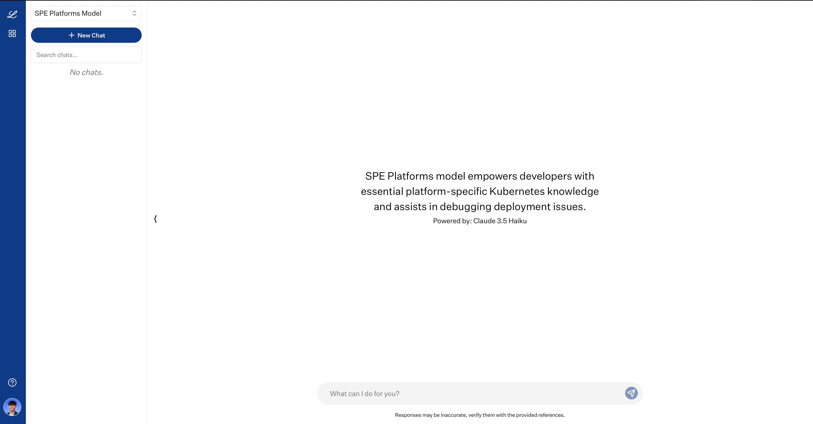

# **CATS Platform Agent**

CATS Platform Agent is your advanced assistant for platform operations, seamlessly integrating documentation insights with real-time Kubernetes cluster intelligence. Building on the foundation of CATSbot, it goes beyond static knowledge retrieval by offering dynamic, context-aware diagnostics and actionable insights with operational capabilities. With its ability to connect directly to platform clusters, CATS Agent empowers users to access live resource data, troubleshoot issues, and optimize deployments with precision.

## Overview

CATS Agent combines the knowledge base of CATSbot with real-time cluster connectivity, allowing users to:

- Query actual cluster resources and states
- Diagnose deployment issues with real-time data
- Receive personalized recommendations based on your specific infrastructure

## Key Features

### Real-Time Cluster Information
- View configuration, state, and health metrics of your Kubernetes resources
- Get detailed logs and events for troubleshooting
- Monitor resource utilization and performance metrics

### Context-Aware Assistance
- Combines documentation knowledge with your actual cluster state
- Provides personalized recommendations based on your specific infrastructure
- Suggests optimizations and best practices for your deployments

### Interactive Operations
- Execute controlled kubectl commands directly from the chat interface
- Explore namespaces and resources across your clusters

## Accessing CATS Agent

### In Chat-In-The-Box

[`CLICK HERE`](https://chat.lilly.com/cortex/chat/spe-platforms-model) to access CATS Agent through Chat-In-The-Box.

:::info

CATS Agent requires the same access provisioning as CATSbot via the `lrl_cats_access_non_rids` AD Group. See the [Get Access](/guide/GetAccess#2-dashboards-group) section for details on joining this group.

:::



## Using CATS Agent

CATS Agent provides a range of capabilities through its specialized tools:

### Querying Cluster Resources

Get real-time information about any resource in your cluster:

```
Show me all pods in <your-namespace> namespace that are not running
```

```
Get details about the ingress configuration for <your-application> in <your-namespace> namespace
```

```
List all deployments in the <your-namespace> namespace and their current status
```

### Diagnosing Issues

Troubleshoot deployment and configuration problems with context-aware assistance:

```
My application in namespace <your-namespace> is returning 503 errors. What could be wrong?
```

```
The persistent volume claim for my database isn't binding. Help me diagnose the issue.
```

```
Check why my deployment pods in the <your-namespace> namespace are crashing and suggest a fix
```

### Combining Documentation with Real-Time Data

Get comprehensive answers that merge platform knowledge with current cluster state:

```
What's the best way to scale my stateful application in the <your-namespace> namespace given my current resource utilization?
```

```
Explain how ingress works in CATS and check if my current configuration on the <ingress-name> ingress follows best practices
```

## Security and Permissions

CATS Agent operates with strict security controls:

- All operations require authentication using your organizational credentials.
- Access is limited to read-only and non-destructive actions on cluster resources.
- Every action is logged to ensure auditability and compliance with organizational policies.

## Available Tools

CATS Agent provides these specialized tools:

### Knowledge Base Querier
- Retrieves documentation and best practices for CATS platform
- Provides general guidance on Kubernetes concepts and patterns
- Answers questions about platform features and capabilities

### Kubernetes Resource Explorer
- Executes read-only kubectl commands to fetch real-time information
- Supports `get`, `describe`, `list` and `logs` operations
- Requires namespace specification for proper resource scoping

### Namespace Explorer
- Shows available namespaces in your clusters
- Filters results based on your access permissions
- Provides usage statistics and resource allocation