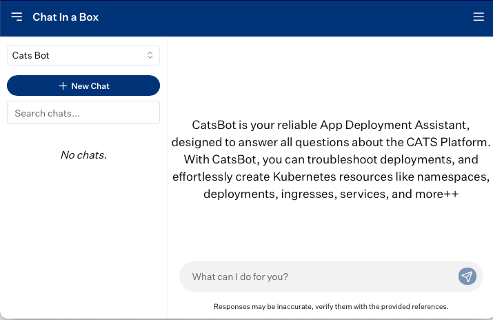
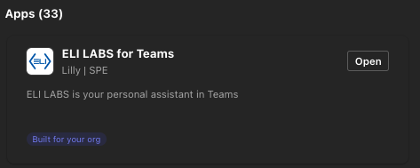
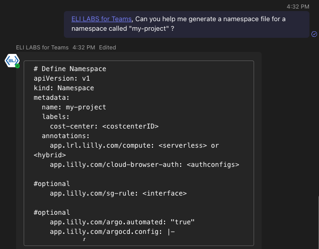

# **CATSbot Virtual Assistant**

:::tip[Meet Your New Deployment Ally: CATS Agent!]

Struggling with deployment hiccups on the CATS Platform? Say hello to [CATS Agent](./CATSAgent.md) – your on-demand, real-time assistant! 🛠️ Whether you're tackling tricky troubleshooting or configuring your deployments, CATS Agent is here to take your productivity to the next level! 🌟

:::

CatsBot is your reliable App Deployment Assistant, designed to answer all questions about the CATS Platform. With CatsBot, you can troubleshoot deployments, and effortlessly create Kubernetes resources like namespaces, deployments, ingresses, services, and more++

## Using CATSbot in Chat-In-The-Box 

[`CLICK HERE`](https://chat.lilly.com/cortex/dashboard) to try out CATSbot! 

:::info

CATSBot access is provisioned via the same AD Group that provides access to the CATS Platform's Dashboard offerings, lrl_cats_access_non_rids. See the [Get Access](/guide/GetAccess#2-dashboards-group) section for more details on how to join this group.

:::

You can also use Chat-In-A-Box to create your own chat bots. Controling what model you want to use, what information you want your bot trained on, and permissions to the bot! Feel free to try it out! 

  

## Using CATSbot in Teams

Now you can use CATSbot in teams via the Eli Labs For Teams applications

### Setup

1. When in a chat click the plus button at the bottom where you draft a message
2. Click, "get more apps" 
3. A new window should pop up, now click the blue "Get More Apps" button
4. Now search for "ELI LABS for Teams" and click the "Add" button. 
5. Now you can either open it directly or choose a chat location to place the app. We suggest selecting a group chat the includes all the members of the project you are working on. 

### Initiating the Bot

To begin chatting with CATSbot using the "ELI LABS for Teams" application, you first need to initiate the chat by mentioning the application in the Teams chat where it has been added. For example, type something like `"@ELI LABS for Teams, tell me about CATS"`. This action will add the application to the chat group and prompt you to select a model. Find the CATSbot model, star it to mark it as a favorite for easy access, and then click the chat bubble icon to start interacting with it. Once you’ve favorited the model and confirmed the name, you’re ready to begin chatting. 

To ask questions, simply tag the application again (e.g., @ELI LABS for Teams) and type your query. This allows you and your peers to chat with CATSbot in Teams group chats while working.

Example: 

