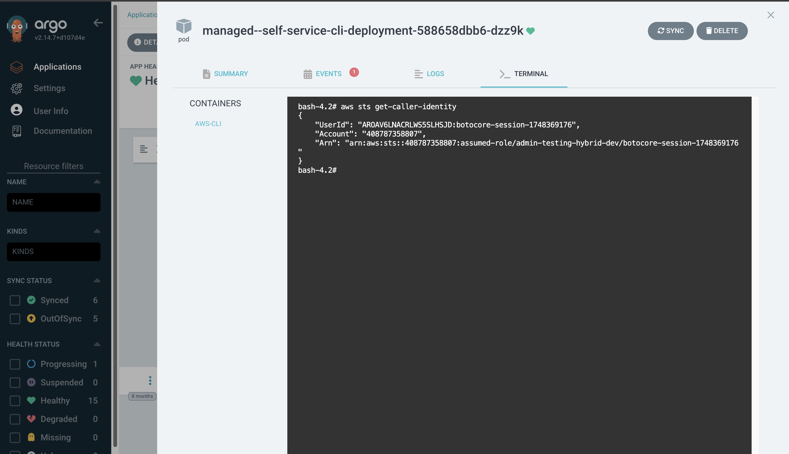

# Cluster Self-Service Toolkit

The Cluster Self-Service Toolkit is a powerful platform feature that provides application teams with a comprehensive set of pre-configured assets for securely managing resources external to their Kubernetes clusters. This toolkit is automatically deployed when a namespace with `hybrid` compute type (annotation `app.lrl.lilly.com/compute: hybrid`) is created, enabling teams to interact with external resources without requiring direct access to those systems.

## Overview

The Self-Service Toolkit follows a security-first approach, creating a controlled environment where application teams can interact with their external resources. All resources in this toolkit have the `managed--` prefix, indicating that they are created, owned, and managed by the CATS platform. These resources cannot be modified through ArgoCD as they fall under platform management.

## Features at a Glance

The Cluster Self-Service Toolkit includes the following key features:

| Feature | Description | Activation |
|---------|-------------|------------|
| [**AWS CLI Access**](#using-aws-cli-access) | Secure pod for executing AWS CLI commands via ArgoCD terminal | Automatic |
| [**External Secrets Integration**](#working-with-external-secrets) | Pre-configured SecretStore for AWS Secrets Manager integration | Automatic |
| [**IAM Roles & Policies**](#iam-roles-and-policies) | Namespace-scoped permissions for AWS resource access | Automatic |
| [**Bouncer Logs Analysis**](#bouncer-logs-analysis-via-athena) | Athena query access through Grafana for application traffic analysis | On-request |

## Architecture & Implementation

Each component of the Self-Service Toolkit is designed to work together to provide a secure and efficient experience for application teams, following core security and platform engineering principles:

### Security Boundaries

The toolkit implements strict security boundaries, ensuring that each namespace can only perform operations on external resources that follow the naming convention `cats/<namespace-name>/*`. This namespace-based isolation ensures that:

1. **Resource Isolation**: All resources are isolated to their specific namespace
2. **Least Privilege**: IAM policies grant only the minimum necessary permissions  
3. **Audit Trail**: All operations performed are logged for accountability and compliance
4. **Managed Infrastructure**: Resources are platform-controlled to ensure security and consistency

### Supporting Resources

The toolkit includes several supporting resources that are automatically deployed:

- **Network Policies**: Ensuring proper network isolation and security
- **SecretStore**: Pre-configured for AWS Secrets Manager integration, supporting both same and cross-account scenarios

:::info

If you are interested in the detailed architecture of this feature, check out our platform designs documentation for the toolkit [here](https://github.com/EliLillyCo/docs/blob/main/platform-design-documentation/self_service_toolkit.md#architectural-design).

:::

## Best Practices

- Always use the toolkit for managing external resources instead of direct AWS access
- Follow naming conventions for resources: `cats/<namespace-name>/<resource-name>`
- Do not attempt to modify the `managed--` resources, as they are controlled by the platform
- Reference the [External Secrets documentation](./ExternalSecrets.md) for best practices on secrets management

## Toolkit Features

### AWS CLI Access {#using-aws-cli-access}

The `managed--self-service-cli-deployment` provides secure AWS CLI access for application teams to interact with their external resources. This deployment creates a pre-configured pod with AWS CLI that team members can access through ArgoCD's exec functionality.

Key capabilities include:
- AWS Secrets Manager operations (create, read, update, delete)
- AWS resource management within team's namespace scope
- Secure execution of AWS CLI commands without requiring direct AWS console access

#### How to Use AWS CLI Access

1. Navigate to your application in ArgoCD
2. Locate the `managed--self-service-cli-deployment` in your resources
3. Use the "Terminal" option to exec into the pod
4. Run standard AWS CLI commands to manage your resources



#### Managing Secrets in AWS Secrets Manager

```bash
# List your secrets (filtered to your namespace)
aws secretsmanager list-secrets --filters Key=name,Values=cats/<your-namespace>

# Create a new secret
aws secretsmanager create-secret --name cats/<your-namespace>/my-new-secret --secret-string '{"username":"admin","password":"my-secure-password"}'

# Update a secret value
aws secretsmanager update-secret --secret-id cats/<your-namespace>/my-existing-secret --secret-string '{"username":"admin","password":"my-new-secure-password"}'

# Retrieve a secret value
aws secretsmanager get-secret-value --secret-id cats/<your-namespace>/my-existing-secret
```

### External Secrets Integration {#working-with-external-secrets}

The toolkit includes a preconfigured SecretStore that facilitates integration with AWS Secrets Manager. This enables:

- Automatic synchronization of secrets from AWS to Kubernetes
- Secure management of sensitive information
- Cross-account secret access when needed

For more information about using external secrets with this toolkit, please refer to the [External Secrets documentation](./ExternalSecrets.md).

### IAM Roles and Policies {#iam-roles-and-policies}

The toolkit automatically provisions IAM roles and policies scoped to your namespace. These roles:

- Allow access to AWS resources with the `cats/<namespace-name>` prefix
- Follow least privilege principles to ensure security 
- Support cross-account interactions when needed
- Enable AWS CLI operations from the access pod

These IAM resources are fully managed by the platform and will be automatically updated if policy requirements change.

### Bouncer Logs Analysis via Athena {#bouncer-logs-analysis-via-athena}

The toolkit also provides application teams with the capability to analyze their application traffic through Bouncer logs using AWS Athena queries in Grafana. This feature enables teams to:

- Understand their application's traffic patterns and user activity
- Monitor and analyze API usage metrics
- Track active user counts and session information
- Generate custom visualizations based on application traffic data

#### How to Access Bouncer Log Analysis

Unlike other features in the toolkit, Bouncer logs analysis requires additional setup by the platform team:

1. Submit a [Feature Request](../support/FeatureRequest.md) to enable Bouncer logs analysis for your application
2. The platform team will create a dedicated Grafana organization for your team
3. AWS Athena datasource will be installed and configured with appropriate permissions
4. Your team will have access to this datasource in the newly created Grafana organization via the RBAC scheme configured 

#### Example Athena Queries

Once your Grafana organization is set up with Athena integration, you can use queries like:

```sql
-- Get all bouncer logs for the test-dev namespace  
SELECT * FROM namespace_test_dev


-- Get daily active user count for your application in the llm-qa namespace
SELECT count(DISTINCT user) AS daily_active_users
FROM namespace_llm_qa;
```

## Future Extensions

The Cluster Self-Service Toolkit is designed to be extensible, allowing for additional tools and capabilities to be added to the asset packet as platform needs evolve. Future additions may include:

- Database management tools
- Advanced logging and monitoring capabilities
- Additional cloud resource provisioning options
- Custom resource management utilities

If you would like to suggest additional tools or features for the Self-Service Toolkit, please follow the standard [Feature Request](../support/FeatureRequest.md) process.

## Troubleshooting

If you encounter issues with the Self-Service Toolkit:

1. Verify your namespace has the correct `app.lrl.lilly.com/compute: hybrid` annotation
2. Ensure you have the appropriate permissions in ArgoCD for your application
3. Check that your resources follow the required naming convention (`cats/<namespace-name>/*`)
4. Contact the platform team if you believe the toolkit resources were not properly deployed

## Support

For questions or issues related to the Cluster Self-Service Toolkit, please submit a support ticket following the standard [support process](../support/TicketTemplate.md).