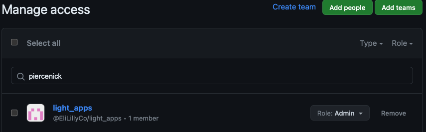
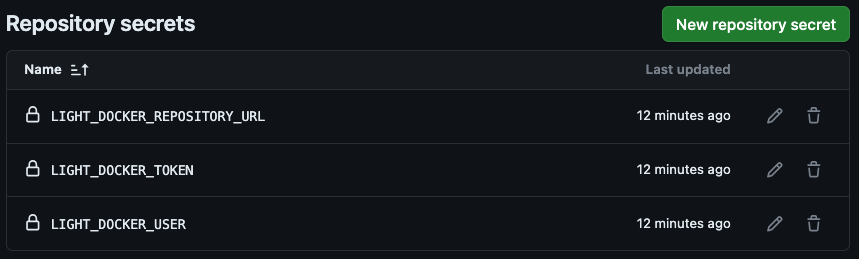
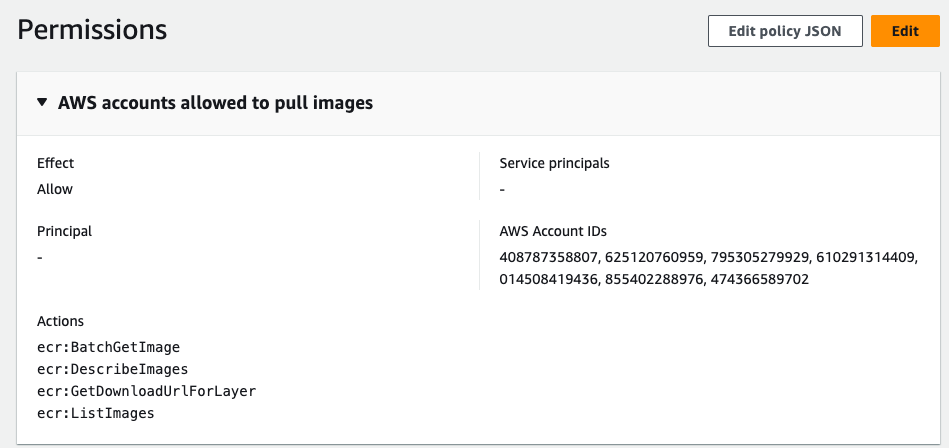

# **ECR Credential Service : Provision Github Repo with Action Credentials and Cross Account Registries**

CronJob that runs on all github repos provided with access by Light-Automation, refresh ECR credentials in the Github Actions secret store and optionally create ECR repos with cross-account access.

## Configuration

In order to create an ECR repo and provide your Github Actions build and push docker images with ECR credentials, you must first add light-apps as collaborator with admin access.

This cronjob will add and continuously update the `Actions/Repository Secrets` so that there will always be fresh credentials to push (and pull) from ECR within an action run.

The cronjob will also create an ECR registry in the production Light account for you that you authenticate to with the repository secrets, it will usually be in the form of `your_repo_name`. 
This registry will be provisioned with cross account permissions, which allows you to develop in the `LRL_light_k8s_infra_apps_test` or `LRL_light_k8s_infra_apps_qa` environments.

  

