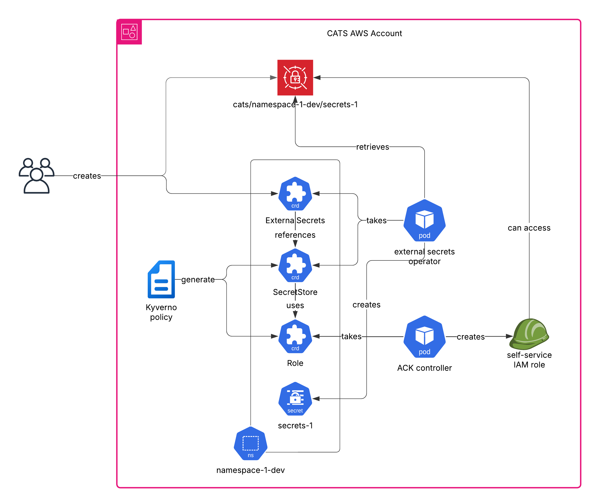
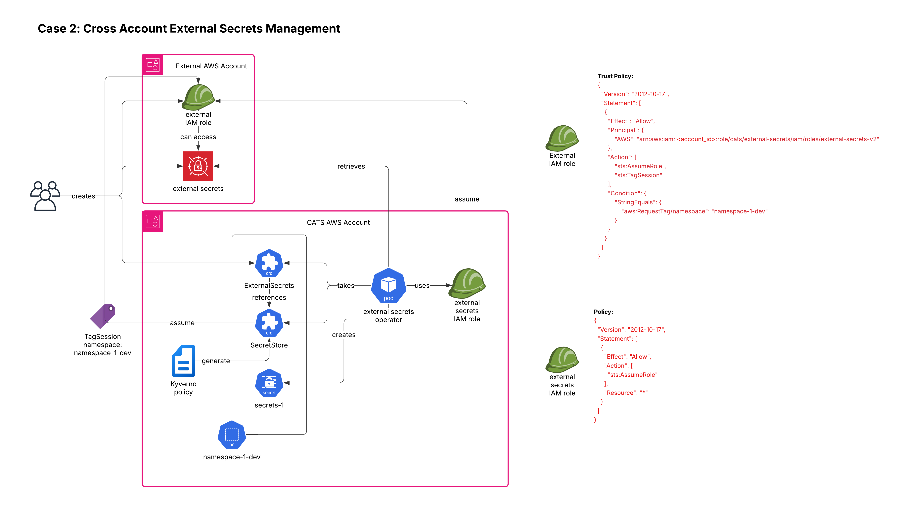
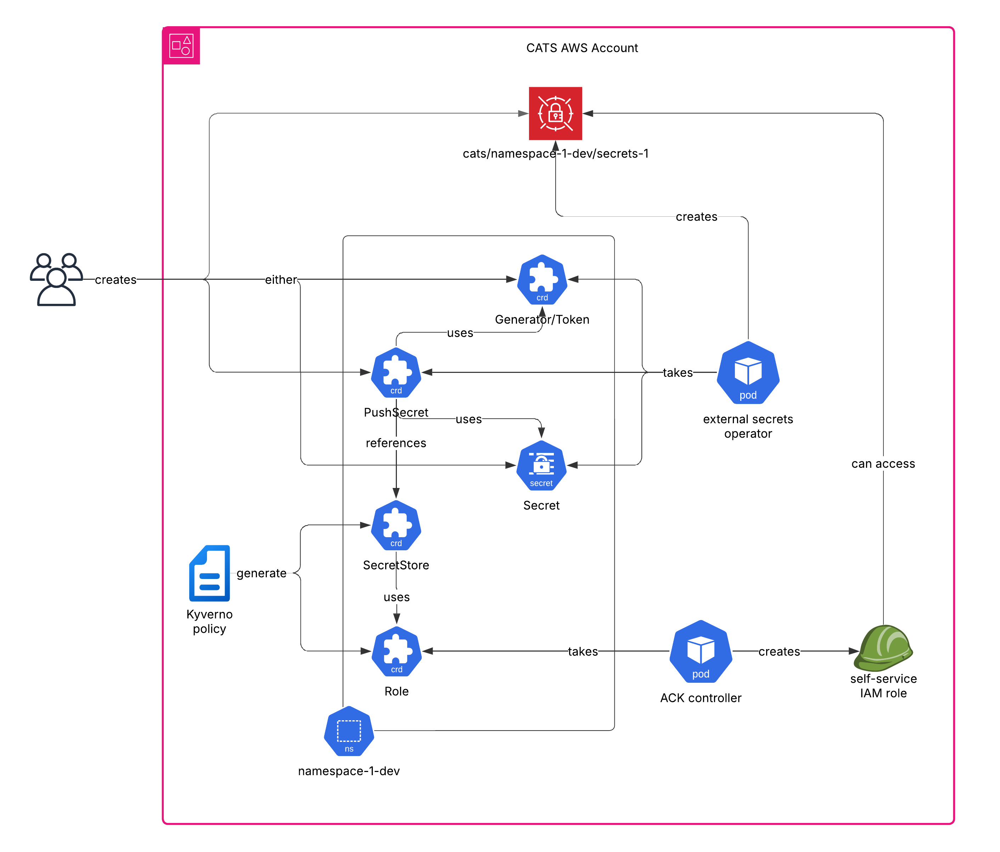

# External Secrets 

:::tip

External Secrets V2 is now available on CATS with enhanced security and higher customizability. More instructions on setting up external secrets with the V2 operator coming soon [here](./ExternalSecrets.md#external-secrets-v2).

:::

External Secrets refer to a method or a tool that allows Kubernetes to access secrets stored in external secret management systems, such as AWS Secrets Manager, HashiCorp Vault, Azure Key Vault, or Google Secret Manager, rather than storing them directly in Kubernetes Secrets. This approach enhances security by centralizing secret management, reducing the risk of secret leakage, and enabling fine-grained access control and auditing capabilities external to Kubernetes.

## AWS Secrets Manager

The CATS Platforms preferred approach is to use AWS Secrets Manager as our secret management system. 

AWS Secrets Manager allows you to store a wide range of sensitive information securely. This includes:

**Database Credentials**: Username and password for RDS, Redshift, or other database services.

**API Keys**: Access keys and secret keys for AWS services or third-party APIs.

**SSH Keys**: Private keys for SSH access to EC2 instances.

**OAuth Tokens**: Tokens for accessing services like GitHub, Google, or other OAuth 2.0 secured APIs.

**Encryption Keys**: Private keys for encrypting and decrypting data.

**Application Secrets**: Configuration data, connection strings, or any other sensitive information used by your applications.

**Certificates**: SSL/TLS certificates for securing web traffic.

**Service Account Credentials**: Credentials for service accounts in different platforms or services.

**Other Secrets**: Any other string-based sensitive data that your application requires.

AWS Secrets Manager ensures that these secrets are securely stored and managed, providing fine-grained access control, automatic rotation, and audit logging capabilities. 

### Using AWS Secrets Manager

The steps to use a secret in CATS are as follows: 

1. **Create AWS Secret**: Using your [-CA account](https://elilillyco.stackenterprise.co/articles/481), log into the AWS console and navigate to Secrets Manager. Here you can create a new secret. Ensure you put all the values in correctly as your account does not have permission to edit or retrieve the secret once it is set. You do have the ability to create another new secret if you mess up. 

2. **Create K8s Secret**: You now have a secret you can use in your solution. To get this secret into the Kubernetes Cluster you must create an external secret object and map the AWS Secrets Manager Secret to the new Kubernetes External Secret Resource. 

## Create AWS Secret

Using AWS Secrets manager in Lilly - https://github.com/EliLillyCo/lrl-cloud-patterns/tree/main/aws/secretsmanager

If you need to create a secret in secret manager, you can use your [-CA account](https://elilillyco.stackenterprise.co/articles/481) in CATS PRD account - `prod-igw-dx-researchit-light`, assuming role `arn:aws:iam::283234040926:role/aws_light_devs`. This role has write-only permissions on the secrets. You can only create secrets using this role. You cannot edit or retrieve secrets using this role. If you make a mistake you will need to create a new secret. 

You can create the secret via the console or through code.

For reference this is the profile:
```shell
[light_prd]
aws_profile = light_prd
username = ***************** YOUR-CA-ACCOUNT ******************-ca
account = prod-igw-dx-researchit-light
account_id = 
role = aws_light_devs
entry_url = https://aws-login.am.lilly.com
role_arn = arn:aws:iam::283234040926:role/aws_light_devs
region = us-east-2
output = json
duration = 3600
note = Saved login_profile to get credentials for prod-igw-dx-researchit-light:aws_light_devs. To use this saved login_profile, use `lilly-aws-auth login light_prd`
```

The above code is for the production cluster. Depending on the Cluster you are working in, you will need to update your code to account for the correct `account` and `role_arn` based off of the table below:

|Environment | Account | Role ARN |
|------------|---------|----------|
|DEV:        | dev-igw-dx-researchit-light  |arn:aws:iam::408787358807:role/aws_light_devs  |
|QA:         | qa-igw-dx-researchit-light   |arn:aws:iam::474366589702:role/aws_light_devs  |
|PRD:        | prod-igw-dx-researchit-light |arn:aws:iam::283234040926:role/aws_light_devs  |


## Create K8s Secret

This section outlines how to create a Kubernetes External secret and map that secret to a secret in AWS Secrets Manager.

Here's a template:

```yaml
apiVersion: kubernetes-client.io/v1
kind: ExternalSecret
metadata:
  name: your-secrets-name
  namespace: your-namespace
spec:
  backendType: secretsManager
  data:
  - key: aws_secret_name
    name: k8s_secret_key
    property: aws_secret_key
  - key: aws_secret_name
    name: k8s_secret_key2
    property: aws_secret_key2
  - key: aws_secret_name
    name: k8s_secret_key3
    property: aws_secret_key3
```

Here is an example live in practice: 

```yaml
apiVersion: "kubernetes-client.io/v1"
kind: ExternalSecret
metadata:
  name: abarp-sa-creds
  namespace: abarp-dev
spec:
  backendType: secretsManager
  data:
    - key: lrl-light-abarp-sa-creds
      name: username
      property: username
    - key: lrl-light-abarp-sa-creds
      name: password
      property: password
    - key: lrl-light-abarp-sa-creds
      name: passphrase
      property: passphrase
```

Configured in the code above is a Kubernetes "External Secret Resource" named `abarp-sa-creds`. This external secret references the secret that was created in AWS Secretes Manager named `lrl-light-abarp-sa-creds`. The above configuration will create the K8s secret with the specified name and keep it in sync with the AWS secret specified.

See the below example of how to reference your secret in your deployment resource:

```yaml
apiVersion: apps/v1
kind: Deployment
metadata:
  name: abarp-dev
  namespace: abarp-dev
  annotations:
    app.lilly.com/flux.automated: "true"
    app.lilly.com/flux.simple.abarp-dev: "283234040926;lrl_abarp;glob:abarp-develop-sha-.*"
spec:
  selector:
    matchLabels:
      app.kubernetes.io/name: abarp-dev
  template:
    metadata:
      labels:
        app.kubernetes.io/name: abarp-dev
    spec:
      containers:
      - image: 283234040926.dkr.ecr.us-east-2.amazonaws.com/lrl_abarp:abarp-develop-sha-2c4f800 # {"$imagepolicy": "abarp-dev:abarp-dev"}
        name: abarp-dev
        env:
        - name: ABARP_CERT_PASSPHRASE
          valueFrom:
            secretKeyRef:
              name: abarp-sa-creds
              key: passphrase
        - name: ABARP_SA_USERNAME
          valueFrom:
            secretKeyRef:
              name: abarp-sa-creds
              key: username
        - name: ABARP_SA_PASSWORD
          valueFrom:
            secretKeyRef:
              name: abarp-sa-creds
              key: password
        ports:
        - containerPort: 3001
        resources:
          limits:
            memory: "1Gi"
            cpu: "0.25"
          requests:
            memory: "1Gi"
            cpu: "0.25"
```


Full documentation on how this works can be found [here](https://github.com/external-secrets/kubernetes-external-secrets).

## Referencing Secret In An External AWS Account

If performing a cross account secret access, create a role (with the appropriate secret manager permissions) in the source account & allow the AWS role ```arn:aws:iam::283234040926:role/light-infra-stack-LightClusterLightInfraServiceAcc-ZTULM7KFYCFC``` assume role permission.  This will allow the external secrets controller access to assume into the source account role & fetch the secret from the source account.

The above example uses the production account role. If you are working in the QA or Dev cluster then see the table below to find the correct role arn for your use case: 

|Environment | Role ARN |
|------------|----------|
|DEV:        | arn:aws:iam::408787358807:role/light-infra-stack-LightClusterLightInfraServiceAcc-3GAJR7QUTINT |
|QA:         |arn:aws:iam::474366589702:role/light-infra-stack-LightClusterLightInfraServiceAcc-1GC05W554VJY  |
|PRD:        |arn:aws:iam::283234040926:role/light-infra-stack-LightClusterLightInfraServiceAcc-ZTULM7KFYCFC  |

Once this is configured, you must specify the role you create in your ExternalSecret config as below:
```yaml
apiVersion: kubernetes-client.io/v1
kind: ExternalSecret
metadata:
  name: test
  namespace: test
spec:
  backendType: secretsManager
  roleArn: <your role arn>
  data:
  - key: some_aws_secret
    name: k8s_secret_key
    property: aws_secret_key
  - key: some_aws_secret
    name: k8s_secret_key2
    property: aws_secret_key2
  - key: some_aws_secret2
    name: k8s_secret_key3
    property: aws_secret_key3
```

<br />


## External Secrets V2
To enhance the customizability and security of external secrets management within the CATS platform, an upgrade has been made on the external secrets operator, resulting in a new operator that targets `ExternalSecret` resources in a separate API Group (`external-secret.io`).

### Use Cases and Patterns
The External Secret operator V2 supports the following use cases/patterns with higher customizability and enhanced security:
1. Same AWS account secrets management (supported by V1)

2. Cross AWS account secrets management (supported by V1)

3. Kubernetes secret/token management with integration to AWS Secret Manager


### Setting up External Secrets with V2 Operator 
The V2 external secret controller uses a new `SecretStore` custom resource to handle configuration with an external secret management provider (i.e., AWS Secrets Manager) to locate the appropriate external secrets. Here is an example of a `SecretStore` that targets the AWS Secrets Manager of the same AWS account that the cluster is being deployed:

```yaml
apiVersion: external-secrets.io/v1beta1
kind: SecretStore
metadata:
  name: aws-secretstore
  namespace: <namespace-name>
spec:
  provider:
    aws:
      service: SecretsManager
      region: us-east-2
```

After setting that up, you can then create a new `ExternalSecret` object that references the newly created `SecretStore` as follows:

```yaml
apiVersion: external-secrets.io/v1beta1
kind: ExternalSecret
metadata:
  name: <external-secret-name>
  namespace: <namespace-name>
spec:
  dataFrom:
  - extract:
      key: <aws-secrets-manager-secret-name>
  refreshInterval: 10s
  secretStoreRef:
    kind: SecretStore
    name: aws-secretstore
  target:
    creationPolicy: Owner
    deletionPolicy: Retain
```

### Custom External Secret Templates and Configuration 

The external secrets operator V2 provides enhanced customization and flexibility for configuring secrets through **Templating**. For more information, please refer to the official documentation from external secrets operator [here](https://external-secrets.io/latest/guides/templating/).

### Push Kubernetes Secret to AWS Secrets Manager

External Secrets Operator V2 supports bidirectional synchronization with the `PushSecret` resource, allowing you to push Kubernetes secrets to AWS Secrets Manager. This is useful for sharing secrets with other systems or backing up Kubernetes secrets.

Here's a template for pushing a Kubernetes secret to AWS Secrets Manager:

```yaml
apiVersion: external-secrets.io/v1alpha1
kind: PushSecret
metadata:
  name: <push-secret-name>
  namespace: <namespace>
spec:
  # Replace: Overwrite the entire secret if it exists
  # Merge: Update existing keys and add new ones
  updatePolicy: Replace

  # None: Do not delete the remote secret when the PushSecret is deleted
  # Delete: Delete the remote secret when the PushSecret is deleted
  deletionPolicy: None
  refreshInterval: 10s
  secretStoreRefs:
    - name: <your-secret-store>
      kind: SecretStore
  selector:
    secret:
      name: <kubernetes-secret-name>
  data:
    # For each key in your Kubernetes secret you want to push
    - match:
        secretKey: <kubernetes-secret-key>
        remoteRef:
          remoteKey: <aws-secrets-manager-secret-name> # Path in AWS Secrets Manager
          property: <property-name>    # Key within the AWS secret
```

Example use case: After creating database credentials with Crossplane or another provider, you can push these credentials to AWS Secrets Manager for use by other applications:

```yaml
apiVersion: external-secrets.io/v1alpha1
kind: PushSecret
metadata:
  name: db-credentials-pushsecret
  namespace: app-namespace
spec:
  updatePolicy: Replace
  deletionPolicy: None
  refreshInterval: 15s
  secretStoreRefs:
    - name: aws-secretstore
      kind: SecretStore
  selector:
    secret:
      name: db-credentials
  data:
    - match:
        secretKey: endpoint
        remoteRef:
          remoteKey: app/database/credentials
          property: endpoint
    - match:
        secretKey: password
        remoteRef:
          remoteKey: app/database/credentials
          property: password
    - match:
        secretKey: username
        remoteRef:
          remoteKey: app/database/credentials
          property: username
```

This configuration will push the `endpoint`, `password`, and `username` keys from the `db-credentials` Kubernetes secret to an AWS Secrets Manager secret at the path `app/database/credentials`.