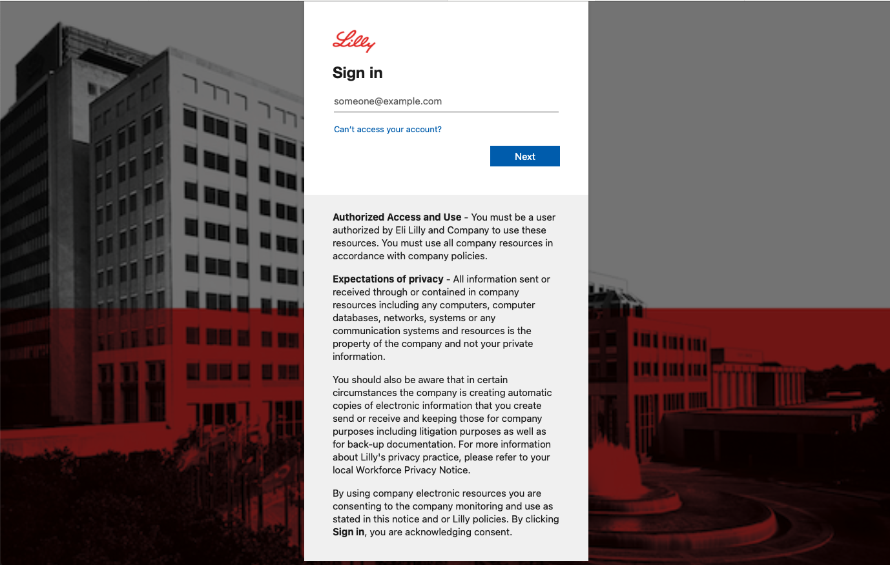
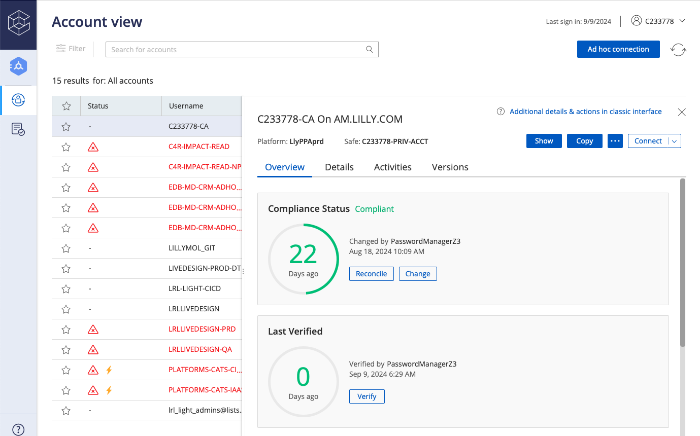
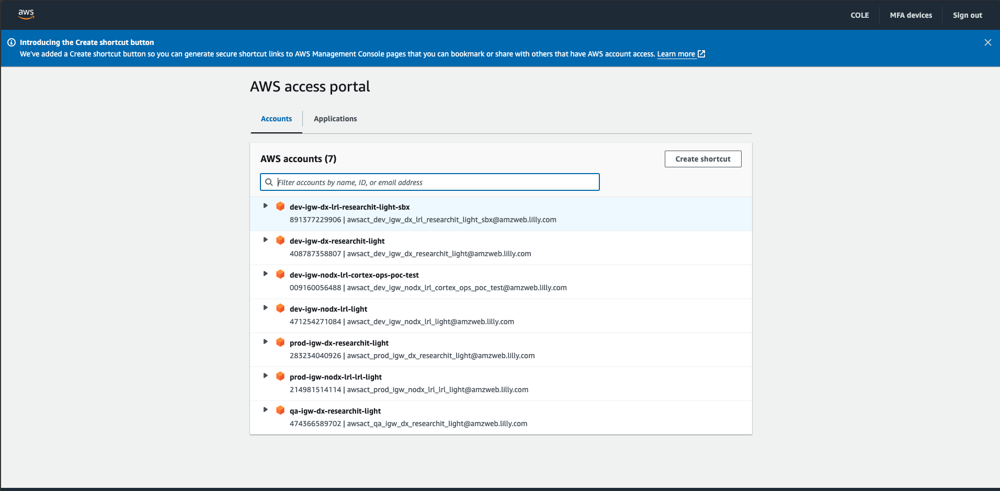
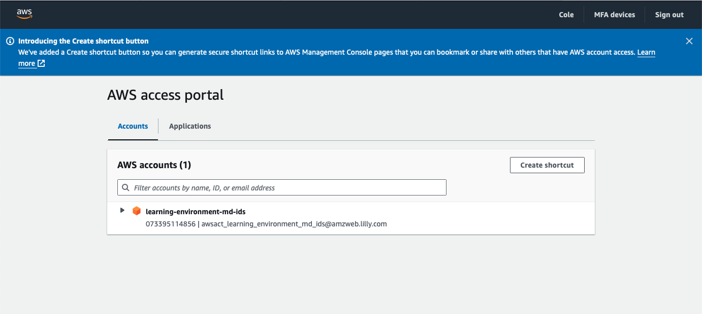

# **Get Access**

To start deploying on the CATS Platform you will need to be added to a few different groups. We have convienently automated this proccess via the Developer [FRONTDOOR](https://dev.lilly.com/docs/platforms-and-tools/cats/)! All you need to do is click the buttons to be automatically added to each group. 

## 1. Github Group
**Group Name**: LRL_light_k8s_infra_write

**Location**: [Github](https://github.com/orgs/EliLillyCo/teams/lrl_light_k8s_infra_write)

**Description**: This is a Github group that provides users access to the repositories where deployment resources are defined. Once you are in this group you can see and work with the github repositories associated with the CATS Platform. 

**Request Access** - Follow the steps below to gain access

1. Have a Github account that is a member of the Eli Lilly Github Organization. Follow [these steps](https://dev.lilly.com/docs/platforms-and-tools/github/) if that is not completed. 
2. Navigate to the [FRONTDOOR](https://dev.lilly.com/docs/platforms-and-tools/cats/#onboarding-and-offboarding) and click the desginated button on the CATS Page to get added to the group. 
3. If you have a Github Account you will be automatically added to the group. If you do not have a Github account the automation will fail, send you an email with instructions on how to set up a Github account and have your account added to the Eli Lilly Github Organization. You will be instructed to try again once you have successfully set up your Github account. 

## 2. Dashboards Group

**Group Name**: lrl_cats_access_non_rids

**Location**: [AD Group Manager](https://idmportal.rf.lilly.com/IdentityManagement/default.aspx)

**Description**: This is an AD group that provides users access to various dashboards related to the CATS Platform. 

**Request Access** - Navigate to the [FRONTDOOR](https://dev.lilly.com/docs/platforms-and-tools/cats/#onboarding-and-offboarding) and click the desginated button on the CATS Page to get added to the group. 

## 3. AWS Console and Cluster Access Group (CA Account)

**Group Name**: aws_light_devs

**Location**: [AD Group Manager](https://idmportal.rf.lilly.com/IdentityManagement/default.aspx)

**Description**: This is an AD group that requires you to have a CA account in order to gain access. Once you are a member of this group it will allow you to access the AWS Accounts where CATS is deployed and use many features in the AWS Console.

**Request Access** - Follow the steps below to gain access

1. Get a [CA Account](https://elilillyco.stackenterprise.co/articles/481)
2. Navigate to the [FRONTDOOR](https://dev.lilly.com/docs/platforms-and-tools/cats/#onboarding-and-offboarding) and click the desginated button on the CATS Page to get added to the group. 
3. If you have a CA Account you will be automatically added to the group. If you do not have a CA account the automation will fail, send you an email with instructions on how to get a CA account, and tell you to try again. 

## 4. Mailing List

**Group Name**: cats_mailing_list

**Location**: [AD Group Manager](https://idmportal.rf.lilly.com/IdentityManagement/default.aspx)

**Description**: When a member of this group the user will recieve communications related to the CATS Platform. Communications include notifications of downtimes, platform changes, release notes, etc. 

**Request Access** - Navigate to the [FRONTDOOR](https://dev.lilly.com/docs/platforms-and-tools/cats/#cats-mailing-list) and click the desginated button on the CATS Page to get added to the group. 

## Sign In with CA Account

Many users struggle to sign in with their CA Account for the first time. The following workflow will help users sign in to the AWS Console but the same process is used to sign into any other service with the CA Account. 

1. have a CA account. You CA account will be structured like this: `C233778-CA@llynet.com`. You should replace your number and the ending will always be `-CA@llynet.com`.

 

2. When opening the AWS console it is important that you do not navigate to the portal when you are already logged in with your normal profile. This happens to many users. It is important that you open a private browser where you are not logged in with any accounts and then navigate to the [AWS Portal](https://lilly-aws-login.awsapps.com/start/#/?tab=accounts). When you get to the portal it will ask you to sign in. Be sure to sign in with your CA account. something like `C233778-CA@llynet.com`.

 

3. The system will then ask you for your password. To get your password you need to go to a different browser and log into [CyberArk](https://pvwa.lilly.com/PasswordVault/auth/saml/) with your normal account. Once you are logged in and have your password you use it to log into the AWS Portal. To find your password select which account you want to see the password for then click the show button. Copy your password and then paste it into the prompt in the private window to proceed.

 

4. If you are in the aws_light_devs group you should see a landing page that looks like this: 

 

5. select which AWS account you want to login with and then select the role "aws_light_devs" 

 

6. You should be in the console and ready to go! To understand which AWS Accounts map to the various CATS Deployment Repos please take a look at this table: 

|Cluster | App Deployment Repo | AWS Account Name | AWS Account ID |  VPC Access |
|--------------------|--------------------------------------------------------------------------------|-------------------------------------|--------------|------------------------|
|Production Cluster  | [infra_apps](https://github.com/EliLillyCo/LRL_light_k8s_infra_apps)           | prod-igw-dx-researchit-light        | 283234040926 | vpc-03bee17f69c9802b9 |
|QA Cluster          | [infra_apps_qa](https://github.com/EliLillyCo/LRL_light_k8s_infra_apps_qa)     | qa-igw-dx-researchit-light          | 474366589702 | vpc-058757a9c034d181c |
|Development Cluster | [infra_apps_test](https://github.com/EliLillyCo/LRL_light_k8s_infra_apps_test) | dev-igw-dx-researchit-light         | 408787358807 | vpc-069388414a9f87f40 |
|Sandbox Cluster     | [infra_apps_sbx](https://github.com/EliLillyCo/LRL_light_k8s_infra_apps_sbx)   | dev-igw-dx-lrl-researchit-light-sbx | 891377229906 | vpc-069388414a9f87f40 |

 
 

### Can't Login ? 

*Login troubleshooting tips found here!!* 

If you login and see this screen and you are sure you are in the aws_light_devs group, this means you are logged in with your normal account. You may even see 0 accounts available to you.

Here is a [ServiceNow Article](https://lilly.service-now.com/now/nav/ui/classic/params/target/kb_view.do%3Fsysparm_article%3DKB2052257) that may help you get properly logged in with the correct account as many users face this issue, especially on windows machines. 
