# Grafana

Grafana is a leading open-source analytics and monitoring platform that provides users with powerful visualization capabilities for their metrics, logs, and traces. Integrated seamlessly with our [Prometheus](./Prometheus.md) metrics scraper, [Loki](./Loki.md) logging querier, and [Jaeger](./Jaeger.md) tracing tool, Grafana allows teams to create custom dashboards that present data in an intuitive and visually appealing manner. With its wide range of visualization options, including graphs, charts, and tables, users can easily track performance trends, identify anomalies, and gain actionable insights into their applications and infrastructure. Grafana also supports alerting functionalities, enabling teams to set up notifications based on specific conditions, ensuring timely responses to potential issues. As an essential component of our observability stack, Grafana empowers users to explore their data effectively and make informed decisions to enhance system reliability and performance.


## Use Grafana In CATS

There are a selection of pre-built dashboards allowing you to view the most common key metrics, application logs, and network tracing for your CATS deployed applications. Usually these dashboards will serve most use cases, however if a custom alert or dashboard is needed by your team, please see their respective sections on this page for more details.

### Prequisites

To start utilizing Grafana for your applications, you must have the following criteria:

- **Metrics**: any kubernetes resource in your namespace
- **Logs**: you must have your pod scheduled on a karpenter node for the promtail daemonset to provision you a log scraper. Pleae consult the [Karpenter](./Karpenter.md) documentation for more information.
- **Tracing**: any ingress resource in your namespace

### Cluster Overview

[Cluster Overview](https://metrics.apps-q.lrl.lilly.com/?orgId=1) dashboard shows a general overview of total resource quantity and usage clusterwide and by namespace. Notice the dashboard navigations built into the cluster overview and the grafana resource sidebar to navigate to the other dashboards.

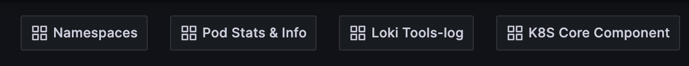

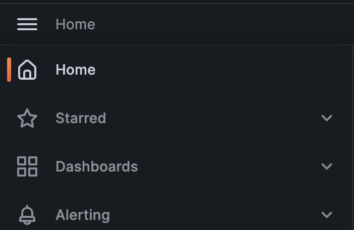

## Namespaces Dashboard

This dashboard displays a list of namespace scoped pods, their status, and what resources they are utilizing.

## Loki Tools-log Dashboard

Using the namespace/pod selector, if the container you are looking at is running on a **Karpenter** node you will automatically be provisioned a logs scraper via **Promtail**. Therefore, the containers stdout application logs will be transformed into structured logs and will be visible in the logs section of the app dashboard.

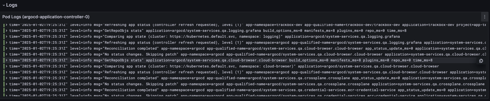

As applications dump many logs, there is also the ability to **search** through the logstream utilizing the following search window, it accepts generic strings.

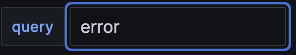

Resulting in all logs containing the string `error`:

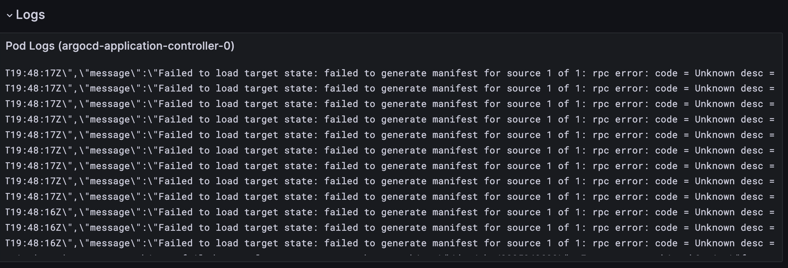

Expanding the individual log, there will now be grouped structured log fields that are exposed. You can add to the structured logging by writing more detailed logs in your applications.


## Pod Stats and Info Dashboard

Please utilize the following selectors to select the namespace, pod, container to view, there are various metrics exposed and visualized throughout the coming dashboards, these are some examples.

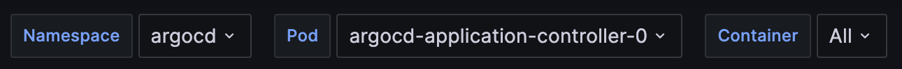

- **Network Usage**: Monitor the network traffic and bandwidth usage of your application.

  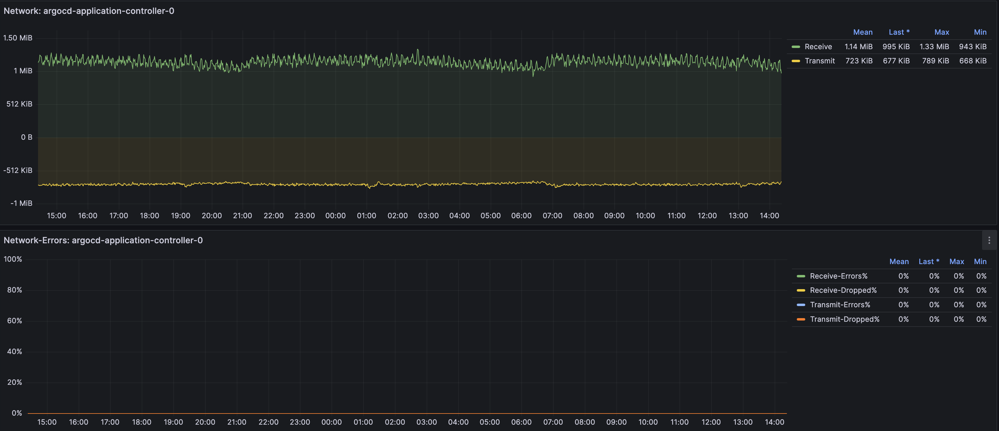

- **RAM Usage**: Track the memory consumption to ensure your application is running efficiently.

  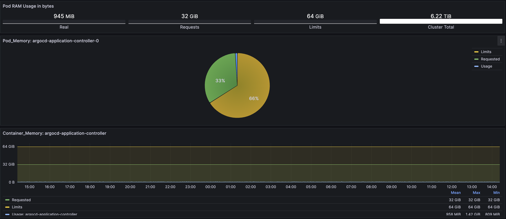

- **Health**: Get an overview of the application's health status, including any critical alerts or issues.

  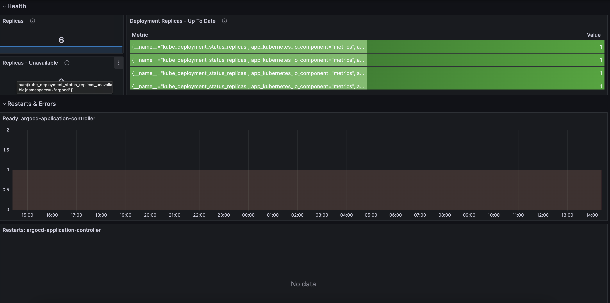

- **CPU Usage**: Analyze the CPU utilization to identify any performance bottlenecks.

  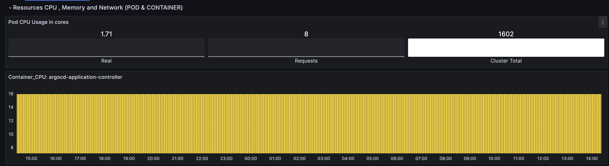

## App Dashboard 

Navigating to the `App Dashboard` will show a comprehensive dashboard for visualizing application resources and logs; it is a combination of all of the above mentioned dashboards with an extra panel for **Jaeger Tracing**.

### Jaeger Tracing

There is one more key service of the observability stack that has not been mentioned, and that is visualizing network information with Jaeger tracing. Tracing as a concept will be covered more in depth in [Jaeger](./Jaeger.md). 

The following screenshots illustrate a basic workflow of using Jaeger in Grafana to trace and analyze your application's hops across a distributed system:

1. **Jaeger Service**: Start by selecting the service you want to trace.

   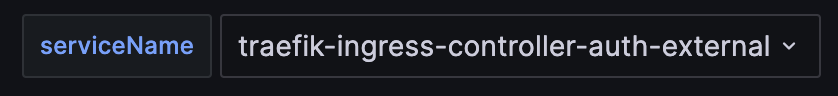

2. **Trace Search**: Use the trace search functionality to find specific traces based on various criteria.

   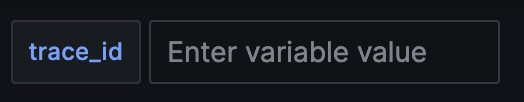

3. **Trace Entry**: View the entry point of the trace to understand where the request originated.

   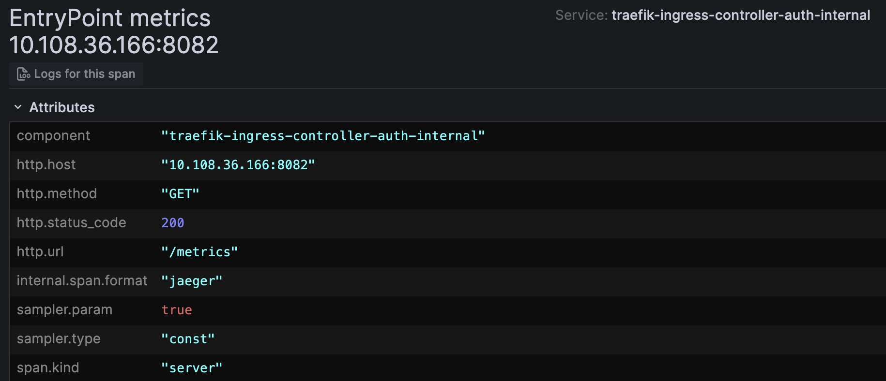

4. **Client View**: Analyze the client view to understand what client made the request.

   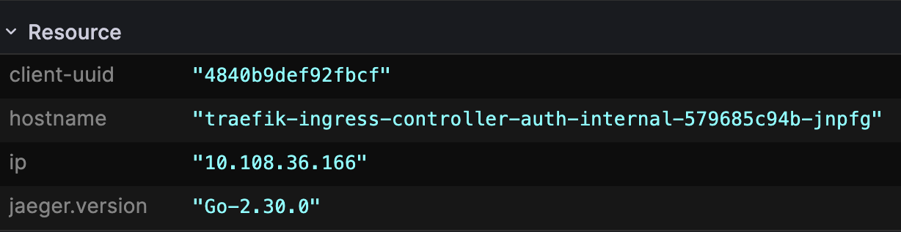

5. **Trace Forward**: Follow the trace forward to see how the request propagates through different services.

   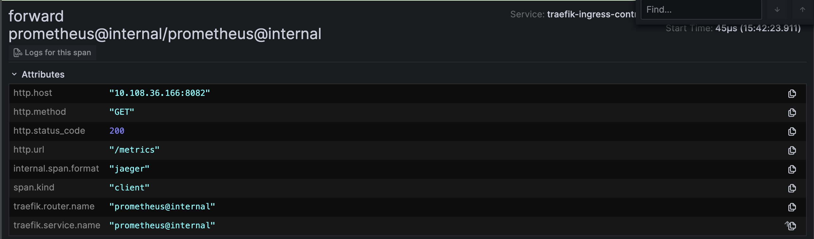


## Grafana Alerts

Grafana Alerts enhance our observability stack by providing real-time notifications based on specific conditions within your metrics and logs. We have integrated Grafana alerts with popular communication platforms such as Slack and Microsoft Teams, allowing teams to receive instant updates on critical performance issues, anomalies, or threshold breaches directly in their preferred messaging channels. This integration ensures that relevant team members stay informed and can respond promptly to potential incidents, improving overall responsiveness and reducing downtime. Custom alert rules can be configured based off the below template: 

### Alerts Template

```yaml

#We have to establish a heirarchy of contact points for the alerts to be sent to the right teams

kind: ConfigMap
apiVersion: v1
metadata:
  name: grafana-alerting-contact-points
  namespace: monitoring-configs
  labels:
    grafana_alert: "2"
data:
  grafana-alerting-contact-points.yaml: |-
    apiVersion: 1
    policies:
      - orgId: 1
        receiver: catsAlerts
        group_by:
          - grafana_folder
          - alertname
        routes:
          - receiver: catsAlerts
            matchers:
              - grafana_folder = system_services
          - receiver: myAlertsTest
            matchers:
              - grafana_folder = myAlertFolder
    contactPoints:
      - orgId: 1
        name: myAlertsTest
        receivers:
          - uid: my-test-alert
            type: teams
            settings:
              username: grafana_bot
              url: my-teams-webhook
              message: |
                {{ template "my_teams.message" . }}
              title: |
                {{ template "my_teams.subject" . }}
    templates:
      - orgId: 1
        name: my_teams.message
        template: |
          Alert: {{ .CommonLabels.alertname }}
          {{ if .CommonAnnotations.description }}
          Description: {{ .CommonAnnotations.description }}
          {{ end }}
      - orgId: 1
        name: my_teams.subject
        template: |
          {{ define "my_teams.subject" }}
           MY ALERTS
          {{ end }}

```

## Create Custom Dashboard

We are excited to provide a new and enhanced way for our customers to create their own personalized dashboards. The old metrics-edit method has been depricated and been replaced by the following process. 

### Grafana Organizations

In Grafana, an organization is a logical grouping of users, dashboards, and data sources. It is a way to segment and manage access to resources within a Grafana instance. By using organizations, you can effectively partition a Grafana setup for different teams, departments, or use cases within a single installation. The CATS team utilizes the organizations feature to provide a workspace for each individual application team. 

#### Default Orgs 

- Main Org: This is the default organization for all users. In this location you will find prebuilt dashboards that are applicable to all application teams. 

- Editor Org: This org is the equivelent of our old Metrics-Edit space. Anyone can use this org by default to build and save dashboards. The dashboards in this location will not be wiped and are persistent. Feel free to exirement and create as much as you want in this org. All users have edit permissions on this org so if you want to lock down your dashboard you will need to request the creation of a new organization specifically for your team. 

#### Request Org Creation

Please submit a request to the CATS Platform team in order for us to create you an organization so that you can get started building your Dashboards. 

1. Navigate to our ServiceNow [ticket submission page](https://lilly.service-now.com/ec?id=sc_cat_item&table=sc_cat_item&sys_id=e022ac201b62ad10827fff39cc4bcbf8&searchTerm=CATS%20-%20Report%20an%20issue)
2. Select a Platform or Application = CATS Platform
3. Issue Type = Request for Information
4. Title = "Grafana Org Creation"
5. Description = "My team would like an org created for us in Grafana. We would like to designate "Admin's Name" as the administrator for our organization. We would like "Organization Name" to be the name our our organiztion. 

#### Selecting your Org

There is a known grafana based bug when trying to use the org selector button in the top left of your screen, we encourage users to avoid using this selector. 

To select an organization click on your profile picture on the top right of the screen and then go to your profile. 

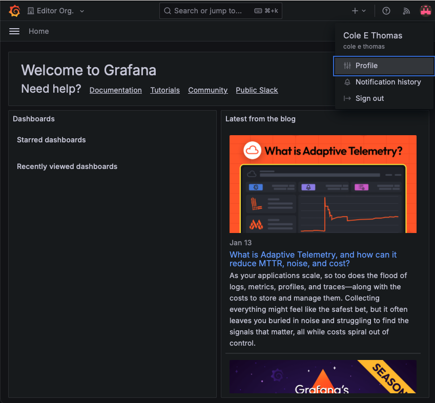

Once on your profile page scroll down to the bottom of the menu and you will see the list of orgs you are a part of. Select the org you want to open

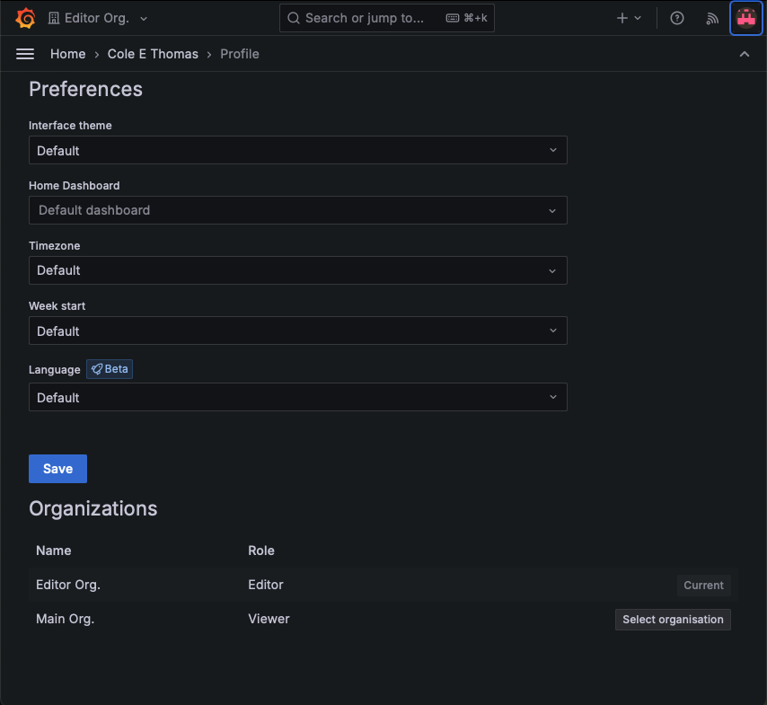


#### Managing Your Org

Each organization has an initial Administrator designated upon creation. 

You can manage the member of your org by clicking on the three bars in the top left corner and selecting "Administration". Note, Please ensure you are in the organization you want to manage when going to this tab. 

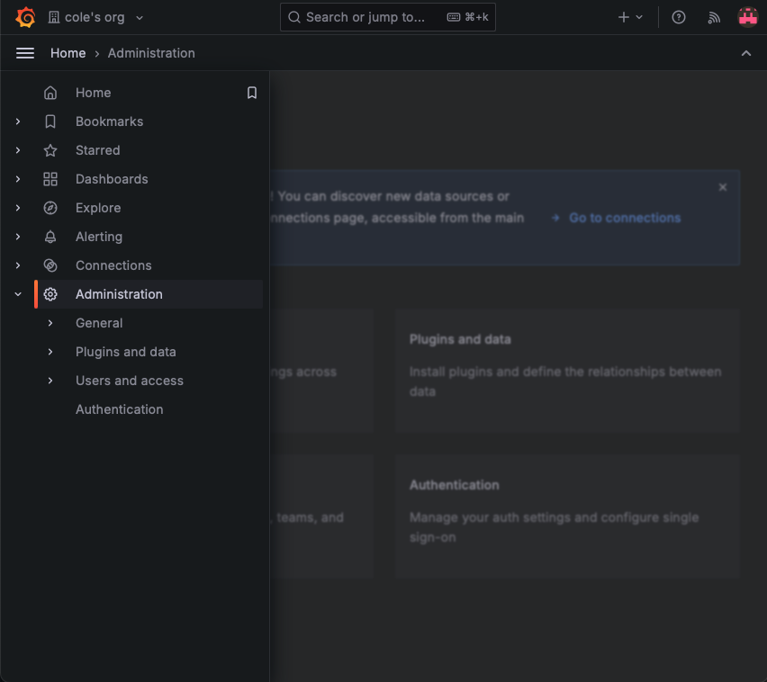

Next got to "Users and Access" and click on "Organization users". This will display all of the users who have access to your org and allow you to specify the permissiosn they have while in your organization.

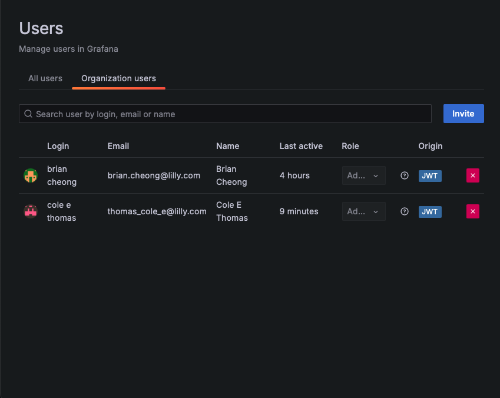

To invite more users simply click "Invite" this will allow you to invite a new user via their email. If the user has already logged into the metrics dashboard before you will be able to look them up by username. 

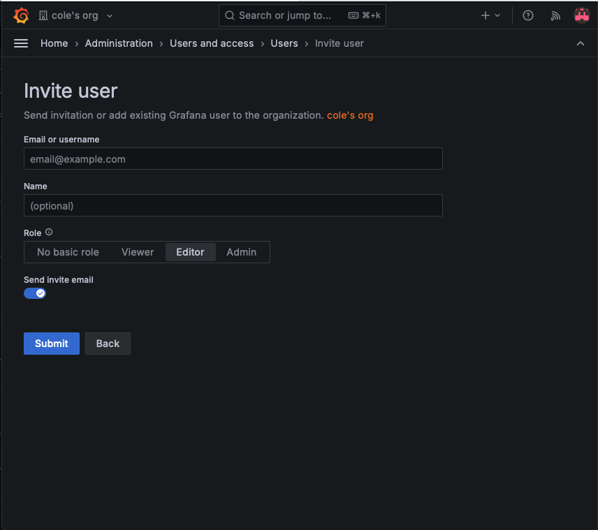

### How to create a Dashboard

Once you have your organization set up it is very straight forward to set up a dashboard. Ensure you have the desired org open by following the instructions outlined above. You can create a dashboard either in your personal org OR within the Editor Org. Remember, if you create a dashboard in the Editor Org, all users will be able to both see the dashboard, and edit it further if they want to. 

1. Simply navigate to the top left and click on the three lines, and select the Dashboard option

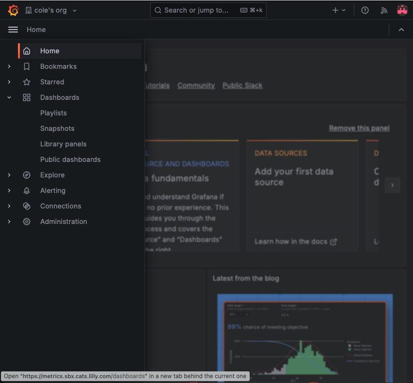

2. Next you simply need to click on "New Dashboard" or "Create dashboard" button to get started

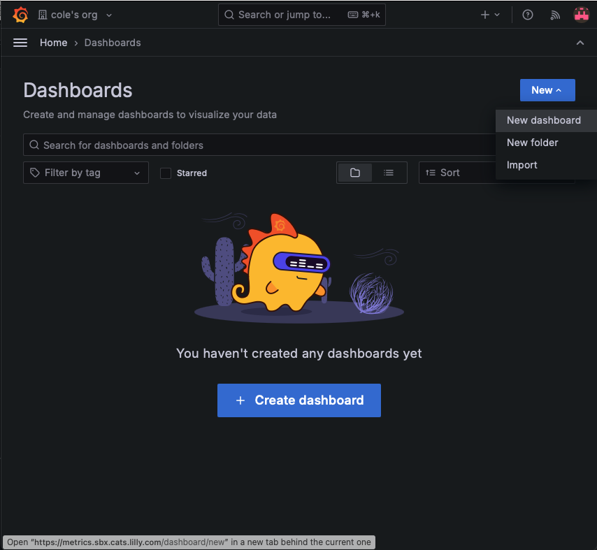

3. click "Add Visualization" to begin adding a something to display the metrics. 

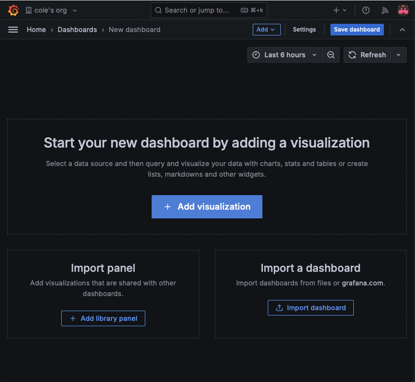

4. Select your datasource. You will see **"Prometheus"** available to use out of the box. You have the ability to add additional data sources if you desire. 

5. Once you are happy with your creation be sure to **SAVE** your dashboard or else you will lose your hard work! 

## Official Documentation

Full details on Grafana can be found on their [Official Documentation Site](https://grafana.com/docs/grafana/latest/).