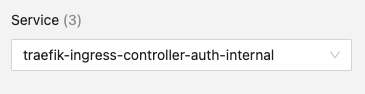
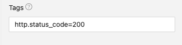
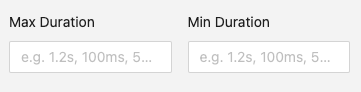
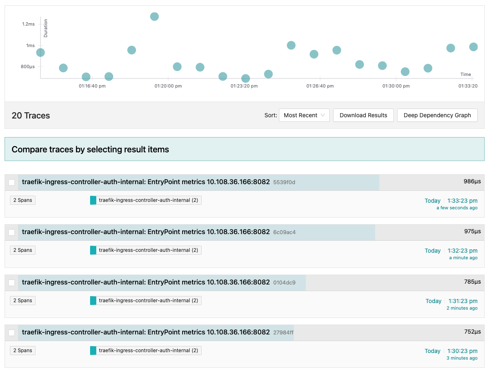
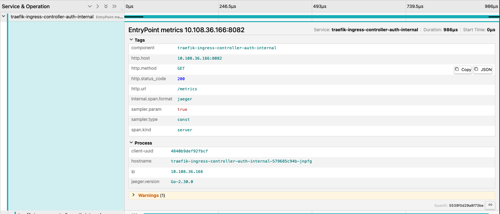
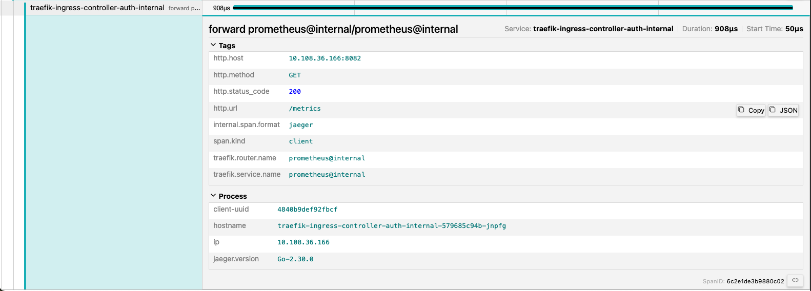
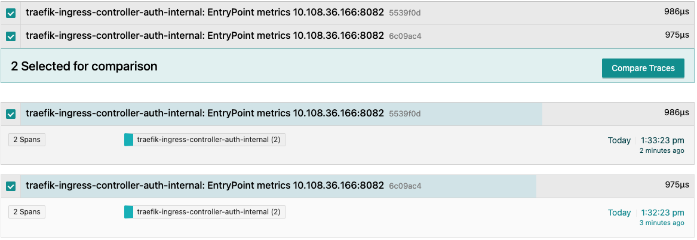

# Jaeger

Jaeger is an open-source, end-to-end distributed tracing system that helps monitor and troubleshoot transactions in microservices-based architectures. It was originally developed by Uber and is a part of the Cloud Native Computing Foundation (CNCF). Jaeger is used for tracking requests as they travel through different services in a distributed system, providing visibility into the system's performance and helping identify bottlenecks, latencies, or errors.

Key features of Jaeger include:

- Distributed Context Propagation: Follows requests as they traverse different services.
- Performance Monitoring: Tracks response times, latency, and the duration of individual operations.
- Root Cause Analysis: Helps identify which component of the system is causing performance issues.
- Service Dependency Analysis: Visualizes the flow and dependencies between services.
- Error Detection: Identifies failed or problematic operations across the services.

## Using Jaeger with CATS

This guide will walk you through using Jaeger to trace and analyze your application's performance. We will cover selecting a service, filtering by tags and duration, querying for traces, viewing client and forward requests, and comparing two traces.

### 1. Select a Service

Start by selecting the service you want to trace from the Jaeger UI. This will correspond to the type of ingress you have for your application.

### 2. Filter by Tags and Duration

Use the filter options to narrow down the traces by specific tags and duration of said traces.

### 3. Query for Traces

Execute the query to retrieve the traces that match your criteria.

### 4. View Client Request

Select a trace to view the client request details.

### 5. View Forward Request

Follow the trace to view the forward request details.

### 6. Compare Two Traces

Select two traces for comparison to analyze differences in performance and behavior.

