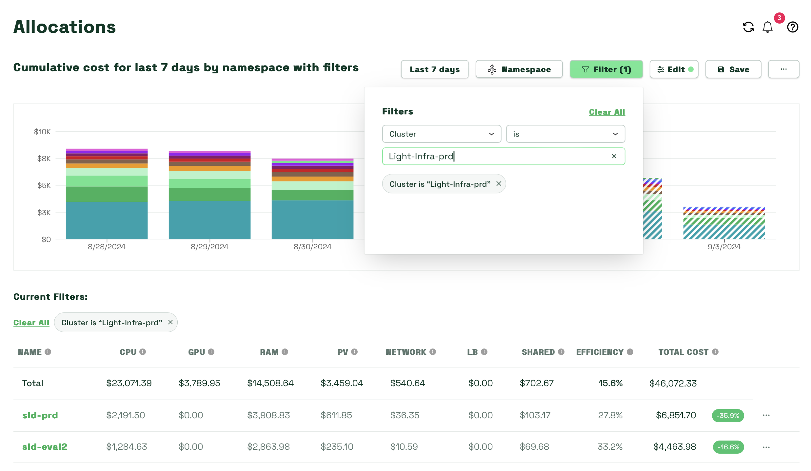
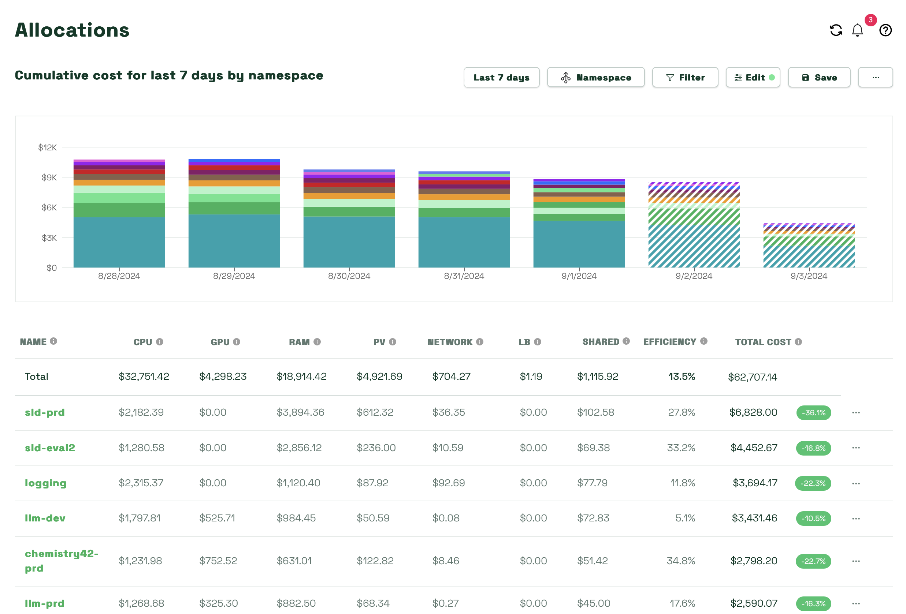
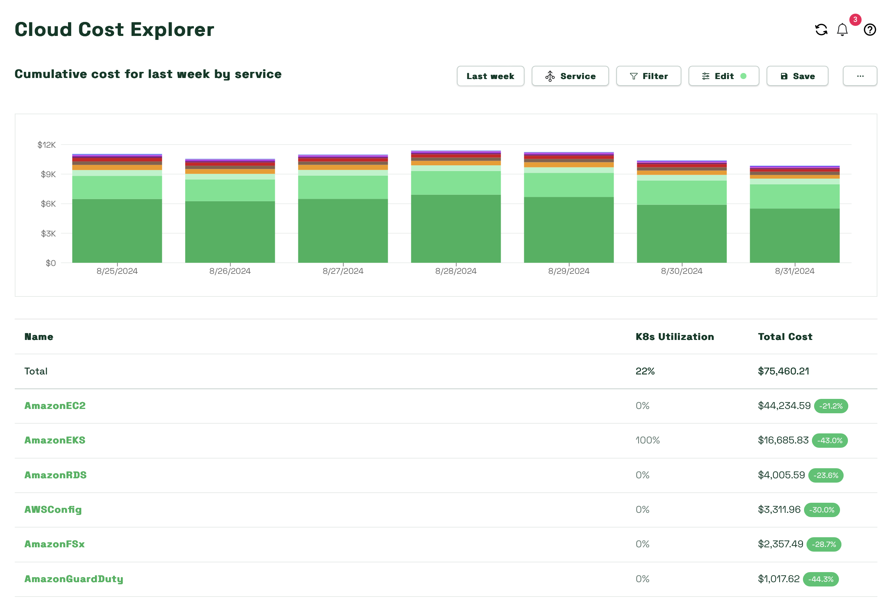

# Kubecost : Cost Monitoring Dashboard

:::warning
This service has been deprecated in CATS due to license discontinuation. Please look at [Opencost](./Opencost.md) for more information about cost observability on CATS.
:::

Kubecost is a comprehensive cost monitoring tool designed for Kubernetes environments. It provides detailed insights into your cloud spending, allowing you to track and optimize resource usage across your clusters. Whether you're managing costs for development, testing, or production environments, Kubecost helps you understand where your resources are being allocated and how to make the most out of your budget. Kubecost also provides recommendations on optimizing your resource efficiency and utilization through various ways (i.e. rightsizing container resource request, managing abandoned workloads, managed orphaned resources, etc.).


## Kubecost Version 2

To enhance the stability of our Kubecost instance across all three clusters and provide a unified, single-pane-of-glass view of cost spending for application and business planning teams, we have introduced the following features in Version 2:

### Federation ETL
This feature consolidates cost data from all three clusters—DEV, QA, and PROD—into the PROD cluster. This enables a comprehensive view of costs across all environments within a single Kubecost dashboard. The dashboard is highly customizable, allowing users to filter cost allocations by individual clusters or across multiple clusters simultaneously using single or multi-aggregation capabilities. Detailed instructions on how to navigate and customize the dashboard are provided below.

### Cloud Cost Billing Integration
This feature incorporates AWS Cost and Usage Report (CUR) data directly into our Kubecost instance. By reconciling Kubecost’s calculated metrics with AWS billing data, this integration significantly improves the accuracy of cost reporting. Additionally, it provides application teams with visibility into other AWS resources used within their applications that are not accounted for in the native Kubernetes resource allocation costs. This feature delivers a detailed and accurate cost breakdown for each application or cost center within the cluster.

To view the PROD Kubecost instance, which consists of cost allocation data across all three clusters (DEV, QA, and PROD), you can access the dashboard here:

[Kubecost Dashboard](https://kubecost.apps.lrl.lilly.com)


<br />

## Navigating the Kubecost Dashboard

When you first access the Kubecost dashboard, you'll be presented with the `Overview` dashboard. This view provides a high-level analysis of costs across all three clusters (DEV, QA, and PROD), with aggregated data displayed by default. To drill down into costs specific to each cluster, follow these steps:

1. **Access Allocations**:
Navigate to `Monitor` > `Allocations` from the main dashboard menu.

2. **Filter by Cluster**:
In the `Cluster` filter, select the desired cluster (`Light-Infra-dev`, `Light-Infra-qa`, or `Light-Infra-prd`) to isolate costs for that specific environment.



### Customizable Dashboard 
The `Allocations` dashboard within Kubecost is highly customizable, enabling you to perform detailed analyses of cluster spending. You can break down costs by various Kubernetes objects such as `Namespace`, `Pod`, and `Deployment`. Kubecost supports advanced filtering and aggregation options, allowing for more complex analyses as needed.
<br />
<br />
To further refine your view:

1. Use the `Filter` option to target specific clusters or Kubernetes objects. For example, setting `Cluster` to `Light-Infra-prd` and `Namespace` to `kubecost` will show cost data specifically for the kubecost namespace in the PROD cluster.
2. Adjust the `Window` to change the time period for cost analysis (e.g., daily, monthly).
3. Use `Aggregation` options to group data by different dimensions, such as `Namespace` or `Cost Center`.
4. Explore the `Edit` feature to tailor the dashboard to your specific needs, creating a view that best represents your application's cost usage.

<!-- Kubecost Dashboard page.png -->

Note: The highlighted blocks represent costs that have not been reconciled with the AWS CUR data. The reconciliation process typically takes up to 48 hours to complete, so if you want to view the reconciled cost for a specific day, come back to the dashboard two days after for more accurate cost breakdown.

### Cost Center Breakdown

A feature that is configured specifically in CATS is the ability to break down cluster costs by `Cost Center`. To view this, aggregate the cost allocation data by `cost-center` label. Ensure that your namespace has a `cost-center` label with a valid Cost Center depending on your organization within Lilly, allowing Kubecost to accurately aggregate resources to your specified cost center.

### Reporting

Kubecost allows for the creation, saving, and scheduling of cost reports as CSV or PDF files, which can be sent to external email recipients. Simply save your dashboard configurations under a preferred name, then navigate to `Reports` in the left panel. Locate your report under the list, click on the `...` under Actions, and select `Schedule Report` to set up email recipients and report format type at your chosen interval.

<!-- Kubecost Dashboard page.png -->


### Cloud Cost Explorer Dashboard
The Cloud Cost Explorer dashboard in Kubecost provides detailed insights into your entire cloud infrastructure spending, including non-Kubernetes resources such as databases, storage, and networking services. This tool allows you to access and analyze Cloud Costs:

Navigate to `Monitor` > `Cloud Cost` to view a summary of our AWS cloud costs across all three clusters in separate `AWS Accounts`, broken down by service (e.g., EC2, S3) and time period. Use `filters` to refine the data by `Account ID`, `Service`, or `Tag`.

The dashboard integrates with AWS Cost and Usage Report (CUR) data, providing a complete picture of both Kubernetes and non-Kubernetes costs. This ensures accurate chargeback and showback reporting by linking costs to specific departments or projects using AWS tags.




## API Directory

Kubecost's API directory offers extensive functionalities to optimize resource allocation and reduce costs. Visit their [API directory](https://docs.kubecost.com/apis/apis-overview) for more information. For instance, the [requestSizingV2](https://docs.kubecost.com/apis/apis-overview/api-request-right-sizing-v2) endpoint under the `Savings API` can recommend CPU and Memory allocations for your containers, based on their usage over a specified period and target utilizations.

Here is an example of getting the right sizing resource recommendation for containers within the `Kubecost` namespace per container specs.

```bash
KUBECOST_ADDRESS='http://kubecost.apps.lrl.lilly.com/model'

curl -G \
  -d 'algorithmCPU=max' \
  -d 'algorithmRAM=max' \
  -d 'targetCPUUtilization=0.7' \
  -d 'targetRAMUtilization=0.7' \
  -d 'window=3d' \
  --data-urlencode 'filter=namespace:"kubecost"' \
  ${KUBECOST_ADDRESS}/savings/requestSizingV2
```

or 

Or simply paste this URL into your browser:
```
https://kubecost.apps.lrl.lilly.com/model/savings/requestSizingV2?algorithmCPU=max&algorithmRAM=max&targetCPUUtilization=0.7&targetRAMUtilization=0.7&window=3d&filter=namespace:%22kubecost%22
```

This guide aims to streamline your Kubecost experience, ensuring effective management and optimization of your Kubernetes resources.
