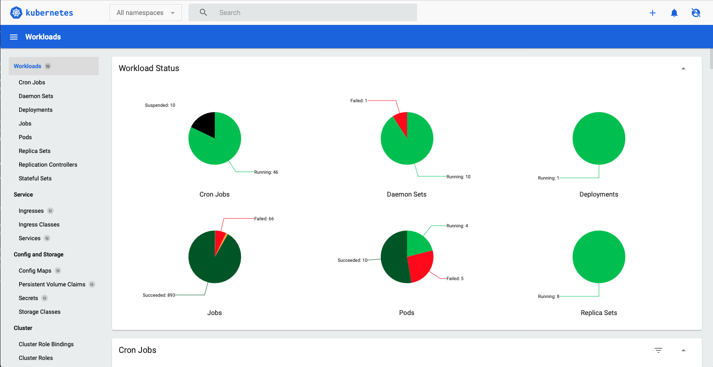

# **Kubernetes Dashboard**

:::warning
This dashboard has been deprecated and is no longer maintained on CATS in an effort to enhance deployment experience and introduce GitOps solution. Please look at [ArgoCD Dashboard](./DeploymentDashboard.md) for the preferred Deployment dashbord on CATS.
:::

The Kubernetes Dashboard provides users with a read-only interface to view and monitor the resources in the Kubernetes cluster. Users can review logs, inspect the status of workloads (like pods, services, and deployments), and track resource usage (CPU, memory, etc.). However, due to the read-only permissions, customers cannot make changes, deploy applications, or take any actions that affect the cluster from this site. This setup is ideal for gaining quick visibility into the system while maintaining strict control over operations.

Click **Skip** on the login page to proceed.

- [Kubernetes Dashboard : PRD](https://k8s-dashboard.apps.lrl.lilly.com/)

- [Kubernetes Dashboard : QA](https://k8s-dashboard.apps-q.lrl.lilly.com/)

- [Kubernetes Dashboard : DEV](https://k8s-dashboard.apps-d.lrl.lilly.com/) 

  

**Note:** This dashboard provides simmilar features to the Argo Deployment Dashboard. When using the argo dashboard there are additional features such as syncing your resources and overall enhanced visability into the state of your resources and how they map to eachother. [Check it out!](./DeploymentDashboard.md)