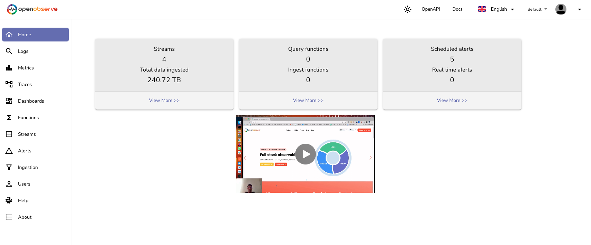

# Logging Dashboards

:::warning
In an effort to enhance our observability stack, the OpenObserve service has been deprecated and is no longer maintained on CATS. Please look at [Grafana](./Grafana.md) for the preferred logging dashboard on CATS.
:::

We offer two logging dashboard options for users: [**OpenObserve**](./OpenObserve.md) and [**Loki**](./Loki.md). OpenObserve is our legacy service, which has been in use for some time, providing robust log aggregation and visualization capabilities. However, we have recently deployed Loki, a more modern and efficient log management system optimized for Kubernetes environments. While OpenObserve indexes the entire log content for easy searching, Loki takes a more lightweight approach by indexing only metadata, such as labels, making it more cost-effective and scalable, especially for teams dealing with high volumes of logs. Both services are integrated into our observability stack, but users may prefer Loki for its streamlined performance and reduced operational overhead.

## Loki Dashboard

As there is no user interface for Loki, the only way to query Loki for logs is through Grafana. Please see the [Grafana](./Grafana.md) documentation for utilizing the tool.

## OpenObserve Dashboard

Access and analyze logs from your applications and infrastructure in one centralized dashboard, enhancing observability. Please head over to the [OpenObserve](./OpenObserve.md) page for details on how to use the dashboard.

- [OpenObserve Logging Dashboard - PRD ](https://logging.apps.lrl.lilly.com/web/)

- [OpenObserve Logging Dashboard - QA ](https://logging.apps-q.lrl.lilly.com/web/) 

- [OpenObserve Logging Dashboard - DEV ](https://logging.apps-d.lrl.lilly.com/web/)

  

