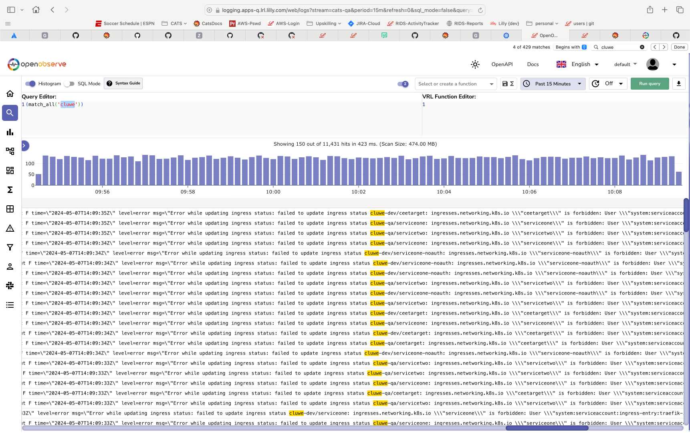

# OpenObserve

OpenObserve is the legacy log aggregation and visualization service available on our platform. It provides comprehensive logging capabilities, indexing entire log contents to allow detailed search queries across applications and systems. This tool helps users collect, monitor, and troubleshoot logs from various sources, ensuring operational visibility and aiding in debugging. While it remains fully supported, users looking for a more efficient, Kubernetes-optimized solution may consider transitioning to our newer logging service, [Loki](./Loki.md), which offers a lighter, more scalable approach to log management. However, OpenObserve continues to be a reliable choice for teams that prefer its detailed log indexing and robust querying features. See our [Logging Dashboards](./LoggingDashboard.md) page for more details on teh various approaches to logging. 

## Official Documentation

Please refer to the offical [OpenObserve Documentation](https://openobserve.ai/docs/) to better understand how to get the best results when using this service. 

## OpenObserve Dashboards

Access and analyze logs from your applications and infrastructure in one centralized dashboard, enhancing observability.

- [Logging Dashboard - PRD ](https://logging.apps.lrl.lilly.com/web/)

- [Logging Dashboard - QA ](https://logging.apps-q.lrl.lilly.com/web/) 

- [Logging Dashboard - DEV ](https://logging.apps-d.lrl.lilly.com/web/)

  

### How to Query in OpenObserve

See the official [OpenObserve Documentation](https://openobserve.ai/docs/user-guide/logs/log-search/) for full instructions on how to use this system service. 

You can use the following query to get started: `(match_all('key-word'))`

Example: 
<!-- Example of using Logging Dashboard loggingImage.png -->

