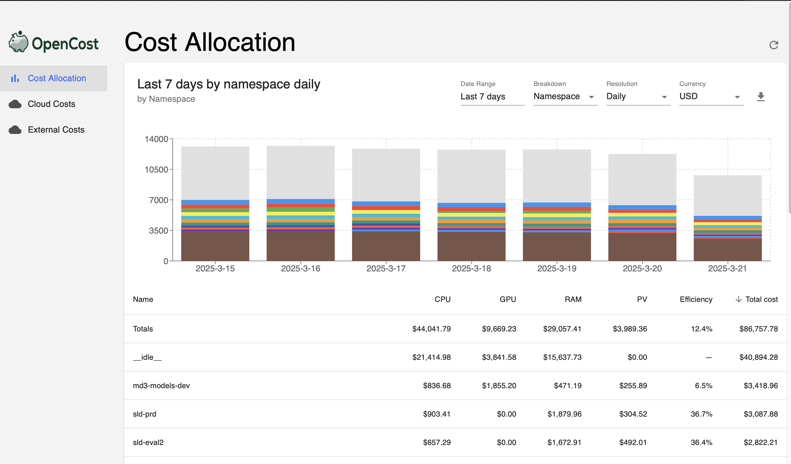
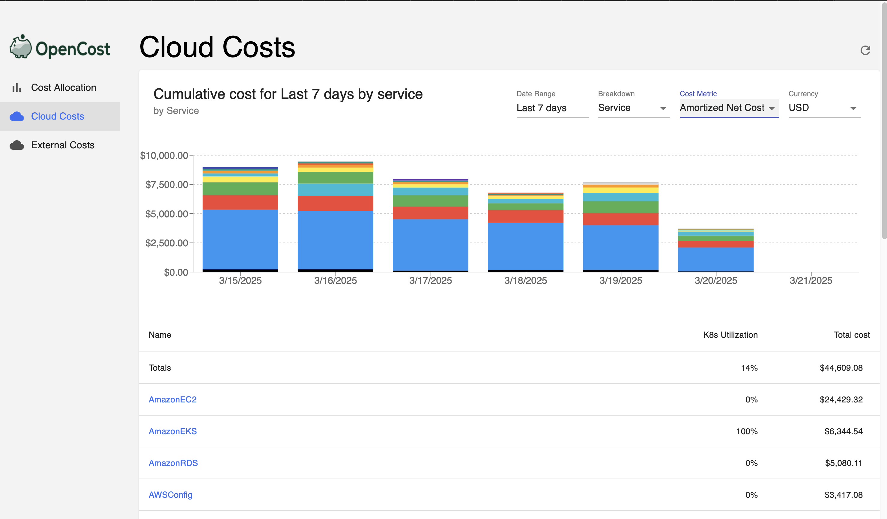

# Opencost : Cost Monitoring Dashboard

Opencost is a cost monitoring tool for workloads running in a Kubernetes cluster. It provides insights into workload spending in your project namespace, allowing you to track and optimize resource usage across your clusters. Whether you're managing costs for development, testing, or production environments, Opencost helps you understand where your resources are being allocated and how to make the most out of your budget. Opencost also provides cost data and metrics associated with cloud compute resources, giving you a more fine-grained breakdown of application cost running in the cloud.

### Cloud Cost Integration
This feature incorporates AWS Cost and Usage Report (CUR) data directly into the Opencost instances. By reconciling Opencost’s calculated metrics with AWS billing data, this integration significantly improves the accuracy of cost reporting. Additionally, it provides application teams with visibility into other AWS resources used within their applications that are not accounted for in the native Kubernetes resource allocation costs. This feature delivers a detailed and accurate cost breakdown for each application or cost center within the cluster.

 

## Navigating the Opencost Dashboard

The Opencost dashboard for each cluster can be accessed as follows:

- [Dev](https://opencost.dev.cats.lilly.com)
- [Qa](https://opencost.qa.cats.lilly.com)
- [Prod](https://opencost.cats.lilly.com)

The main dashboard displayed by Opencost on initial page load is the "**Cost Allocations**" dashboard. This dashboard provides a high-level cost showback of workload compute and storage resources across the cluster broken down by `Namespaces` by default. You can customize the date range, aggregation concept, resolution type, and currency via the dropdown panels at the top of the dashboard.

To understand more about the cloud cost spending of your resources, select the "**Cloud Costs**" dashboard from the left navigation bar. This dashboard provides a cost breakdown of cloud resources that have been integrated into the cluster to support different types of workloads and use cases.

:::note 
The AWS CUR data integration and ingestion process typically takes up to 48 hours to complete. If you want to view the reconciled cost for a specific day, come back to the dashboard two days after for more accurate cost breakdown.
:::

### Grafana dashboard for Cost Observability 
Due to several limitations of the default Opencost dashboard, we have integrated and customized some Grafana dashboards that provide a more detailed breakdown of your workload costs within the cluster. We highly recommend application teams to use Grafana as the preferred dashboarding solution for observing their project workload spending as we build out more robust and comprehensive cost observability dashboards as a platform service.

To access the different cost overview dashboards that we have imported on Grafana, you can check them out here:
- [Dev](https://metrics.apps-d.lrl.lilly.com/dashboards/f/fefnvrbucbtvkd/)
- [Qa](https://metrics.apps-q.lrl.lilly.com/dashboards/f/fefuifcjpnev4f/)
- [Prod](https://metrics.apps.lrl.lilly.com/dashboards/f/aefuj14rbxblsf/) 