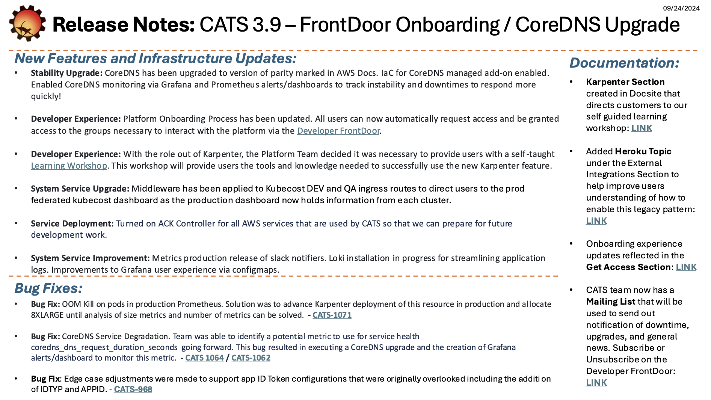
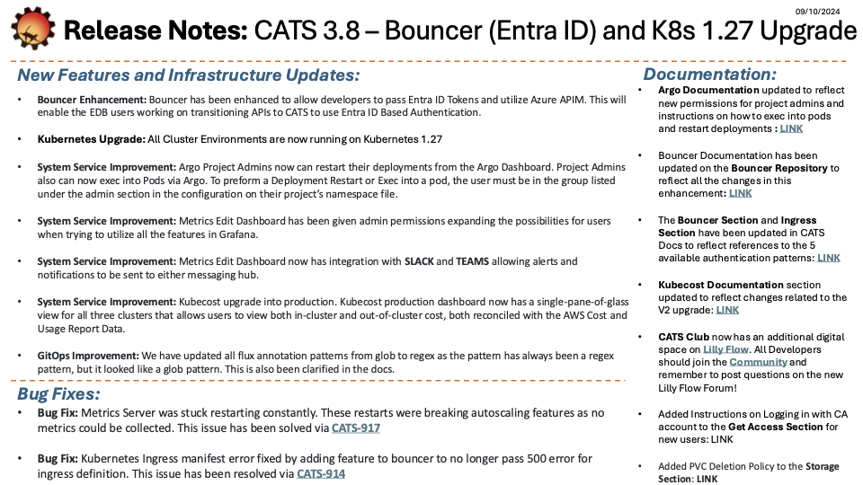
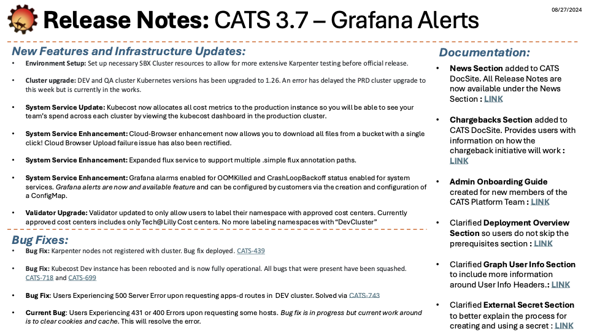
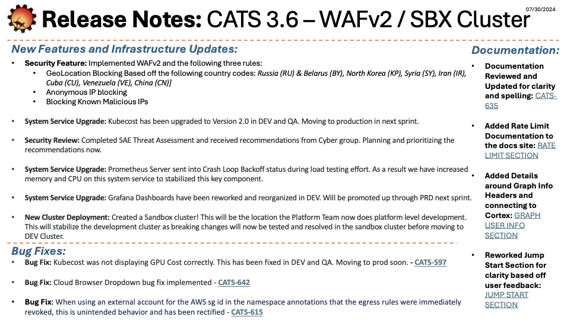
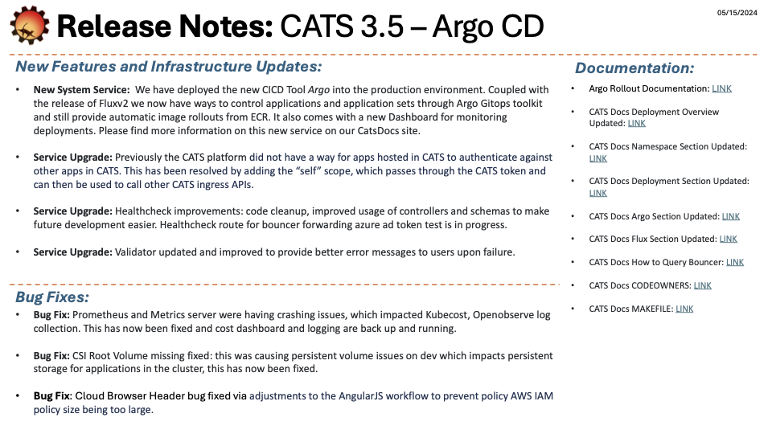
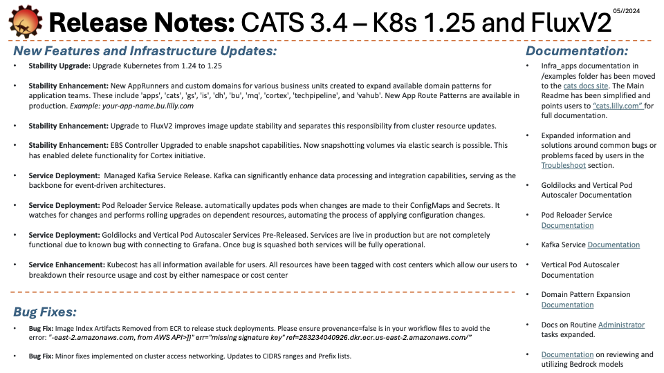
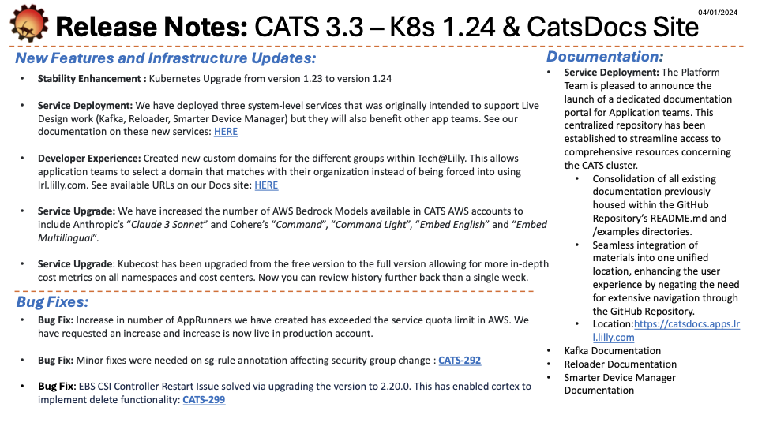
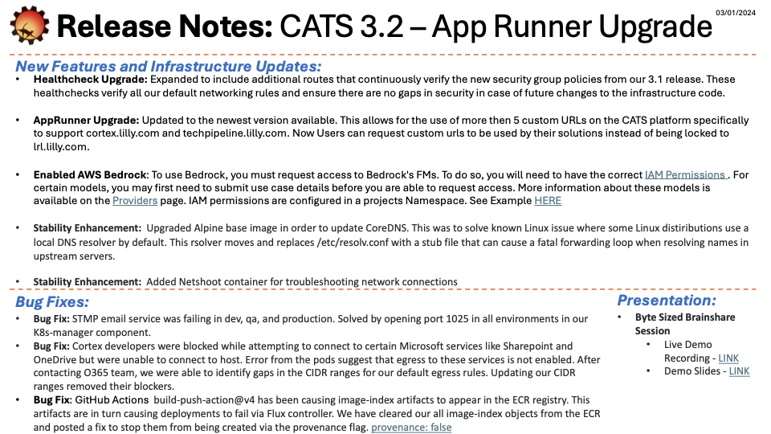
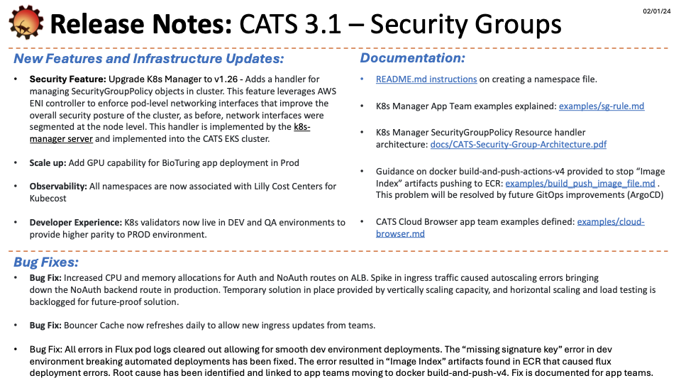

# Release Notes

Here you can find all of the release notes for the CATS Platform. This section will be updated with new notes once they are available.

Find our full collection of [Release notes in PDF format](https://github.com/EliLillyCo/LRL_light_k8s_infra_apps_docs/tree/main/storage) if you would like to follow our convienet links to documentation or JIRA Issues for more context. 

 

## CATS 3.11 - DocSite V2 and Stability Fixes

 

## CATS 3.10 - Stability Fixes and Obervability Enhancements

 

## CATS 3.9 - FrontDoor Onboarding and CoreDNS Upgrade

 

## CATS 3.8 - K8s 1.27 and Grafana Enhancement (Entra ID)

 

## CATS 3.7 - Grafana Alerts

 

## CATS 3.6 - WAFv2 / SBX Cluster

 

## CATS 3.5 - Argo CD

 

## CATS 3.4 - K8s 1.25 / Flux V2

 

## CATS 3.3 - K8s 1.24 / Cats DocSite

 

## CATS 3.2 - AppRunner Upgrade

 

## CATS 3.1 - Security Groups

