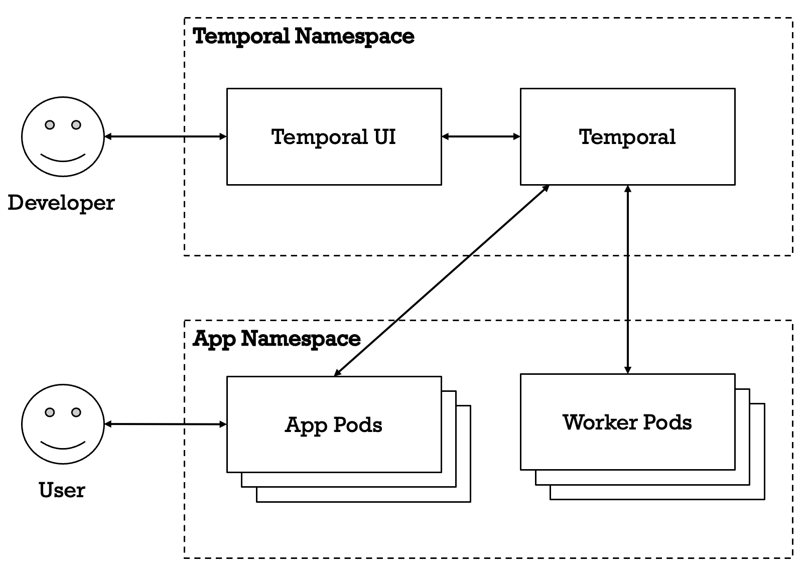

<!-- import Badges from '@site/src/components/forms/buildingBlocks/Badges.tsx' # This is a custom LillyKubed implementation --> 

# Temporal

<!-- <Badges frontmatter={frontMatter}  /> # This is a custom LillyKubed implementation -->

- [DEV Cluster Temporal UI](http://temporal.dev.cats.lilly.com)
- [QA Cluster Temporal UI](http://temporal.qa.cats.lilly.com)
- [PROD Cluster Temporal UI](http://temporal.cats.lilly.com)

## Overview

[Temporal](https://temporal.io/) provides a way for applications to durably run background jobs including:

- Event-driven workflows
- SAGA and distributed transactions
- State machines
- Batch processing
- Scheduled jobs and cron
- Some situations where you might want to use a queue. The Temporal scheduler queues jobs internally for you and helps with error handling. Temporal allows you to setup multiple queues to control workflow exeuction.

Temporal calls background jobs "workflows" and each workflow is consists of one or more "activities".
Temporal's SDK allows you to write your workflows and activities in one several popular programming languages.
Once you have created your workflows you can trigger them from your applcation using the SDK or create scheduled workflows.

Temporal's durable execution engine provides several benefits over traditional background jobs:

- Temporal keeps track of workflow execution state which allows you to easily monitor them through the UI and API.
- Temporal will automatically retry failed jobs based on your configured policies.
- Your application can query and send events to running workflows.
  This feature allows you to implement event driven applications and state machines, including ones that include manual steps.
- Workflows can sleep for short or long periods of time without taking up compute resources.

:::warning
The inputs and outputs from your workflow's activities will be captured in Temporal's database and archive (if archival is enabled).
Please keep this in mind when doing CI and PI assessments for your application.
:::

## Architecture

The CATS clusters host Temporal and its UI and make it available as a service to CATS projects.
Temporal's multi-tenancy featurs are used to provide separation between projects.

Applications using Temporal will need to run one or more worker pods which contain the application's workflow and activity code.
At first glance, requiring app developers to host their own worker pods can seem like a major downside to Temporal.
However, this setup provides the app developers the most control over scaling their application.
Temporal also allows applications to create multiple worker pools, which can be used for workflow prioritization or separating workflows that require a special resource, like a GPU.
Code sharing between the application and workflows is also easier in this setup than some alternative products.

## Alternatives

Several other high quality workflow execution engines exist, each with their own set of tradeoffs.
Here are the main tradeoffs for some popular options.

- Apache Airflow
  - Provides a nice high level UI for viewing the status of all workflows
  - Provides nice calendar view for workflows
  - Does not support multi-tenancy
  - Airflow workflows must be written in Python
  - Workflow code must be present in the Airflow containers, which can make setting up CI/CD difficult
- AWS Step Functions
  - Can scale to zero
  - Workflows are written in JSON/YAML DSL which provides less features than a full programming language
  - Lambdas have a 15 minute time limit
  - Poor integration with CATS
  - Monitoring UI can be rough

## Support

You can request Temporal support through the [CATS ServiceNow Request](https://lilly.service-now.com/ec?id=sc_cat_item&table=sc_cat_item&sys_id=e022ac201b62ad10827fff39cc4bcbf8&searchTerm=CATS%20-%20Report%20an%20issue) in the ServiceNow catalog.
Please provide the following information in your ticket.
Tickets without sufficent detail may be moved down the queue.

- In the description please include that you are having issues with "Temporal in CATS".
- The name of your project folder in Lilly-Kubed-Apps.
- The name of the environment you are having issues in or have questions about. 
- If you are facing an issue, please include details about the issue and how you identified it.
- Please be aware that EDAT is not familiar with the details of your project. We are likely not familiar with any area specific terminology or acronyms.

### Support Scope

Within Scope:

- Issues with application onboarding.
- Answering questions about Temporal concepts.
- Help solving issues where detailed debugging information is provided.

Out of Scope:

- Fixing issues with application code.
- Adding or removing users from an application AD group.

### Incidents

Incidents with the Temporal service can be filed using the [CATS ServiceNow Request](https://lilly.service-now.com/ec?id=sc_cat_item&table=sc_cat_item&sys_id=e022ac201b62ad10827fff39cc4bcbf8&searchTerm=CATS%20-%20Report%20an%20issue).

The following criteria are used for determining incident priority:

- P1: N/A
- P2: Temporal platform is down or unavailable to multiple applications
- P3
  - Onboarding issues
  - Access issues for a newly onboarded app
  - User access issues
- P4: N/A
- P5: N/A