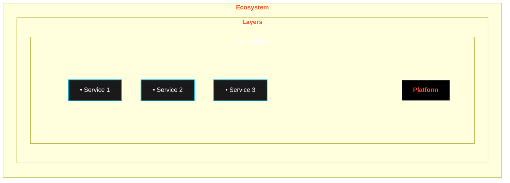
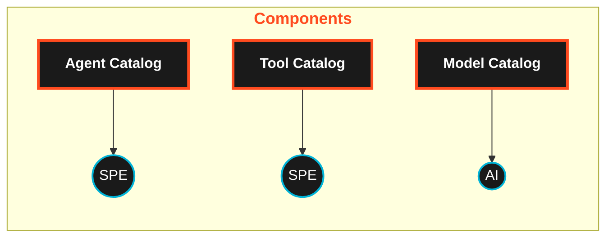
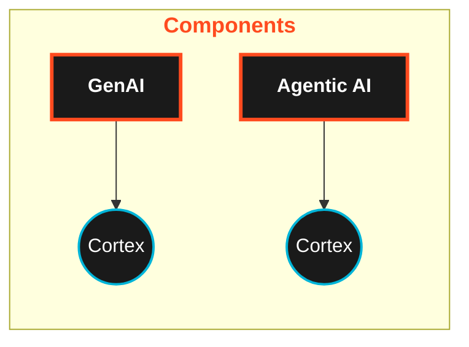
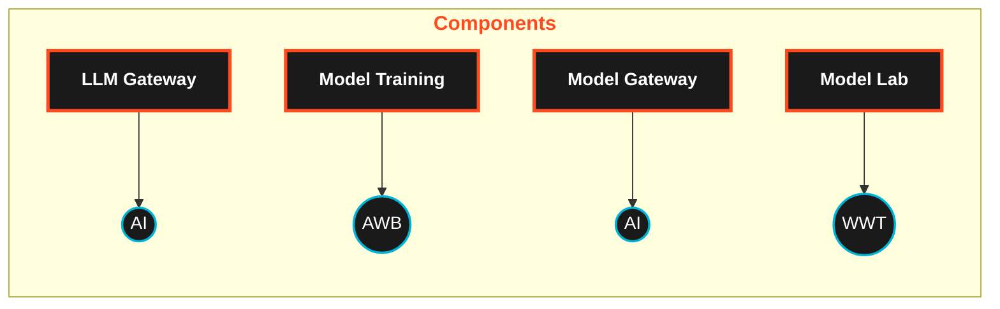
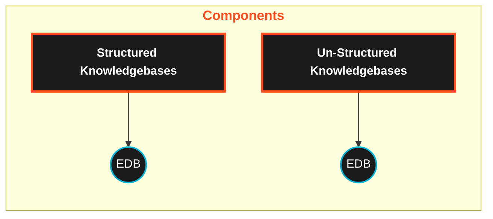
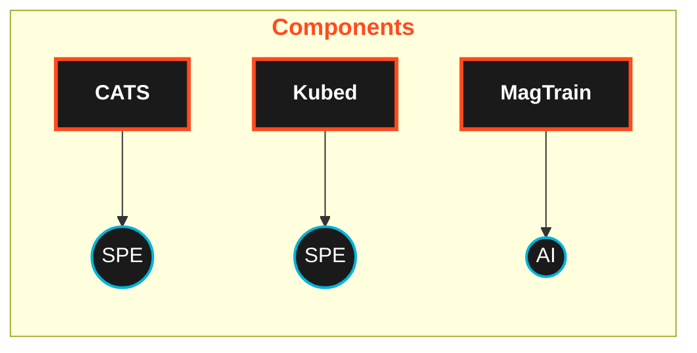
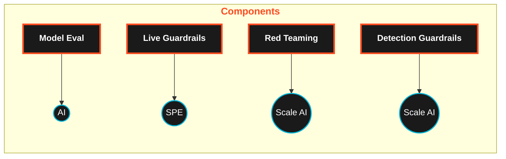

# EcoSystems

## Overview

The AI Architecture Ecosystem is the primary tool for making AI technology decisions at Lilly. It defines the layers (the stack), capabilities, and platforms that are approved for use.

The ecosystem, and supporting documentation, is created and maintained by ML/AI experts. The framework represents a comprehensive reconciliation of existing Lilly AI services, external AI benchmarking, and emerging AI technologies appropriate for applying in the pharmaceutical industry. As new capabilities and features are identified, the framework is updated accordingly.

# AI Architecture Layers

## Experience Layer
### Definition
Consistent human interfaces for bringing AI-enabled products to meet users and customers where they are. This layer focuses on creating intuitive and accessible user interfaces that deliver AI capabilities to end users in a seamless manner.
### Components

## AI Layer
### Definition
Re-usable capabilities merging deterministic and probabilistic AI approaches; accessible to local engineers. This layer provides modular AI components that combine rule-based (deterministic) and statistical (probabilistic) methods that can be leveraged by developers within the organization.
### Components

## Model Layer
### Definition
Leading commercial and strategic capabilities for probabilistic approaches, providing common controls, MLOps, and LLMOps features, underpinning AI-enabled products; reserved for domain experts. This layer manages the lifecycle of machine learning and large language models with specialized tools and governance for expert users.
### Components

## Data Layer
### Definition
AI-enabled and enabling capabilities, such as data products, vector databases, semantic layers, and synthetic data. This layer provides the structured and unstructured data resources necessary for AI systems, including specialized storage and processing technologies optimized for AI workloads.
### Components

## Infrastructure Layer
### Definition
Scalable, secure compute, storage, and orchestration foundations for regulated pharma environments. This layer provides the underlying technical resources and management systems that support AI operations while meeting industry-specific compliance requirements.
### Components

## Responsible AI Layer
### Definition
Guardrails that test, monitor, and document models and data to ensure ethical, regulatory, and security standards. This layer implements controls and oversight mechanisms to ensure AI systems operate within appropriate boundaries and comply with relevant policies and regulations.
### Components

