# Agentic Patterns

## Agent Pattern Frameworks: Strategic Overview

Agent patterns represent architectural approaches to AI problem-solving, each with distinct strengths for specific use cases. These patterns form a spectrum from simple single-agent systems to complex multi-agent collaborations, providing solutions for various complexity levels and task types.

### Foundation Patterns
Single Agent, ReAct, and Plan-and-Execute patterns form the foundation, handling tasks ranging from straightforward conversational assistance to complex multi-step problems requiring systematic reasoning and structured execution.

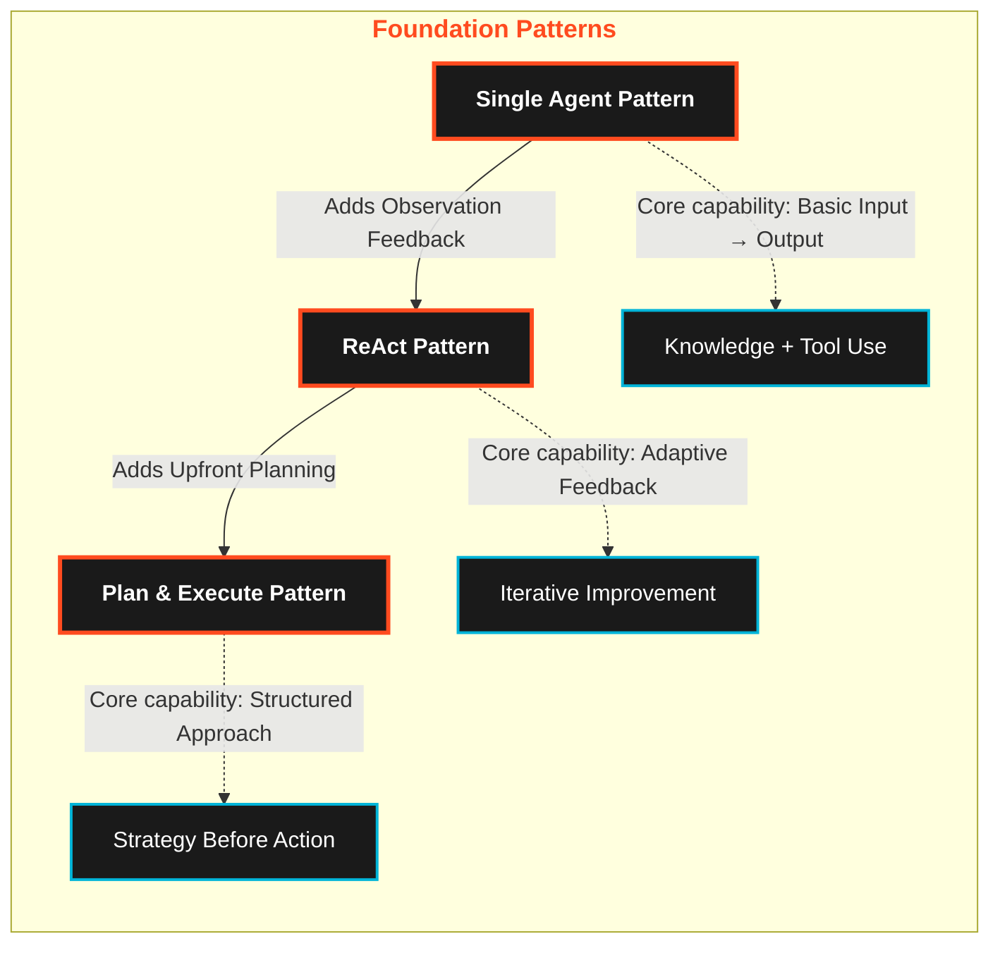
```mermaid
graph LR
    classDef default fill:#2d2d2d,stroke:#ff4b1f,color:white,stroke-width:2px
    classDef mainNode fill:#1a1a1a,stroke:#ff4b1f,color:white,stroke-width:3px
    classDef capability fill:#1a1a1a,stroke:#00b4d8,color:white,stroke-width:2px

    subgraph FoundationPatterns["<font size='+1' color='#ff4b1f'><b>Foundation Patterns</b></font>"]
        direction TB
        
        SingleAgent["<b>Single Agent Pattern</b>"] -->|Adds Observation Feedback| ReAct["<b>ReAct Pattern</b>"]
        ReAct -->|Adds Upfront Planning| PlanExecute["<b>Plan & Execute Pattern</b>"]
        
        SingleAgent -.->|"Core capability: Basic Input → Output"| Basic["Knowledge + Tool Use"]
        ReAct -.->|"Core capability: Adaptive Feedback"| Adaptive["Iterative Improvement"]
        PlanExecute -.->|"Core capability: Structured Approach"| Planning["Strategy Before Action"]
    end
    
    class SingleAgent,ReAct,PlanExecute mainNode
    class Basic,Adaptive,Planning capability
```

### Advanced Cognitive Patterns
Self-Critique, Tree of Thought, and Graph of Thought patterns enhance reasoning quality through metacognitive evaluation, path exploration, and complex concept mapping, particularly valuable for quality-critical tasks and complex problem spaces.

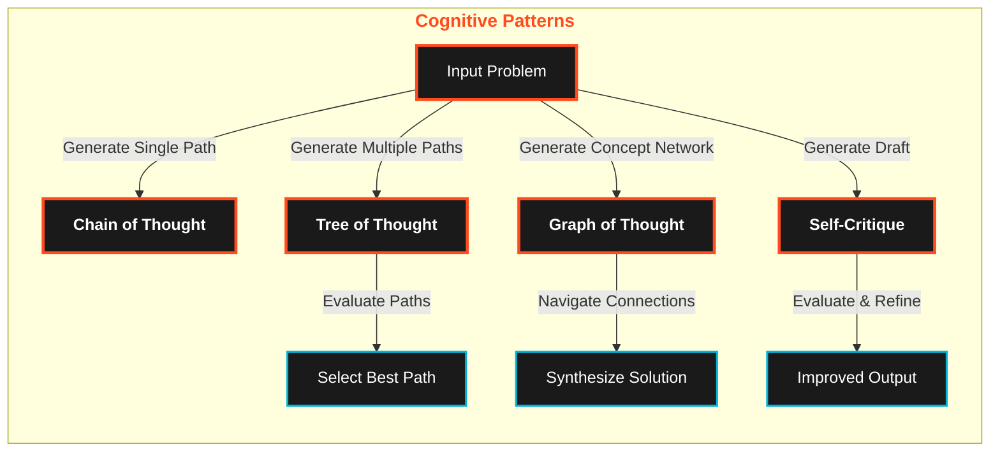
```mermaid
graph LR
    classDef default fill:#2d2d2d,stroke:#ff4b1f,color:white,stroke-width:2px
    classDef mainNode fill:#1a1a1a,stroke:#ff4b1f,color:white,stroke-width:3px
    classDef output fill:#1a1a1a,stroke:#00b4d8,color:white,stroke-width:2px

    subgraph CognitivePatterns["<font size='+1' color='#ff4b1f'><b>Cognitive Patterns</b></font>"]
        direction TB
        
        Root["Input Problem"] -->|"Generate Single Path"| COT["<b>Chain of Thought</b>"]
        
        Root -->|"Generate Multiple Paths"| TOT["<b>Tree of Thought</b>"]
        TOT -->|"Evaluate Paths"| SelectPath["Select Best Path"]
        
        Root -->|"Generate Concept Network"| GOT["<b>Graph of Thought</b>"]
        GOT -->|"Navigate Connections"| Synthesize["Synthesize Solution"]
        
        Root -->|"Generate Draft"| SC["<b>Self-Critique</b>"]
        SC -->|"Evaluate & Refine"| Improve["Improved Output"]
        
    end
    
    class Root mainNode
    class COT,TOT,GOT,SC mainNode
    class SelectPath,Synthesize,Improve output
```

### Collaboration Patterns
Supervisor-Worker, Peer Network, Parallel Collaboration, and System-to-System patterns enable multi-agent cooperation with different coordination models—from hierarchical oversight to decentralized peer networks and external system integration.

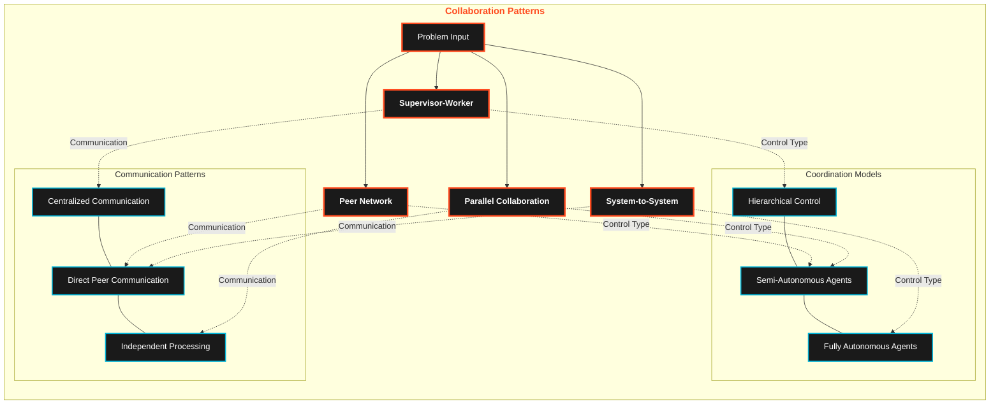
```mermaid
graph LR
    classDef default fill:#2d2d2d,stroke:#ff4b1f,color:white,stroke-width:2px
    classDef mainNode fill:#1a1a1a,stroke:#ff4b1f,color:white,stroke-width:3px
    classDef taxonomyNode fill:#1a1a1a,stroke:#00b4d8,color:white,stroke-width:2px

    subgraph CollaborationPatterns["<font size='+1' color='#ff4b1f'><b>Collaboration Patterns</b></font>"]
        direction TB
        
        Input["Problem Input"] --> SW["<b>Supervisor-Worker</b>"]
        Input --> PN["<b>Peer Network</b>"]
        Input --> PC["<b>Parallel Collaboration</b>"]
        Input --> S2S["<b>System-to-System</b>"]
        
        subgraph Taxonomy ["Coordination Models"]
            direction TB
            Hierarchical["Hierarchical Control"] --- SemiAuto["Semi-Autonomous Agents"] --- FullAuto["Fully Autonomous Agents"]
        end
        
        SW -.->|"Control Type"| Hierarchical
        PN -.->|"Control Type"| SemiAuto
        PC -.->|"Control Type"| SemiAuto
        S2S -.->|"Control Type"| FullAuto
        
        subgraph Communication ["Communication Patterns"]
            direction TB
            Centralized["Centralized Communication"] --- Direct["Direct Peer Communication"] --- Independent["Independent Processing"]
        end
        
        SW -.->|"Communication"| Centralized
        PN -.->|"Communication"| Direct
        PC -.->|"Communication"| Independent
        S2S -.->|"Communication"| Direct
    end
    
    class Input mainNode
    class SW,PN,PC,S2S mainNode
    class Hierarchical,SemiAuto,FullAuto,Centralized,Direct,Independent taxonomyNode
```

### Memory Architecture
Effective agents require complementary memory systems: Working Memory for session context, Episodic Memory for conversation history, Semantic Memory for persistent facts, Long-Term Memory for archived information, and Procedural Memory for learned strategies.

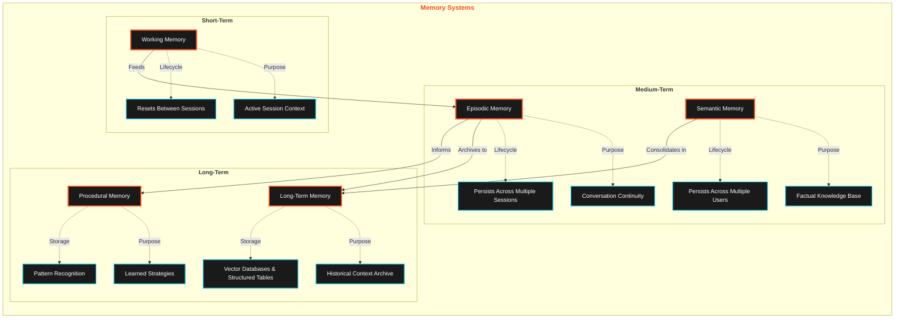
```mermaid
graph LR
    classDef default fill:#2d2d2d,stroke:#ff4b1f,color:white,stroke-width:2px
    classDef mainNode fill:#1a1a1a,stroke:#ff4b1f,color:white,stroke-width:3px
    classDef memoryPurpose fill:#1a1a1a,stroke:#00b4d8,color:white,stroke-width:2px

    subgraph MemoryTypes["<font size='+1' color='#ff4b1f'><b>Memory Systems</b></font>"]
        direction TB
        
        subgraph ShortTerm["<b>Short-Term</b>"]
            Working["Working Memory"]
            Working -.->|"Purpose"| ActiveContext["Active Session Context"]
            Working -.->|"Lifecycle"| Reset["Resets Between Sessions"]
        end
        
        subgraph MediumTerm["<b>Medium-Term</b>"]
            Episodic["Episodic Memory"]
            Semantic["Semantic Memory"]
            
            Episodic -.->|"Purpose"| ConvHistory["Conversation Continuity"]
            Semantic -.->|"Purpose"| FactBase["Factual Knowledge Base"]
            
            Episodic -.->|"Lifecycle"| Persistent1["Persists Across Multiple Sessions"]
            Semantic -.->|"Lifecycle"| Persistent2["Persists Across Multiple Users"]
        end
        
        subgraph LongTerm["<b>Long-Term</b>"]
            LTM["Long-Term Memory"]
            Procedural["Procedural Memory"]
            
            LTM -.->|"Purpose"| Archive["Historical Context Archive"]
            Procedural -.->|"Purpose"| Strategies["Learned Strategies"]
            
            LTM -.->|"Storage"| VectorDB["Vector Databases & Structured Tables"]
            Procedural -.->|"Storage"| Patterns["Pattern Recognition"]
        end
        
        Working -->|"Feeds"| Episodic
        Episodic -->|"Archives to"| LTM
        Semantic -->|"Consolidates in"| LTM
        Episodic -->|"Informs"| Procedural
    end
    
    class Working,Episodic,Semantic,LTM,Procedural mainNode
    class ActiveContext,ConvHistory,FactBase,Archive,Strategies,Reset,Persistent1,Persistent2,VectorDB,Patterns memoryPurpose
```

### Evaluation Framework
Comprehensive assessment requires multi-dimensional evaluation across tool usage, planning quality, core skills, memory effectiveness, self-reflection capabilities, system performance, safety constraints, and behavioral consistency.

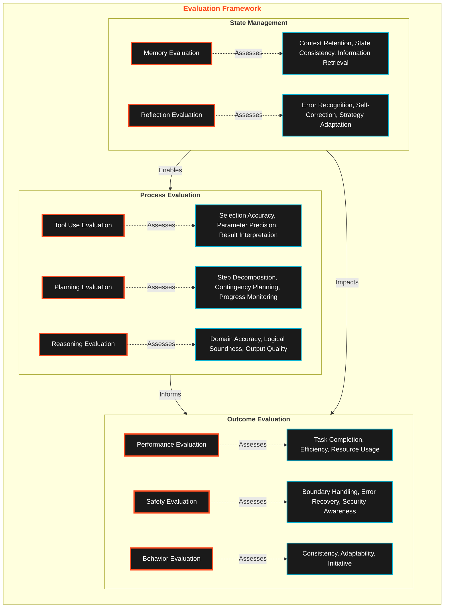
```mermaid
graph LR
    classDef default fill:#2d2d2d,stroke:#ff4b1f,color:white,stroke-width:2px
    classDef mainNode fill:#1a1a1a,stroke:#ff4b1f,color:white,stroke-width:3px
    classDef metricsNode fill:#1a1a1a,stroke:#00b4d8,color:white,stroke-width:2px

    subgraph EvaluationFramework["<font size='+1' color='#ff4b1f'><b>Evaluation Framework</b></font>"]
        direction TB
        
        subgraph ProcessDimensions["<b>Process Evaluation</b>"]
            ToolUse["Tool Use Evaluation"]
            Planning["Planning Evaluation"]
            Reasoning["Reasoning Evaluation"]
            
            ToolUse -.->|"Assesses"| ToolMetrics["Selection Accuracy, Parameter Precision, Result Interpretation"]
            Planning -.->|"Assesses"| PlanMetrics["Step Decomposition, Contingency Planning, Progress Monitoring"]
            Reasoning -.->|"Assesses"| ReasonMetrics["Domain Accuracy, Logical Soundness, Output Quality"]
        end
        
        subgraph StateDimensions["<b>State Management</b>"]
            Memory["Memory Evaluation"]
            Reflection["Reflection Evaluation"]
            
            Memory -.->|"Assesses"| MemMetrics["Context Retention, State Consistency, Information Retrieval"]
            Reflection -.->|"Assesses"| ReflectMetrics["Error Recognition, Self-Correction, Strategy Adaptation"]
        end
        
        subgraph OutcomeDimensions["<b>Outcome Evaluation</b>"]
            Performance["Performance Evaluation"]
            Safety["Safety Evaluation"] 
            Behavior["Behavior Evaluation"]
            
            Performance -.->|"Assesses"| PerfMetrics["Task Completion, Efficiency, Resource Usage"]
            Safety -.->|"Assesses"| SafetyMetrics["Boundary Handling, Error Recovery, Security Awareness"]
            Behavior -.->|"Assesses"| BehaviorMetrics["Consistency, Adaptability, Initiative"]
        end
        
        ProcessDimensions -->|"Informs"| OutcomeDimensions
        StateDimensions -->|"Enables"| ProcessDimensions
        StateDimensions -->|"Impacts"| OutcomeDimensions
    end
    
    class ToolUse,Planning,Reasoning,Memory,Reflection,Performance,Safety,Behavior mainNode
    class ToolMetrics,PlanMetrics,ReasonMetrics,MemMetrics,ReflectMetrics,PerfMetrics,SafetyMetrics,BehaviorMetrics metricsNode
```

### Pattern Integration
The most powerful agent systems often combine multiple patterns, memory types, and evaluation approaches to create specialized solutions for complex tasks. Understanding these building blocks enables architects to design systems that leverage the strengths of each pattern while addressing their individual limitations.

### Comprehensive Agent Patterns Ecosystem
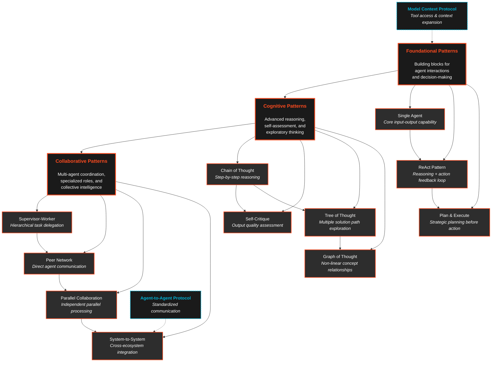
```mermaid
graph TD
    classDef default fill:#2d2d2d,stroke:#ff4b1f,color:white,stroke-width:2px
    classDef mainNode fill:#1a1a1a,stroke:#ff4b1f,color:white,stroke-width:3px
    classDef protocolNode fill:#1a1a1a,stroke:#00b4d8,color:white,stroke-width:2px,stroke-dasharray: 5 2
    
    FP[<font size='+1' color='#ff4b1f'><b>Foundational Patterns</b></font><br><br>Building blocks for<br>agent interactions<br>and decision-making]
    
    CP[<font size='+1' color='#ff4b1f'><b>Cognitive Patterns</b></font><br><br>Advanced reasoning,<br>self-assessment, and<br>exploratory thinking]
    
    CL[<font size='+1' color='#ff4b1f'><b>Collaborative Patterns</b></font><br><br>Multi-agent coordination,<br>specialized roles, and<br>collective intelligence]
    
    %% Foundation Pattern nodes
    SA[Single Agent<br><i>Core input-output capability</i>]
    RP[ReAct Pattern<br><i>Reasoning + action feedback loop</i>]
    PE[Plan & Execute<br><i>Strategic planning before action</i>]
    
    %% Cognitive Pattern nodes
    COT[Chain of Thought<br><i>Step-by-step reasoning</i>]
    SC[Self-Critique<br><i>Output quality assessment</i>]
    TOT[Tree of Thought<br><i>Multiple solution path exploration</i>]
    GOT[Graph of Thought<br><i>Non-linear concept relationships</i>]
    
    %% Collaborative Pattern nodes
    SW[Supervisor-Worker<br><i>Hierarchical task delegation</i>]
    PN[Peer Network<br><i>Direct agent communication</i>]
    PC[Parallel Collaboration<br><i>Independent parallel processing</i>]
    S2S[System-to-System<br><i>Cross-ecosystem integration</i>]
    
    %% Protocol nodes
    MCP[<font color='#00b4d8'><b>Model Context Protocol</b></font><br><i>Tool access & context expansion</i>]
    A2A[<font color='#00b4d8'><b>Agent-to-Agent Protocol</b></font><br><i>Standardized communication</i>]
    
    %% Main category relationships
    FP --> CP
    CP --> CL
    
    %% Foundation Pattern relationships
    FP --> SA
    FP --> RP
    FP --> PE
    SA --> RP
    RP --> PE
    
    %% Cognitive Pattern relationships
    CP --> COT
    CP --> SC
    CP --> TOT
    CP --> GOT
    COT --> SC
    COT --> TOT
    TOT --> GOT
    
    %% Collaborative Pattern relationships
    CL --> SW
    CL --> PN
    CL --> PC
    CL --> S2S
    SW --> PN
    PN --> PC
    PC --> S2S
    
    %% Protocol relationships
    MCP -.-> FP
    A2A -.-> S2S
    
    %% Apply styling
    class FP,CP,CL mainNode
    class MCP,A2A protocolNode
```

# Patterns
## Single Agent
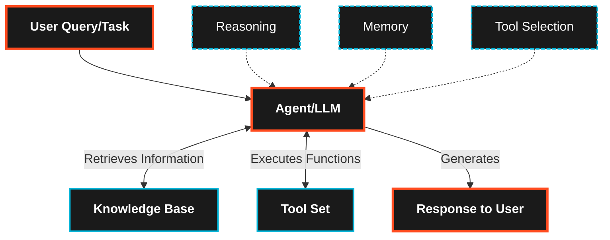
```mermaid
graph TD
    classDef default fill:#2d2d2d,stroke:#ff4b1f,color:white,stroke-width:2px
    classDef mainNode fill:#1a1a1a,stroke:#ff4b1f,color:white,stroke-width:3px
    classDef resourceNode fill:#1a1a1a,stroke:#00b4d8,color:white,stroke-width:2px
    classDef componentNode fill:#1a1a1a,stroke:#00b4d8,color:white,stroke-width:2px,stroke-dasharray: 5 2
    
    %% Main agent workflow
    Input[<b>User Query/Task</b>] --> Agent[<b>Agent/LLM</b>]
    
    %% Knowledge and tool connections - bidirectional
    Agent <-->|Retrieves Information| KB[<b>Knowledge Base</b>]
    Agent <-->|Executes Functions| Tools[<b>Tool Set</b>]
    
    %% Processing and output
    Agent -->|Generates| Response[<b>Response to User</b>]
    
    %% Components that influence different stages
    Reasoning[Reasoning] -.-> Agent
    Memory[Memory] -.-> Agent
    ToolSelection[Tool Selection] -.-> Agent
    
    class Input,Agent,Response mainNode
    class KB,Tools resourceNode
    class Reasoning,Memory,ToolSelection componentNode
```

- **Function**: Agent processes user input, retrieves information from knowledge sources when needed, and executes tools to perform actions beyond text generation
- **When to Use**: Foundational pattern for most agent applications; suitable for general task handling where a single agent can process inputs and generate appropriate outputs
- **Key Advantage**: Provides a complete input-to-output workflow with both informational and functional capabilities in a simple, extensible architecture
- **Best For**: Conversational assistants, task automation, knowledge work, and any application where an intelligent agent needs to both access information and take actions

## Supervisor-Worker Agent
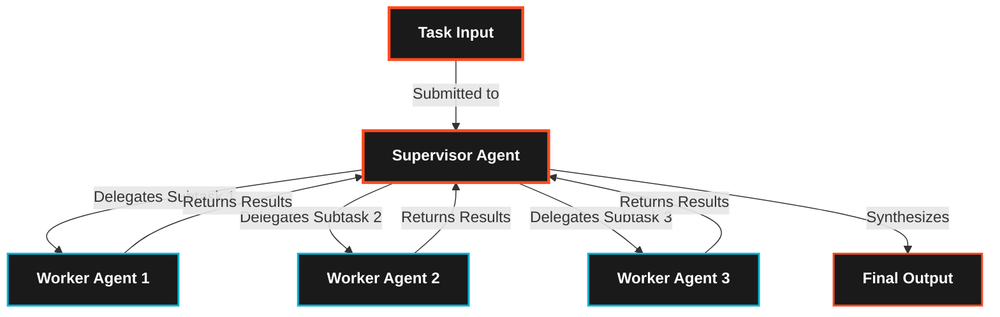
```mermaid
graph TD
    classDef default fill:#2d2d2d,stroke:#ff4b1f,color:white,stroke-width:2px
    classDef mainNode fill:#1a1a1a,stroke:#ff4b1f,color:white,stroke-width:3px
    classDef supervisorNode fill:#1a1a1a,stroke:#ff4b1f,color:white,stroke-width:3px
    classDef workerNode fill:#1a1a1a,stroke:#00b4d8,color:white,stroke-width:2px
    classDef outputNode fill:#1a1a1a,stroke:#ff4b1f,color:white,stroke-width:2px
    
    Input[<b>Task Input</b>] -->|Submitted to| Supervisor[<b>Supervisor Agent</b>]
    
    Supervisor -->|Delegates Subtask 1| Worker1[<b>Worker Agent 1</b>]
    Supervisor -->|Delegates Subtask 2| Worker2[<b>Worker Agent 2</b>]
    Supervisor -->|Delegates Subtask 3| Worker3[<b>Worker Agent 3</b>]
    
    Worker1 -->|Returns Results| Supervisor
    Worker2 -->|Returns Results| Supervisor
    Worker3 -->|Returns Results| Supervisor
    
    Supervisor -->|Synthesizes| Output[<b>Final Output</b>]
    
    class Input mainNode
    class Supervisor supervisorNode
    class Worker1,Worker2,Worker3 workerNode
    class Output outputNode
```

- **Function**: Supervisor breaks down tasks, workers complete specialized subtasks, supervisor synthesizes results
- **When to Use**: Complex problems requiring specialized expertise, parallel processing, or multiple perspectives
- **Key Advantage**: Hierarchical oversight enables quality control and resolution of conflicting outputs
- **Best For**: Content creation, research synthesis, strategic analysis, and creative problem solving

## ReAct (Reasoning and Action) 
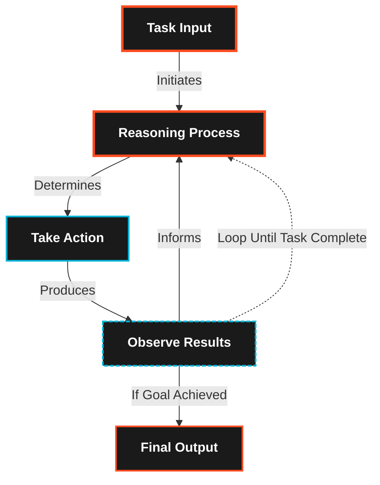
```mermaid
graph TD
    classDef default fill:#2d2d2d,stroke:#ff4b1f,color:white,stroke-width:2px
    classDef mainNode fill:#1a1a1a,stroke:#ff4b1f,color:white,stroke-width:3px
    classDef thoughtNode fill:#1a1a1a,stroke:#ff4b1f,color:white,stroke-width:3px
    classDef actionNode fill:#1a1a1a,stroke:#00b4d8,color:white,stroke-width:2px
    classDef observationNode fill:#1a1a1a,stroke:#00b4d8,color:white,stroke-width:2px,stroke-dasharray: 5 2
    classDef outputNode fill:#1a1a1a,stroke:#ff4b1f,color:white,stroke-width:2px
    
    Input[<b>Task Input</b>] -->|Initiates| Thought[<b>Reasoning Process</b>]
    Thought -->|Determines| Action[<b>Take Action</b>]
    Action -->|Produces| Observation[<b>Observe Results</b>]
    Observation -->|Informs| Thought
    
    Observation -->|If Goal Achieved| Output[<b>Final Output</b>]
    
    %% Loop visualization
    Observation -.->|Loop Until Task Complete| Thought
    
    class Input mainNode
    class Thought thoughtNode
    class Action actionNode
    class Observation observationNode
    class Output outputNode
```

- **Function**: Agent thinks, acts, observes results, then thinks again in continuous loop until goal is achieved
- **When to Use**: Tasks requiring systematic reasoning, tool use, and ability to adapt based on feedback
- **Key Advantage**: Creates transparent decision trail while enabling course correction from observations
- **Best For**: Information retrieval, multi-step problem solving, data analysis, and systematic troubleshooting

## Plan and Execute
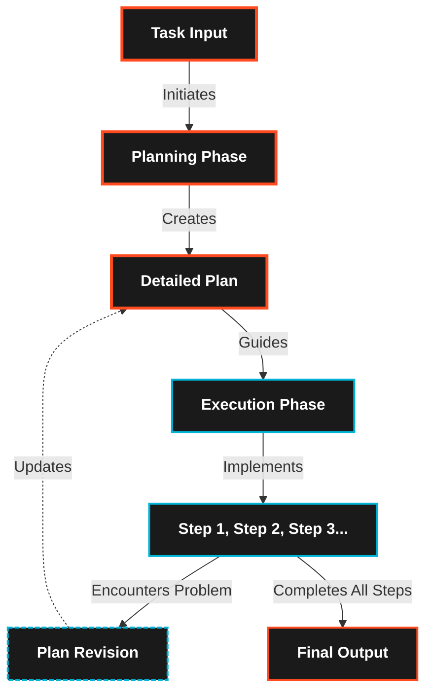
```mermaid
graph TD
    classDef default fill:#2d2d2d,stroke:#ff4b1f,color:white,stroke-width:2px
    classDef mainNode fill:#1a1a1a,stroke:#ff4b1f,color:white,stroke-width:3px
    classDef planningNode fill:#1a1a1a,stroke:#ff4b1f,color:white,stroke-width:3px
    classDef executionNode fill:#1a1a1a,stroke:#00b4d8,color:white,stroke-width:2px
    classDef reviseNode fill:#1a1a1a,stroke:#00b4d8,color:white,stroke-width:2px,stroke-dasharray: 5 2
    classDef outputNode fill:#1a1a1a,stroke:#ff4b1f,color:white,stroke-width:2px
    
    Input[<b>Task Input</b>] -->|Initiates| Planning[<b>Planning Phase</b>]
    Planning -->|Creates| Plan[<b>Detailed Plan</b>]
    
    Plan -->|Guides| Execution[<b>Execution Phase</b>]
    Execution -->|Implements| Steps[<b>Step 1, Step 2, Step 3...</b>]
    
    Steps -->|Encounters Problem| Revise[<b>Plan Revision</b>]
    Revise -.->|Updates| Plan
    
    Steps -->|Completes All Steps| Output[<b>Final Output</b>]
    
    class Input mainNode
    class Planning,Plan planningNode
    class Execution,Steps executionNode
    class Revise reviseNode
    class Output outputNode
```

- **Function**: First creates comprehensive plan with steps and contingencies, then systematically executes while monitoring progress
- **When to Use**: Complex tasks with clear structure, predictable workflows, or situations where thorough planning reduces risks
- **Key Advantage**: Separates strategic thinking from tactical execution, enabling careful consideration before commitment to action
- **Best For**: Software development, project management, complex workflows, document creation, and process automation

## Self Critique
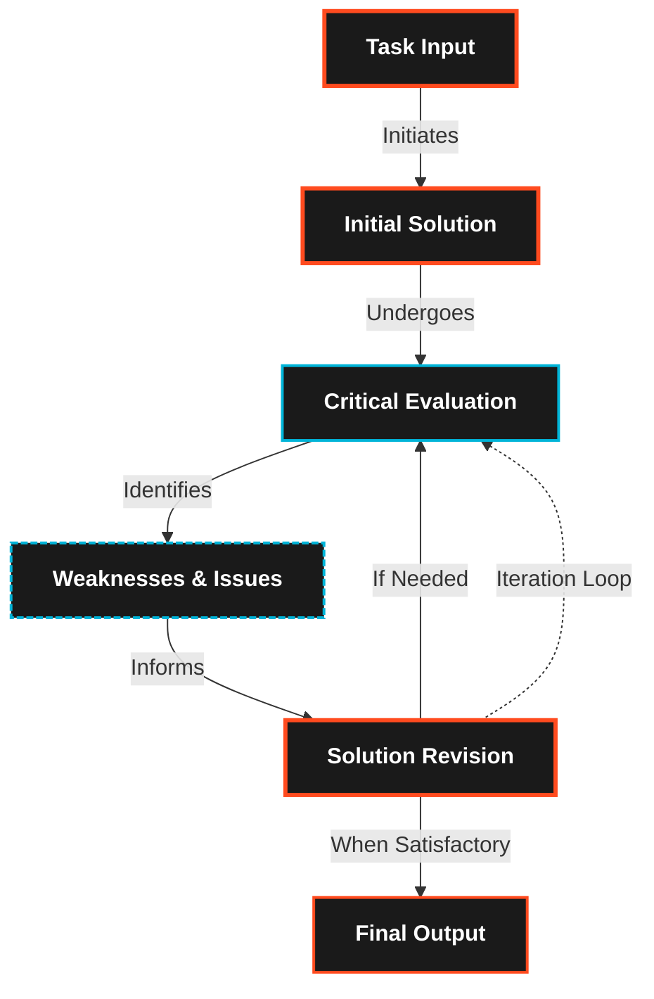
```mermaid
graph TD
    classDef default fill:#2d2d2d,stroke:#ff4b1f,color:white,stroke-width:2px
    classDef mainNode fill:#1a1a1a,stroke:#ff4b1f,color:white,stroke-width:3px
    classDef solutionNode fill:#1a1a1a,stroke:#ff4b1f,color:white,stroke-width:3px
    classDef critiqueNode fill:#1a1a1a,stroke:#00b4d8,color:white,stroke-width:2px
    classDef issuesNode fill:#1a1a1a,stroke:#00b4d8,color:white,stroke-width:2px,stroke-dasharray: 5 2
    classDef outputNode fill:#1a1a1a,stroke:#ff4b1f,color:white,stroke-width:2px
    
    Input[<b>Task Input</b>] -->|Initiates| Draft[<b>Initial Solution</b>]
    Draft -->|Undergoes| Critique[<b>Critical Evaluation</b>]
    Critique -->|Identifies| Issues[<b>Weaknesses & Issues</b>]
    Issues -->|Informs| Revision[<b>Solution Revision</b>]
    
    Revision -->|If Needed| Critique
    Revision -->|When Satisfactory| Output[<b>Final Output</b>]
    
    %% Loop visualization
    Revision -.->|Iteration Loop| Critique
    
    class Input mainNode
    class Draft,Revision solutionNode
    class Critique critiqueNode
    class Issues issuesNode
    class Output outputNode
```

- **Function**: Agent creates solution, critically evaluates it against multiple criteria, identifies weaknesses, and iteratively refines until quality threshold is met
- **When to Use**: Tasks where quality matters more than speed, complex problems with multiple valid approaches, or high-stakes outputs requiring error minimization
- **Key Advantage**: Improves output quality through metacognitive evaluation, reducing errors and blind spots inherent in single-pass generation
- **Best For**: Content creation, decision analysis, code generation, strategy development, and any task requiring rigorous quality control

## Peer Network Collaboration
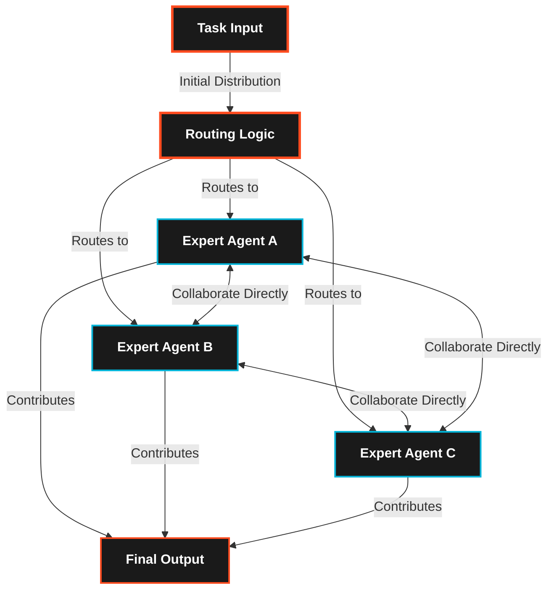
```mermaid
graph TD
    classDef default fill:#2d2d2d,stroke:#ff4b1f,color:white,stroke-width:2px
    classDef mainNode fill:#1a1a1a,stroke:#ff4b1f,color:white,stroke-width:3px
    classDef routerNode fill:#1a1a1a,stroke:#ff4b1f,color:white,stroke-width:3px
    classDef agentNode fill:#1a1a1a,stroke:#00b4d8,color:white,stroke-width:2px
    classDef outputNode fill:#1a1a1a,stroke:#ff4b1f,color:white,stroke-width:2px
    
    Input[<b>Task Input</b>] -->|Initial Distribution| Router[<b>Routing Logic</b>]
    
    Router -->|Routes to| AgentA[<b>Expert Agent A</b>]
    Router -->|Routes to| AgentB[<b>Expert Agent B</b>]
    Router -->|Routes to| AgentC[<b>Expert Agent C</b>]
    
    %% Direct peer communication paths
    AgentA <-->|Collaborate Directly| AgentB
    AgentB <-->|Collaborate Directly| AgentC
    AgentA <-->|Collaborate Directly| AgentC
    
    AgentA -->|Contributes| Output[<b>Final Output</b>]
    AgentB -->|Contributes| Output
    AgentC -->|Contributes| Output
    
    class Input mainNode
    class Router routerNode
    class AgentA,AgentB,AgentC agentNode
    class Output outputNode
```

- **Function**: Specialized agents communicate directly with each other as peers, dynamically routing tasks and information based on expertise needs without centralized control
- **When to Use**: Complex problems with fuzzy domain boundaries, collaborative tasks requiring rich inter-agent communication, or situations where flexibility trumps structured hierarchy
- **Key Advantage**: Enables emergent problem solving as agents freely exchange information, negotiate responsibilities, and adapt the workflow based on discoveries during the process
- **Best For**: Creative collaboration, complex research, interdisciplinary analysis, dynamic problem spaces, and simulating human team interactions

## Parallel Collaboration
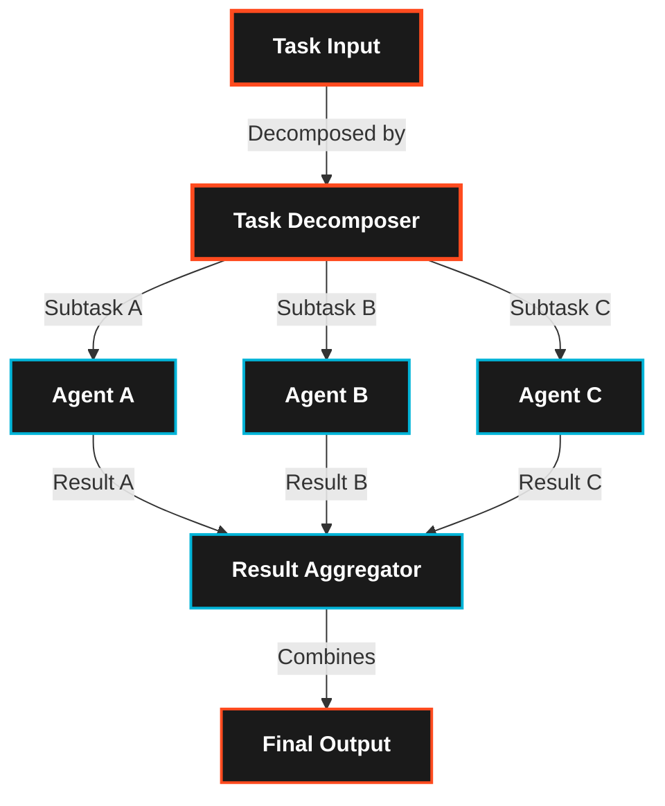
```mermaid
graph TD
    classDef default fill:#2d2d2d,stroke:#ff4b1f,color:white,stroke-width:2px
    classDef mainNode fill:#1a1a1a,stroke:#ff4b1f,color:white,stroke-width:3px
    classDef splitterNode fill:#1a1a1a,stroke:#ff4b1f,color:white,stroke-width:3px
    classDef agentNode fill:#1a1a1a,stroke:#00b4d8,color:white,stroke-width:2px
    classDef aggregatorNode fill:#1a1a1a,stroke:#00b4d8,color:white,stroke-width:2px
    classDef outputNode fill:#1a1a1a,stroke:#ff4b1f,color:white,stroke-width:2px
    
    Input[<b>Task Input</b>] -->|Decomposed by| Splitter[<b>Task Decomposer</b>]
    
    Splitter -->|Subtask A| AgentA[<b>Agent A</b>]
    Splitter -->|Subtask B| AgentB[<b>Agent B</b>]
    Splitter -->|Subtask C| AgentC[<b>Agent C</b>]
    
    %% Agents work independently in parallel
    AgentA -->|Result A| Aggregator[<b>Result Aggregator</b>]
    AgentB -->|Result B| Aggregator
    AgentC -->|Result C| Aggregator
    
    Aggregator -->|Combines| Output[<b>Final Output</b>]
    
    class Input mainNode
    class Splitter splitterNode
    class AgentA,AgentB,AgentC agentNode
    class Aggregator aggregatorNode
    class Output outputNode
```

- **Function**: Task is decomposed into independent subtasks, multiple agents work simultaneously without direct communication, results are combined afterward
- **When to Use**: Tasks with naturally parallel components, situations requiring maximum throughput, or problems where subtask independence can be maintained
- **Key Advantage**: Maximum efficiency through true parallelism with minimal coordination overhead or communication bottlenecks
- **Best For**: Batch processing, independent analyses of different datasets, distributed searching, content generation across distinct domains, and massively parallelizable computations

## Tree of Thought
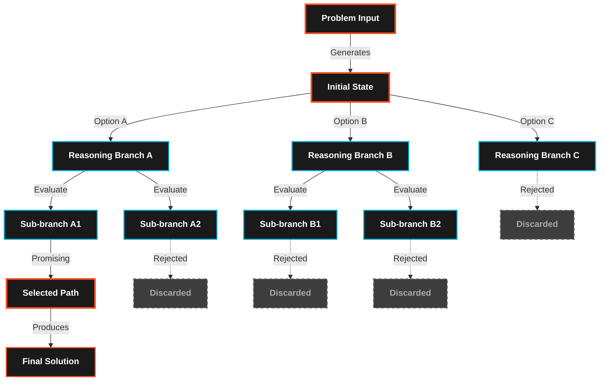
```mermaid
graph TD
    classDef default fill:#2d2d2d,stroke:#ff4b1f,color:white,stroke-width:2px
    classDef mainNode fill:#1a1a1a,stroke:#ff4b1f,color:white,stroke-width:3px
    classDef branchNode fill:#1a1a1a,stroke:#00b4d8,color:white,stroke-width:2px
    classDef selectedNode fill:#1a1a1a,stroke:#ff4b1f,color:white,stroke-width:3px
    classDef discardNode fill:#3d3d3d,stroke:#666666,color:#aaaaaa,stroke-width:2px,stroke-dasharray: 5 5
    classDef outputNode fill:#1a1a1a,stroke:#ff4b1f,color:white,stroke-width:2px
    
    Input[<b>Problem Input</b>] -->|Generates| Root[<b>Initial State</b>]
    
    Root -->|Option A| Branch1[<b>Reasoning Branch A</b>]
    Root -->|Option B| Branch2[<b>Reasoning Branch B</b>]
    Root -->|Option C| Branch3[<b>Reasoning Branch C</b>]
    
    Branch1 -->|Evaluate| SubBranch1A[<b>Sub-branch A1</b>]
    Branch1 -->|Evaluate| SubBranch1B[<b>Sub-branch A2</b>]
    
    Branch2 -->|Evaluate| SubBranch2A[<b>Sub-branch B1</b>]
    Branch2 -->|Evaluate| SubBranch2B[<b>Sub-branch B2</b>]
    
    SubBranch1A -->|Promising| Selected[<b>Selected Path</b>]
    SubBranch1B -.->|Rejected| Discard1[<b>Discarded</b>]
    SubBranch2A -.->|Rejected| Discard2[<b>Discarded</b>]
    SubBranch2B -.->|Rejected| Discard3[<b>Discarded</b>]
    Branch3 -.->|Rejected| Discard4[<b>Discarded</b>]
    
    Selected -->|Produces| Output[<b>Final Solution</b>]
    
    class Input mainNode
    class Root mainNode
    class Branch1,Branch2,Branch3,SubBranch1A,SubBranch1B,SubBranch2A,SubBranch2B branchNode
    class Selected selectedNode
    class Discard1,Discard2,Discard3,Discard4 discardNode
    class Output outputNode
```

- **Function**: Agent explores multiple potential reasoning pathways simultaneously, evaluating each branch's promise, pruning unproductive paths, and ultimately selecting the most viable solution
- **When to Use**: Complex problems with multiple potential approaches, situations with high uncertainty, strategic decision-making, or any scenario where exploring alternative hypotheses improves outcomes
- **Key Advantage**: Reduces risk of getting stuck in suboptimal solution paths by systematically exploring and evaluating multiple possibilities before committing to one
- **Best For**: Creative problem-solving, strategic planning, game-playing agents, complex decision analysis, and situations where the optimal solution path isn't immediately obvious

## Graph of Thought
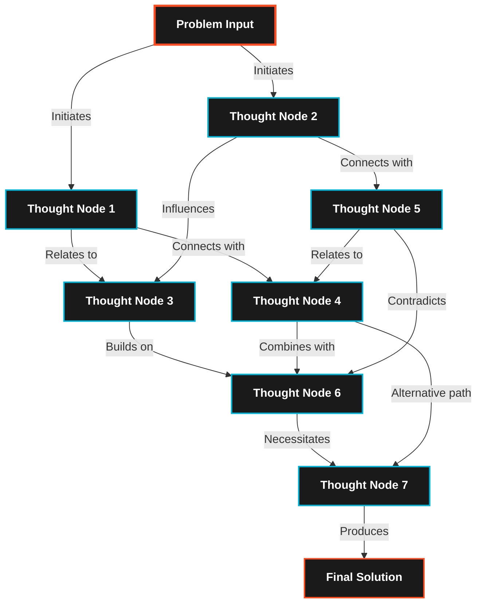
```mermaid
graph TD
    classDef default fill:#2d2d2d,stroke:#ff4b1f,color:white,stroke-width:2px
    classDef mainNode fill:#1a1a1a,stroke:#ff4b1f,color:white,stroke-width:3px
    classDef nodeNode fill:#1a1a1a,stroke:#00b4d8,color:white,stroke-width:2px
    classDef pathNode fill:#1a1a1a,stroke:#ff4b1f,color:white,stroke-width:3px
    classDef outputNode fill:#1a1a1a,stroke:#ff4b1f,color:white,stroke-width:2px
    
    Input[<b>Problem Input</b>] -->|Initiates| Node1[<b>Thought Node 1</b>]
    Input -->|Initiates| Node2[<b>Thought Node 2</b>]
    
    Node1 -->|Relates to| Node3[<b>Thought Node 3</b>]
    Node1 -->|Connects with| Node4[<b>Thought Node 4</b>]
    Node2 -->|Influences| Node3
    Node2 -->|Connects with| Node5[<b>Thought Node 5</b>]
    
    Node3 -->|Builds on| Node6[<b>Thought Node 6</b>]
    Node4 -->|Combines with| Node6
    Node5 -->|Relates to| Node4
    Node5 -->|Contradicts| Node6
    
    Node6 -->|Necessitates| Node7[<b>Thought Node 7</b>]
    Node4 -->|Alternative path| Node7
    
    Node7 -->|Produces| Output[<b>Final Solution</b>]
    
    class Input mainNode
    class Node1,Node2,Node3,Node4,Node5,Node6,Node7 nodeNode
    class Output outputNode
```

- **Function**: Agent builds a complex network of interconnected thoughts with non-hierarchical relationships, allowing ideas to reference, contradict, support, or build upon each other in multidimensional ways
- **When to Use**: Problems requiring complex system thinking, scenarios with multiple interdependent variables, or situations where relationships between concepts are cyclical or non-linear
- **Key Advantage**: Enables representation of rich conceptual relationships that can't be captured in linear chains or hierarchical trees, allowing for more nuanced exploration of complex problem spaces
- **Best For**: System design, complex causal analysis, interdisciplinary reasoning, knowledge mapping, multi-constraint problems, and modeling complex relationships between concepts

## System to System
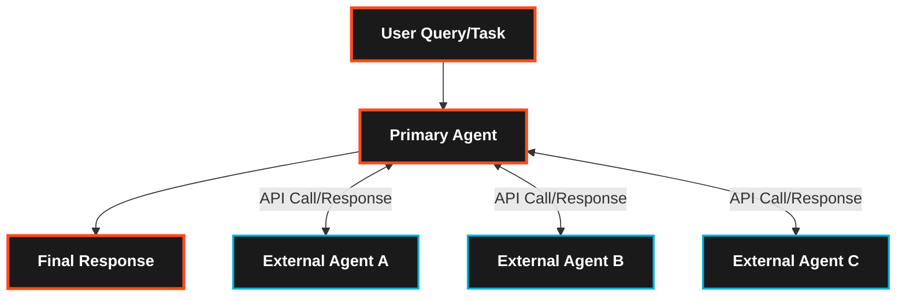
```mermaid
graph TD
    classDef default fill:#2d2d2d,stroke:#ff4b1f,color:white,stroke-width:2px
    classDef mainNode fill:#1a1a1a,stroke:#ff4b1f,color:white,stroke-width:3px
    classDef primaryNode fill:#1a1a1a,stroke:#ff4b1f,color:white,stroke-width:3px
    classDef externalNode fill:#1a1a1a,stroke:#00b4d8,color:white,stroke-width:2px
    
    %% Primary system components
    Input[<b>User Query/Task</b>] --> PrimaryAgent[<b>Primary Agent</b>]
    PrimaryAgent --> Response[<b>Final Response</b>]
    
    %% External agent connections
    PrimaryAgent <-->|API Call/Response| AgentSystemA[<b>External Agent A</b>]
    PrimaryAgent <-->|API Call/Response| AgentSystemB[<b>External Agent B</b>]
    PrimaryAgent <-->|API Call/Response| AgentSystemC[<b>External Agent C</b>]
    
    class Input,PrimaryAgent,Response primaryNode
    class AgentSystemA,AgentSystemB,AgentSystemC externalNode
```

- **Function**: Primary agent orchestrates interactions with independent third-party agent systems, translating requests and synthesizing responses across different APIs
- **When to Use**: Tasks requiring specialized capabilities from multiple external systems or situations needing composite intelligence from diverse agent ecosystems
- **Key Advantage**: Leverages specialized capabilities from different providers while maintaining a unified experience for the user
- **Best For**: Complex workflows requiring diverse expertise, cross-platform automation, and tasks requiring capabilities beyond a single agent system

# Memory
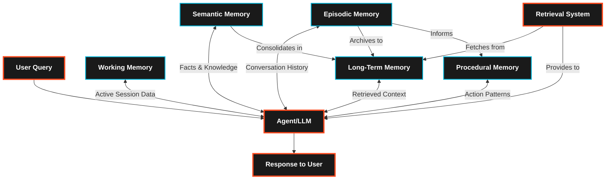
```mermaid
graph TD
    classDef default fill:#2d2d2d,stroke:#ff4b1f,color:white,stroke-width:2px
    classDef mainNode fill:#1a1a1a,stroke:#ff4b1f,color:white,stroke-width:3px
    classDef memoryNode fill:#1a1a1a,stroke:#00b4d8,color:white,stroke-width:2px
    classDef systemNode fill:#1a1a1a,stroke:#ff4b1f,color:white,stroke-width:3px
    
    %% Core agent
    Agent[<b>Agent/LLM</b>] --> Response[<b>Response to User</b>]
    Input[<b>User Query</b>] --> Agent
    
    %% Memory types with directional relationships
    WorkingMem[<b>Working Memory</b>] <-->|Active Session Data| Agent
    EpisodicMem[<b>Episodic Memory</b>] <-->|Conversation History| Agent
    SemanticMem[<b>Semantic Memory</b>] <-->|Facts & Knowledge| Agent
    LongTermMem[<b>Long-Term Memory</b>] <-->|Retrieved Context| Agent
    ProceduralMem[<b>Procedural Memory</b>] <-->|Action Patterns| Agent
    
    %% Memory relationships
    EpisodicMem -->|Archives to| LongTermMem
    SemanticMem -->|Consolidates in| LongTermMem
    EpisodicMem -->|Informs| ProceduralMem
    
    %% Memory access methods
    RetrievalSystem[<b>Retrieval System</b>] -->|Fetches from| LongTermMem
    RetrievalSystem -->|Provides to| Agent
    
    class Agent,Input,Response mainNode
    class WorkingMem,EpisodicMem,SemanticMem,LongTermMem,ProceduralMem memoryNode
    class RetrievalSystem systemNode
```

- **Working Memory**: Temporary session data that resets between interactions
- **Episodic Memory**: Conversation history across multiple sessions
- **Semantic Memory**: Persistent facts about users and domains
- **Long-Term Memory**: Retrievable historical context in vector stores or databases
- **Procedural Memory**: Learned effective strategies and tool usage patterns

# Evaluation
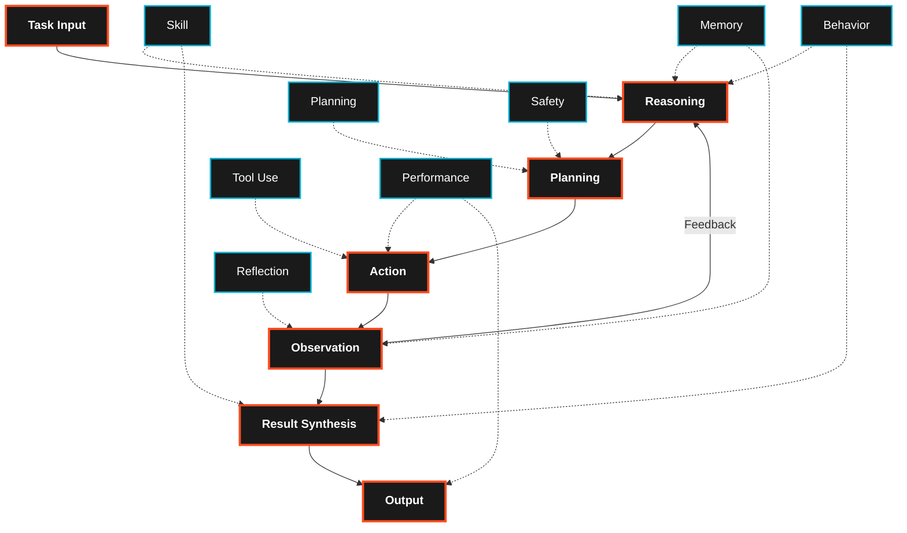
```mermaid
graph TD
    classDef default fill:#2d2d2d,stroke:#ff4b1f,color:white,stroke-width:2px
    classDef mainNode fill:#1a1a1a,stroke:#ff4b1f,color:white,stroke-width:3px
    classDef workflowNode fill:#1a1a1a,stroke:#ff4b1f,color:white,stroke-width:3px
    classDef criteriaNode fill:#1a1a1a,stroke:#00b4d8,color:white,stroke-width:2px
    
    %% Main agent workflow
    Input[<b>Task Input</b>] --> Reasoning[<b>Reasoning</b>]
    Reasoning --> Planning[<b>Planning</b>]
    Planning --> Action[<b>Action</b>]
    Action --> Observation[<b>Observation</b>]
    Observation --> ResultSynthesis[<b>Result Synthesis</b>]
    ResultSynthesis --> Output[<b>Output</b>]
    Observation -->|Feedback| Reasoning
    
    %% Evaluation dimensions mapped to workflow components
    Skill[Skill] -.-> Reasoning
    Memory[Memory] -.-> Reasoning
    Behavior[Behavior] -.-> Reasoning
    
    Planning_[Planning] -.-> Planning
    Safety[Safety] -.-> Planning
    
    ToolUse[Tool Use] -.-> Action
    Performance[Performance] -.-> Action
    
    Reflection[Reflection] -.-> Observation
    Memory -.-> Observation
    
    Skill -.-> ResultSynthesis
    Behavior -.-> ResultSynthesis
    
    Performance -.-> Output
    
    class Input,Reasoning,Planning,Action,Observation,ResultSynthesis,Output workflowNode
    class ToolUse,Planning_,Skill,Memory,Reflection,Performance,Safety,Behavior criteriaNode
```

- **Tool Calling & Selection**: Assesses appropriate tool usage
- **Planning & Strategy**: Evaluates task decomposition efficiency
- **Skill-Based**: Tests core capability performance
- **Memory & State Management**: Measures context retention effectiveness
- **Reflection & Self-Evaluation**: Assesses error recognition capability
- **End-to-End System**: Evaluates overall task completion
- **Safety & Reliability**: Tests boundary condition handling
- **Behavioral Testing**: Measures response consistency patterns
