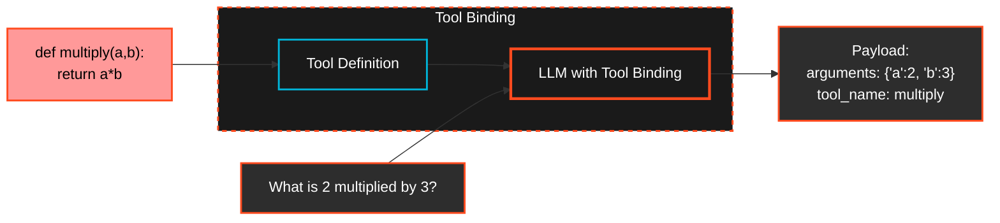
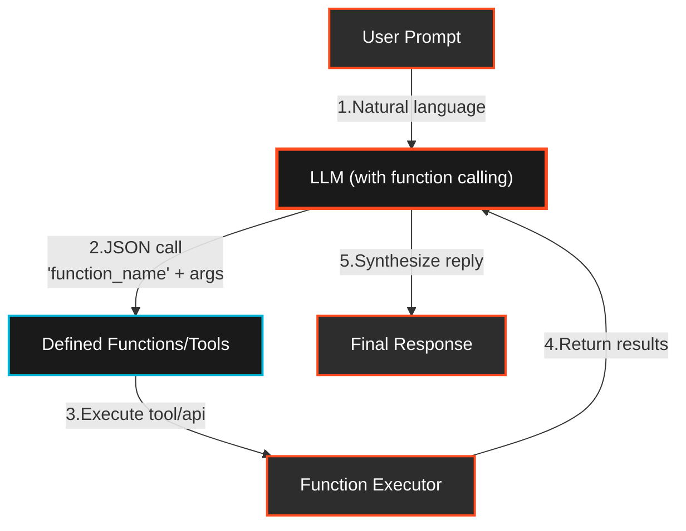
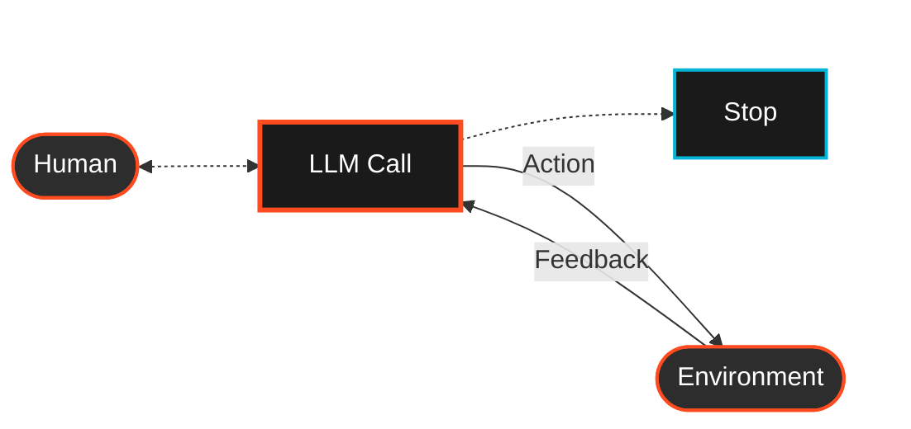
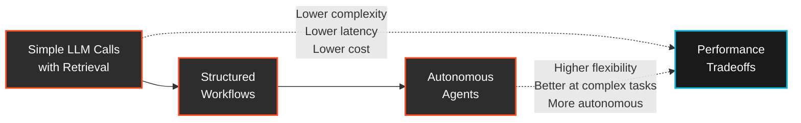
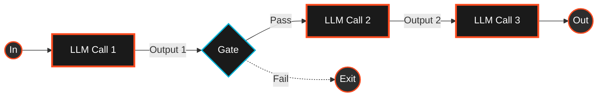
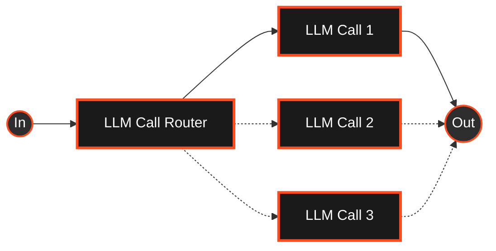
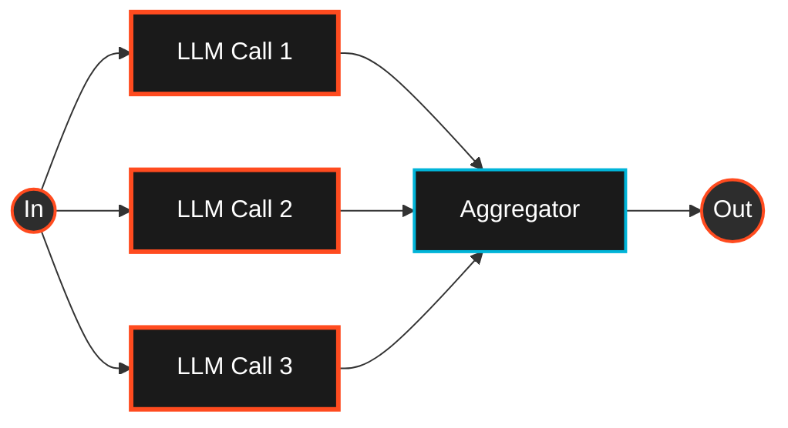
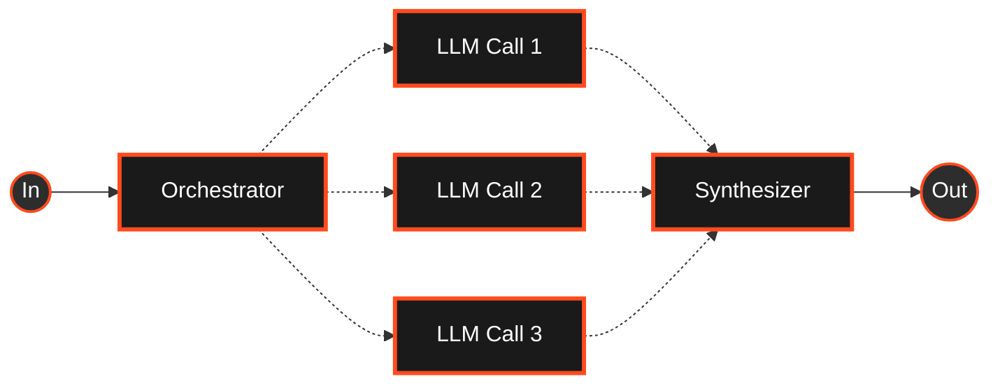
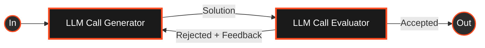
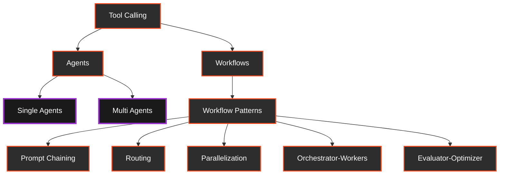

# Workflows
In this article we explore the architectural patterns of AI agents and workflows, examining how LLMs can be orchestrated to perform complex tasks through tool calling, reasoning, and various execution strategies.

## Tool Calling 
Function calling enables LLMs to emit structured JSON "calls" to predefined functions (i.e., tools or APIs), rather than free-form text, allowing seamless integration with external systems. 
A key principle of tool calling is that the model decides when to use a tool based on the input's relevance.

This mechanism underpins modern agent frameworks by giving LLMs the ability to decide autonomously which tool to invoke and with what parameters, and even to chain multiple calls in service of complex tasks.

## From Tools to Agents
While tool calling provides LLMs with the ability to interact with external systems, agents represent a more sophisticated integration where these capabilities are combined with reasoning, planning, and autonomy. Agents leverage tool calling as a fundamental mechanism but extend it with additional capabilities.

# What Are Agents and Agentic Systems

## Agentic AI Systems
Agentic AI systems can autonomusly perform tasks, make decisions and solve complex problems based on context and objectives with minimal human supervision. these systems combine the flexibility of Gen-AI based reasoning (agents) with the precision of traditional software engineeting (tools) to plan, adapt and react.

The key components of agents are:
- **Autonomy**: Agents act independently within a defined scope, making their own decisions without continuous human intervention.
- **Goal-Oriented**: They break down high-level objectives into ordered sub-tasks, ensuring systematic progress toward specific outcomes.
- **Tool Integration**: Agents invoke external functions—APIs, databases, custom code—to execute real-world actions rather than just generate text.
- **Memory & Context**: By storing short- and long-term memories, they track past interactions and maintain continuity across complex workflows.
- **Feedback Loop**: Agents evaluate the results of each action, learn from failures, and iteratively refine their approach using reinforcement learning or iterative planning.
- **Decision-Making Framework**: They employ reasoning strategies (e.g., chain-of-thought, rule-based logic) to choose which tools to use and how to sequence tasks for optimal performance.

## Building Blocks of an Agentic System

At the core of agentic systems is an LLM enhanced with capabilities like retrieval, tools, and memory. These models can actively decide what to search, which tools to use, and what to remember. When implementing, focus on tailoring these augmentations to your use case and providing a clear, well-documented interface for your LLM.

# Agents and Workflows: Choosing the Right Approach

There is an important architectural distinction between workflows and agents:

- **Workflows**: Systems where LLMs and tools are orchestrated through predefined code paths. The logic is hard-coded, and execution follows a fixed sequence.
- **Agents**: Systems where LLMs dynamically determine their own actions and tool usage. They maintain control over task execution, deciding how to proceed based on goals and context.

## When to Use Workflows vs. Agents

When building LLM-powered applications, it's important to choose the simplest solution that meets your requirements. This decision framework can help determine the appropriate approach:

### Use Workflows When:
- Tasks are well-defined with predictable steps
- Consistency and reliability are critical priorities
- You need tight control over execution paths
- Performance and latency requirements are strict
- Cost efficiency is a primary concern
- The problem space is well-understood and stable

### Use Agents When:
- Tasks require dynamic decision-making and adaptation
- Problems are complex with unpredictable paths to solutions
- Flexibility is more important than deterministic behavior
- The environment or requirements change frequently
- Tasks benefit from autonomous exploration of solutions
- Multiple tools need to be orchestrated based on context

### Complexity-Performance Tradeoff

Agentic systems often trade latency and cost for better task performance. This tradeoff should be carefully considered:

1. **Start Simple**: For many applications, optimizing single LLM calls with retrieval and in-context examples is sufficient
2. **Add Structure**: When more control is needed, implement workflows with predefined paths
3. **Introduce Agency**: Only move to fully agentic systems when the benefits of flexibility and autonomous decision-making outweigh the increased complexity, latency, and cost

The diagram below illustrates this progression from simple to complex approaches:

# Workflow Patterns and Future Directions

## Understanding Workflow Patterns

Workflow patterns are specific, reusable architectural approaches that solve common orchestration challenges. These patterns have emerged from practical experience implementing LLM-based systems and provide proven templates for different use cases.

Each pattern offers distinct advantages for particular scenarios, with tradeoffs in complexity, flexibility, and performance. Understanding these patterns helps developers select the most appropriate architecture for their specific requirements.

## Workflow: Prompt Chaining
- **What it is**: Breaks a complex task into a linear sequence of LLM calls, where each step depends on the output of the previous one. Optional checks ("gates") can be added to validate intermediate results before continuing.
- **Use Case**: Tasks that naturally decompose into smaller, ordered subtasks.
- **Goal**: Improve accuracy by simplifying each step (with increased latency).
- **Examples**:
  - Write marketing copy → translate it.
  - Draft document outline → verify → write document.

## Workflow: Routing
- **What it is**: An initial LLM (or classifier) decides what kind of input it's dealing with, then sends it to a specialized follow-up process with tailored prompts, models, or tools.
- **Use Case**: Handling different input types that require different processing logic or prompts.
- **Goal**: Avoid one-size-fits-all prompts and optimize each case for performance.
- **Examples**:
  - Route support tickets by topic (refund, tech, billing).
  - Send easy queries to small models, complex ones to powerful models.

## Workflow: Parallelization
- **What it is**: Executes multiple LLM tasks simultaneously. Two major types:  
  - **Sectioning** divides the task into parts that can be handled independently.  
  - **Voting** runs the same task multiple times to compare and combine outputs.
- **Use Case**: Tasks where subtasks are independent or benefit from diversity in answers.
- **Goal**: Reduce latency or improve quality through redundancy and diversity.
- **Examples**:
  - **Sectioning**: One model handles query; another filters for safety.
  - **Voting**: Multiple LLMs review code or content and compare flags.

## Workflow: Orchestrator-Workers
- **What it is**: A central LLM (the "orchestrator") dynamically analyzes the input, decides what subtasks are needed, and delegates each one to a "worker" LLM. The orchestrator then combines the results into a final answer.
- **Use Case**: Complex or open-ended tasks where required steps vary case by case.
- **Goal**: Introduce flexibility in how tasks are broken down and executed.
- **Examples**:
  - Modify code across multiple unpredictable files.
  - Aggregate and analyze info from multiple sources for research.

## Workflow: Evaluator-Optimizer
- **What it is**: One LLM generates an initial output, and another LLM (or the same one in a different role) evaluates that output and provides feedback or suggestions. This loop can repeat until the result meets defined quality standards.
- **Use Case**: Tasks that benefit from refinement and where clear quality signals are available.
- **Goal**: Use iteration and self-critique to improve outputs.
- **Examples**:
  - Refine literary translation based on nuance critiques.
  - Perform multi-round research and validation for deeper coverage.

## Looking Ahead: Agentic Patterns

While this article has focused primarily on workflow patterns, the agent side of the hierarchy deserves equal attention. In our upcoming article "Agentic Patterns," we will explore in depth the different types of agent architectures:

- **Single Agents**: Autonomous systems that operate independently, using various reasoning and decision-making strategies to accomplish tasks
- **Multi-Agents**: Collaborative systems where multiple agents work together, often specializing in different aspects of a problem

These agent patterns represent the next frontier in LLM applications, enabling even more sophisticated reasoning, planning, and problem-solving capabilities. By understanding both workflow patterns and agent patterns, developers can make informed decisions about which architectural approaches best suit their specific use cases.

# Conceptual Hierarchy

The diagram below illustrates the conceptual hierarchy between tool calling, agents, and workflow patterns:

# References

- [LangChain Tool Calling Concepts](https://python.langchain.com/docs/concepts/tool_calling/)
- [LangChain Workflow](https://langchain-ai.github.io/langgraph/tutorials/workflows/)
- [LangChain Tool Calling How-To](https://python.langchain.com/docs/how_to/tool_calling/)
- [OpenAI Function Calling Guide](https://platform.openai.com/docs/guides/function-calling?utm_source=chatgpt.com&api-mode=chat)
- [Prompting Guide: Function Calling](https://www.promptingguide.ai/applications/function_calling?utm_source=chatgpt.com)
- [Anthropic: Building Effective Agents](https://www.anthropic.com/engineering/building-effective-agents)
- [LangGraph Multi-agent systems](https://langchain-ai.github.io/langgraph/concepts/multi_agent/)
