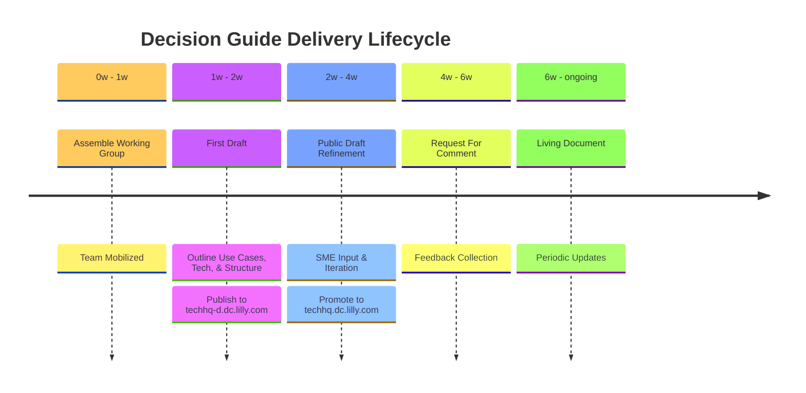

# Decision Guide Timeline

Our goal is to deliver each decision guide in less than 8 weeks, i.e. roughly 4 sprints. We'll use a
[Jira TECHHQ project](https://lilly-jira.atlassian.net/jira/software/c/projects/TECHHQ/boards/9887/timeline) to track
priorities and progress.

## Working Group

The 'Directly Responsible' decision guide owner assembles the team to kickstart the creation of the decision guide. This
stage involves gathering the necessary experts and stakeholders to ensure a comprehensive and well-rounded guide. We
recommend scheduling a standing meeting cadence for the drafting process.

## First Draft

The team outlines the use cases and technologies relevant to the decision guide. This stage involves initial research
and documentation to create a foundational draft. The first draft should be checked in and published to the TechHQ
non-prod environment.

## Public Draft Refinement

Subject matter experts (SMEs) provide input and iterate on the draft. This stage focuses on refining the content to
ensure accuracy and relevance. The Public Draft should be promoted to TechHQ Prod by removing the <code>draft:
true</code> or <code>unlisted: true</code> metadata.

## Request For Comment

Crucial feedback is gathered from stakeholders and other relevant parties. This stage involves collecting and
incorporating feedback to enhance the guide's comprehensiveness and usability.

## Living Document

Once all feedback has been incorporated and the guide is finalized, it becomes a Living Document. This status indicates
that the guide will be continuously updated and revised as needed to remain current and relevant.
