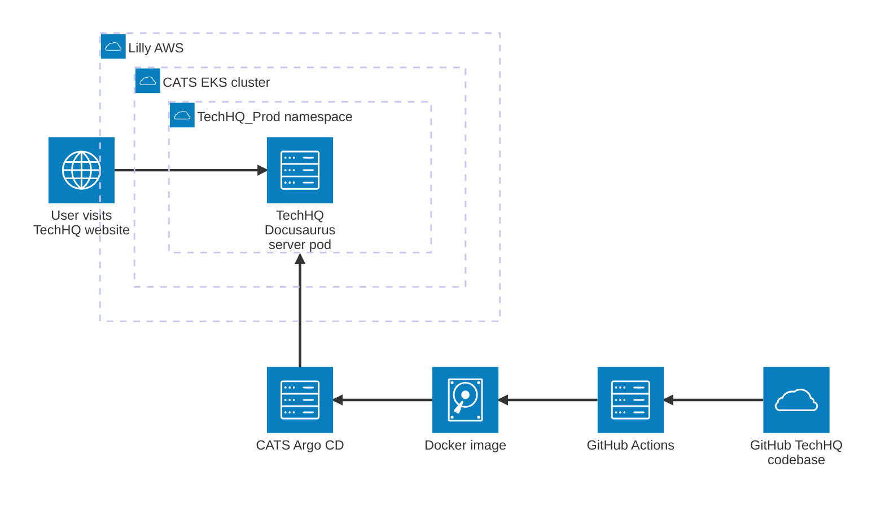

# Markdown Extensions

## Mermaid

[Mermaid diagramming & charting](https://mermaid.js.org/)

## Markmap

[Markmap mindmaps](https://markmap.js.org/)

<!-- prettier-ignore -->
:::warning Known Markmap Bug
Markmap generates a known exception on live
page reload in dev environments: _Failed to read the 'value' property from 'SVGLength': Could not resolve relative
length._ This bug is not present in prod.
:::

<MarkMap>

- Digital Core Marketplace

  - Objective

    - Deliver a Digital Core Marketplace with self-service products, reusable components, and cutting-edge platforms to
      improve cycle time and value

  - Leading indicators & Measures

    - % of Digital Core services covered
      - Serves as a Unified Frontdoor providing access to 100% of Digital Core services
    - Used by % of new product initiatives
      - Products, platforms, and/or guidance provided by the marketplace enable 70% of new product initiatives
    - Internal NPS
      - 80% Positive (box 4-5) Net Promoter Score for the Marketplace
    - Used for % of Digital Core engagements
      - 100% of new Digital Core engagement requests use the Marketplace

  - Planned Outcomes

    - 40% of Marketplace users report 2 months saved each time they use a Marketplace product, component, or platform
    - Enhance partner understanding of available capabilities and tech investments

  - Ecosystem

    - TechHQ

      - Audience: Tech@Lilly leadership, architects, product managers, and tech decision-makers
      - Purpose: Serves as a hub for self-service products, reusable components, and innovative platforms to simplify
        and unify guidance and decision-making processes

    - [Get IT Help on LillyNow](https://now.lilly.com/landing/global-information-technology/global-it-resources)

      - Purpose: Provides access to IT help and resources, including guides, tips, and FAQs to help employees perform
        their jobs effectively
      - Audience: Lilly employees seeking IT support and resources

    - [Discovering Tech@Lilly](https://collab.lilly.com/sites/ITPortal)

      - Audience: Lilly employees seeking information and learning resources to perform their jobs effectively
      - Purpose: Provides employees with information and learning resources to enhance productivity through guides,
        tips, and FAQs

    - ServiceNow Catalog

      - Audience: Lilly employees needing to order technology hardware, software, and services
      - Purpose: Allows employees to order technology hardware, software, and services through a self-service portal

    - ServiceNow Knowledge Base

      - Audience: Lilly employees, IT teams, and suppliers
      - Purpose: Provide detailed information and solutions for IT-related issues through knowledge base articles

    - ChatNow
      - Audience: Lilly employees seeking immediate IT support and assistance
      - Purpose: Offers instant and direct assistance for various IT support needs through a chatbot integrated into
        Teams

  - Q1 '25 Priorities - TechHQ Decision Guidance - Digital Core Quarterly Roadmaps & Milestones

</MarkMap>

## Font Awesome icons

<FAIcon icon="fa-brands fa-github" size="2x" /> Example FA GitHub icon

## External link highlights

<ExternalLink>[GitHub](https://github.com)</ExternalLink> 
<ExternalLink>[LillyFlow](https://elilillyco.stackenterprise.co/)</ExternalLink> 
<ExternalLink>[Tech@Lilly on Viva Engage](https://engage.cloud.microsoft/main/org/lilly.com/groups/eyJfdHlwZSI6Ikdyb3VwIiwiaWQiOiI5MjA5NTIwMTI4In0/new)</ExternalLink>

## Additional admonitions

In addition to Docusaurus' built-in [admonitions](https://docusaurus.io/docs/next/markdown-features/admonitions),
[community extensions](https://docusaurus.community/knowledge/component-library/existing/Admonitions/) are also
included.

<section style={{display : 'flex', margin_right : '50px'}}>
:::note 
Beta is the stage where the innovation
is ready to be used for its primary intended purpose.
:::

<!-- prettier-ignore -->
:::security Warning!
This is a security warning
:::

</section>

<!-- prettier-ignore -->
:::caution 
Caution Caution!
:::

## Columns and cards

  <Columns> 
  <Column className='text--left'>
    <Card shadow='tl'>
      <CardHeader>
        <h3>Lorem Ipsum</h3>
      </CardHeader>
      <CardBody>
        Lorem ipsum dolor sit amet, consectetur adipiscing elit, sed do eiusmod tempor incididunt ut labore et dolore magna aliqua. Quis ipsum suspendisse ultrices gravida.
      </CardBody>
      <CardFooter>
        <button className='button button--secondary button--block'>See All</button>
      </CardFooter>
    </Card>
  </Column>
  <Column className='text--center'>
    <Card shadow='tl'>
      <CardHeader>
        <h3>Lorem Ipsum</h3>
      </CardHeader>
      <CardBody>
        Lorem ipsum dolor sit amet, consectetur adipiscing elit, sed do eiusmod tempor incididunt ut labore et dolore magna aliqua. Quis ipsum suspendisse ultrices gravida.
      </CardBody>
      <CardFooter>
        <button className='button button--secondary button--block'>See All</button>
      </CardFooter>
    </Card>
  </Column>
  <Column className='text--justify'>
    <Card shadow='tl'>
      <CardHeader>
        <h3>Lorem Ipsum</h3>
      </CardHeader>
      <CardBody>
        Lorem ipsum dolor sit amet, consectetur adipiscing elit, sed do eiusmod tempor incididunt ut labore et dolore magna aliqua. Quis ipsum suspendisse ultrices gravida.
      </CardBody>
      <CardFooter>
        <button className='button button--secondary button--block'>See All</button>
      </CardFooter>
    </Card>
  </Column>
</Columns>
 
<Columns> 
  <Column className='text--left'>
    <Card shadow='tl'>
      <CardHeader>
        <h3>Lorem Ipsum</h3>
      </CardHeader>
      <CardBody>
        Lorem ipsum dolor sit amet, consectetur adipiscing elit, sed do eiusmod tempor incididunt ut labore et dolore magna aliqua. Quis ipsum suspendisse ultrices gravida.
      </CardBody>
      <CardFooter>
        <button className='button button--secondary button--block'>See All</button>
      </CardFooter>
    </Card>
  </Column>
  <Column className='text--center'>
    <Card shadow='tl'>
      <CardHeader>
        <h3>Lorem Ipsum</h3>
      </CardHeader>
      <CardBody>
        Lorem ipsum dolor sit amet, consectetur adipiscing elit, sed do eiusmod tempor incididunt ut labore et dolore magna aliqua. Quis ipsum suspendisse ultrices gravida.
      </CardBody>
      <CardFooter>
        <button className='button button--secondary button--block'>See All</button>
      </CardFooter>
    </Card>
  </Column>
  <Column className='text--justify'>
    <Card shadow='tl'>
      <CardHeader>
        <h3>Lorem Ipsum</h3>
      </CardHeader>
      <CardBody>
        Lorem ipsum dolor sit amet, consectetur adipiscing elit, sed do eiusmod tempor incididunt ut labore et dolore magna aliqua. Quis ipsum suspendisse ultrices gravida.
      </CardBody>
      <CardFooter>
        <button className='button button--secondary button--block'>See All</button>
      </CardFooter>
    </Card>
  </Column>
</Columns>
