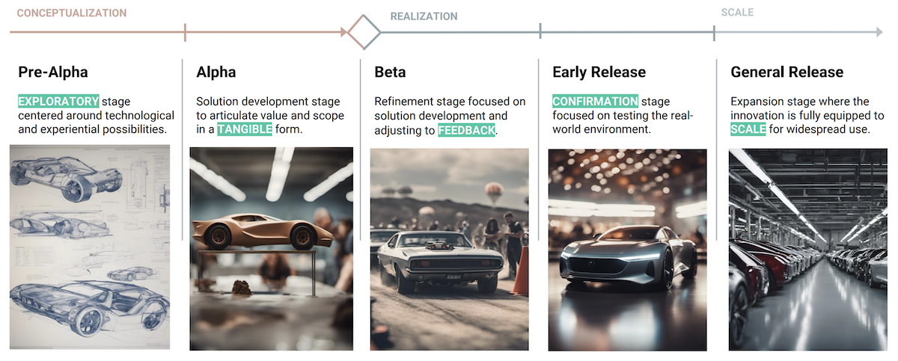
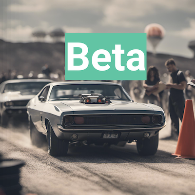

# 🛞 Our Innovation Stages

Our Tech Innovation Pipeline is a structured pathway for innovations across Tech@Lilly with focused enablers and enhanced visibility into the progression of breakthrough technologies and disruptive solutions.

The pipeline's five stages go from Conceptualization to Realization to Scale.

## Pre-Alpha
Think of this as the brainstorming stage where we're gathering sketches, wireframes,
and maybe even napkin doodles. This isn't about clarity but about exploring and sharing
potential. It’s more than just an idea.

<!-- .element height="50%" width="50%" -->

:::note Definition
Pre-alpha is the EXPLORATORY stage
centered around technological and experiential
possibilities. The clarity of the innovation's potential
is still evolving, and it includes diverse artifacts and
research materials. The pre-alpha stage is where an
idea becomes a fledgling innovation with
investigative work that discovers signals of
feasibility, desirability, and/or viability.
:::

:::info Purpose
The goal of this stage is to gather and communicate ideas, identify potential features, and
validate core concepts. It sets the groundwork for the upcoming, more defined stages of development.
:::

## Alpha
Now, we're onto building a rough draft or prototype. It might be a piece of software, a design blueprint, or another kind of tangible
representation.
It's not complete and its OK to have glitches or missing parts, but it's the first real look at our innovation. The primary objective here? Refine our vision, iron out the kinks, and prepare for the stages ahead.

<!-- .element height="50%" width="50%" -->

:::note Definition
Alpha is the stage where the innovation
takes its first TANGIBLE form. This may be functional
software or a UX design that has a fair degree of
fidelity, but neither are usually ‘feature-complete’. It is
usually tested internally within the team involved in the
early stages. It likely has bugs and incomplete
features.
:::

:::info Purpose
The primary goal of the alpha stage is to
identify key features and begin to define Product
scope, strategy and vision more closely with a demo.
This stage allows for rapid testing of the product's
functionality with primary stakeholders and serves as
a preparation for the beta stage, where a larger
contingent of resources and people are be needed to
advance it further.
:::

## Beta
We're getting there! Our innovation is now usable for a small audience but might still have a few rough edges.
We are ready to provide it to a select group of users and gather their feedback. Their insights will be crucial in making sure our product isn't just functional, but also user-
friendly and ready for a larger set of users.

<!-- .element height="50%" width="50%" -->

:::note Definition
Beta is the stage where the innovation
is ready to be used for its primary intended purpose.
It is the first time the innovation is provided to a
select group of users in a controlled environment. A
beta release provides the stability required for end
users to regularly exercise functionality with minimal
disruption but does not guarantee service levels or
support agreements.
:::

:::info Purpose
The purpose of the beta stage is to gather
FEEDBACK from real-world users who can identify
major bugs, usability issues, or other potential
problems that were not apparent during the alpha
stage. This helps ensure the product is becoming a
valuable solution heading for Early Release.
:::

## Early Release
Consider this a trial run. Before we go all out, we try our innovation in a limited, real-world
setting. When the stakes are high, it's a smart
move to ensure the technology and processes are ready to scale.

<!-- .element height="50%" width="50%" -->

:::note Definition
Early Release is the CONFIRMATION
stage where the innovation is tried in a limited real-
world, supported environment. Early Release limits
risk when a product’s intended vision and scale
includes a very large number of users/customers or
could negatively impact business functions if
unforeseen challenges arise. This stage establishes
a market test of an innovation to help justify the
larger investment needed to achieve full scale.
:::

:::info Purpose
The purpose of the Early Release stage is
to ensure we are ready to scale. It validates the
product's functionality, usability, and reliability in a
real-world setting before it is released to a larger
audience. We learn from data to inform decisions
and ensure scalability. This stage allows for the
identification and resolution of operational issues
before scaling to the full intended user/customer
base.
:::

## General Release
Time to roll out! Our innovation is
ready to face the world. It's polished, tested, and has the stamp of approval.
From here on, our focus pivots from initial innovation to promotion,
continuous improvements, and a roadmap of future features and capabilities.

<!-- .element height="50%" width="50%" -->

:::note Definition
General Release marks the official
introduction of the innovation to its full
intended audience, whether that's a
department, the entire company, or the
broader public. At this point, the innovation is
fully supported and equipped to SCALE.
:::

:::info Purpose
The purpose of the General Release
stage is to achieve the value promised by the
innovation framework.
:::