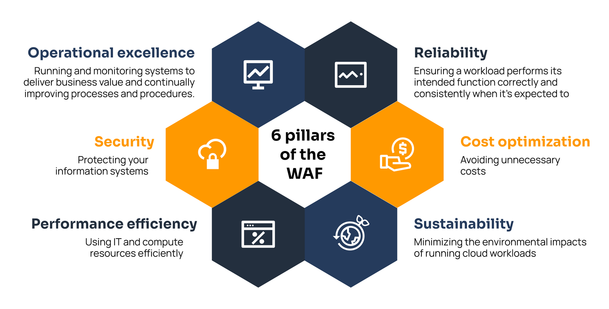
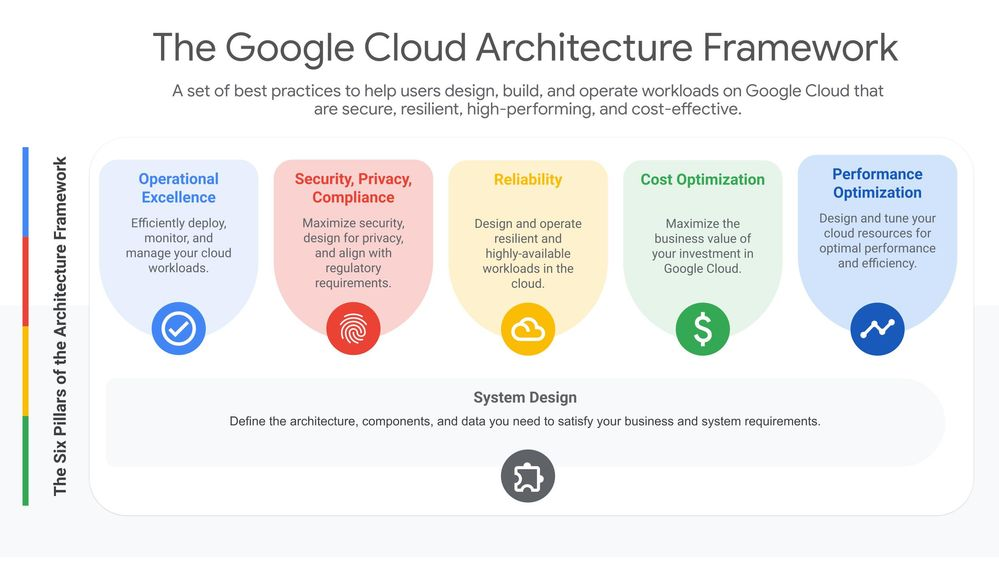
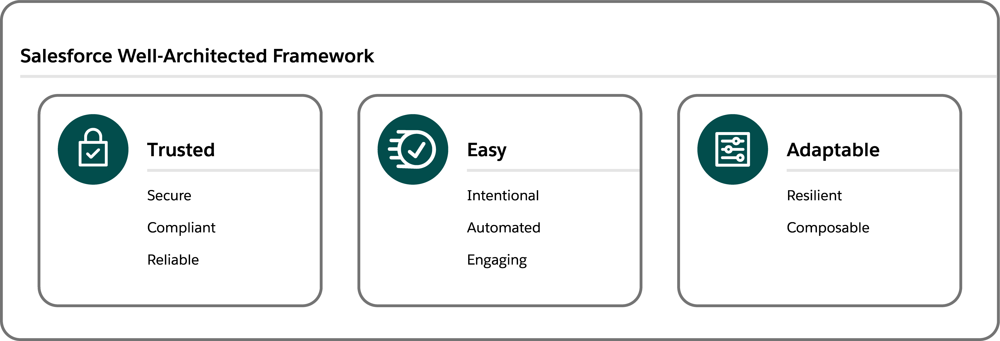

# 📐 Tech@Lilly Well-architected

## Blueprints for Success

In today's tech landscape, elevating our systems is crucial to achieve scale, speed, and innovation. A well-architected
framework helps us design, deploy, and manage our digital workloads effectively, ensuring reliability, security, and
cost-efficiency. Start evaluating digital architecture against best practices to unlock greater value for our business
and customers today!

## Well-Architected Pillars

Our architecture leverages well-architected frameworks from Microsoft, AWS, and Google. These frameworks share common
pillars that help us design, deploy, and manage systems effectively, whether they are cloud-based, on-premises, hybrid,
or SaaS. By following these pillars, we ensure our systems are robust, secure, and efficient.

1. **Operational Excellence**

   - Run and monitor systems to deliver business value and continuously improve processes. Automate changes, respond to
     events, and define standards for daily operations.

2. **Security, Privacy & Compliance**

   - Protect information, systems, and assets. Implement strong identity and access management, safeguard data, maintain
     data integrity, and establish controls to detect security and compliance events.

3. **Reliability**

   - Ensure workloads perform their intended functions correctly and consistently. Design systems to recover from
     failures, meet customer demands, and mitigate disruptions.

4. **Performance Efficiency**

   - Optimize the use of IT and computing resources to maintain performance. Select the right resource types and sizes,
     monitor performance, and make informed decisions to maintain efficiency as business needs evolve.

5. **Cost Optimization**

   - Manage costs to maximize value delivery. Understand and control spending, select cost-effective resources, and
     scale to meet business needs without overspending.

6. **Sustainability** (_an emerging pillar, especially for computationally-intensive AI workloads_)
   - Minimize the environmental impact of cloud workloads. Design and operate systems to reduce energy consumption and
     improve efficiency, supporting long-term sustainability goals.

## Industry-leading Frameworks

To evaluate and improve your system's architecture, start with _one_ of these frameworks. Since AWS, Azure, and Google's
well-architected frameworks are so similar, select one based on team comfort and interest. If this is your first time,
we recommend starting with the [AWS Well-architected Tool](https://aws.amazon.com/well-architected-tool/), which will
ask you specific questions and record your decisions for future reference.

### [AWS Well-Architected](https://aws.amazon.com/architecture/well-architected/)

### [Azure Well-Architected Framework](https://learn.microsoft.com/en-us/azure/well-architected/)

### [Google Cloud Architecture Framework](https://cloud.google.com/architecture/framework)

### [Salesforce Well-architected](https://architect.salesforce.com/well-architected/overview)

